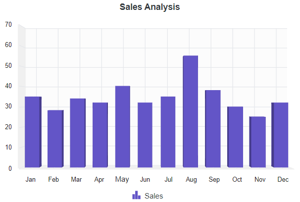

# Getting started with the Vue 3D chart component in Vue 3

This article provides a step-by-step guide for setting up a [Vite](https://vitejs.dev) project with JavaScript and integrating the Syncfusion<sup style="font-size:70%">&reg;</sup> Vue 3D Chart component using either the [Composition API](https://vuejs.org/guide/introduction.html#composition-api) or the [Options API](https://vuejs.org/guide/introduction.html#options-api).

The Composition API, introduced in Vue 3, organizes related logic into reusable composition functions and is recommended for larger or composition-oriented code bases. The Options API organizes component logic with `data`, `methods`, and life cycle hooks and may be preferable for smaller components or teams familiar with Vue 2 patterns.

## Prerequisites

[System requirements for Syncfusion<sup style="font-size:70%">&reg;</sup> Vue UI components](https://ej2.syncfusion.com/vue/documentation/system-requirements)

## Set up the Vite project

A recommended approach for beginning with Vue is to scaffold a project using [Vite](https://vitejs.dev). To create a new Vite project, use one of the commands that are specific to either NPM or Yarn.

```bash
npm create vite@latest
```

or

```bash
yarn create vite
```


Using one of the above commands starts an interactive setup. Follow these steps:

1. Define the project name. For this article use `my-project`.

```bash
? Project name: » my-project
```

2. Select `Vue` as the framework to create a Vue 3 project.

```bash
? Select a framework: » - Use arrow-keys. Return to submit.
Vanilla
> Vue
  React
  Preact
  Lit
  Svelte
  Others
```

3. Choose `JavaScript` as the project variant.

```bash
? Select a variant: » - Use arrow-keys. Return to submit.
> JavaScript
  TypeScript
  Customize with create-vue ↗
  Nuxt ↗
```


4. After creating the project, install dependencies by running:

```bash
cd my-project
npm install
```

or

```bash
cd my-project
yarn install
```

Now that `my-project` is ready with default settings, add Syncfusion<sup style="font-size:70%">&reg;</sup> Vue components to the project.

## Add Syncfusion<sup style="font-size:70%">&reg;</sup> Vue packages

Syncfusion<sup style="font-size:70%">&reg;</sup> Vue component packages are available at [npmjs.com](https://www.npmjs.com/search?q=ej2-vue). To use Syncfusion<sup style="font-size:70%">&reg;</sup> Vue components in the project, install the corresponding npm package.

This article uses the Vue 3D Chart component as an example. Install the `@syncfusion/ej2-vue-charts` package with:

```bash
npm install @syncfusion/ej2-vue-charts
```

or

```bash
yarn add @syncfusion/ej2-vue-charts
```

> Note: npm v5+ saves packages to `dependencies` by default; `--save` is not required.

## Add Syncfusion<sup style="font-size:70%">&reg;</sup> Vue component

Follow the steps below to add the Vue 3D Chart component using the Composition API or Options API.

1. Import and register the 3D Chart component, its child directives, and required modules in the `script` section of **src/App.vue**.  
   **Important:** When using Composition API, also import `provide` from 'vue' and inject the modules — this is required or the series will not render.




<script setup>
import { provide } from 'vue';
import { 
  Chart3DComponent, 
  Chart3DSeriesCollectionDirective, 
  Chart3DSeriesDirective, 
  ColumnSeries3D, 
  Category3D 
} from "@syncfusion/ej2-vue-charts";

let seriesData = [
    { month: 'Jan', sales: 35 }, { month: 'Feb', sales: 28 },
    { month: 'Mar', sales: 34 }, { month: 'Apr', sales: 32 },
    { month: 'May', sales: 40 }, { month: 'Jun', sales: 32 },
    { month: 'Jul', sales: 35 }, { month: 'Aug', sales: 55 },
    { month: 'Sep', sales: 38 }, { month: 'Oct', sales: 30 },
    { month: 'Nov', sales: 25 }, { month: 'Dec', sales: 32 }
];

let title = 'Sales Analysis';
let primaryXAxis = { valueType: 'Category' };

provide('chart3d', [ColumnSeries3D, Category3D]);
</script>




<script>
import { 
  Chart3DComponent, 
  Chart3DSeriesCollectionDirective, 
  Chart3DSeriesDirective, 
  ColumnSeries3D, 
  Category3D 
} from '@syncfusion/ej2-vue-charts';

export default {
  name: "App",
  components: {
    'ejs-chart3d'               : Chart3DComponent,
    'e-chart3d-series-collection': Chart3DSeriesCollectionDirective,
    'e-chart3d-series'          : Chart3DSeriesDirective
  },
  data() {
    return {
      seriesData: [
        { month: 'Jan', sales: 35 }, { month: 'Feb', sales: 28 },
        { month: 'Mar', sales: 34 }, { month: 'Apr', sales: 32 },
        { month: 'May', sales: 40 }, { month: 'Jun', sales: 32 },
        { month: 'Jul', sales: 35 }, { month: 'Aug', sales: 55 },
        { month: 'Sep', sales: 38 }, { month: 'Oct', sales: 30 },
        { month: 'Nov', sales: 25 }, { month: 'Dec', sales: 32 }
      ],
      title: 'Sales Analysis',
      primaryXAxis: { valueType: 'Category' }
    };
  },
  provide: {
    chart3d: [ColumnSeries3D, Category3D]
  }
};
</script>




> **Critical – Do not skip this step**  
> You **must** provide the required modules (`ColumnSeries3D`, `Category3D`, etc.) using `provide`.  
> If you forget → the chart container appears **empty** (no bars/series visible), usually with **no console error**.  
> This is the most common reason the 3D Chart fails to display data in Vue 3 projects.
## Run the project

To run the project, use the following command:

```bash
npm run dev
```

or

```bash
yarn run dev
```

The output will appear as follows:



## Verify the chart

After starting the development server, confirm the chart renders correctly:

- Start the development server with `npm run dev` or `yarn run dev`.
- Open the project URL shown in the terminal (commonly `http://localhost:5173`) and verify the chart displays.
- If the chart does not render, open the browser console and check for errors related to missing modules, incorrect imports, or incompatible Vue versions.

## Troubleshooting (common issues)

- Chart not rendering: ensure chart modules (for example, `ColumnSeries3D`, `Category3D`, `Legend3D`, `Tooltip`) are provided via `provide` (Composition API) or `provide`/`provide:` (Options API).
- Wrong package version: confirm `@syncfusion/ej2-vue-charts` matches the project's Vue version.
- Missing child directives: ensure `Chart3DSeriesCollectionDirective` and `Chart3DSeriesDirective` are registered when using directives.
- Console errors: inspect import paths and verify dependencies are installed.

> **Sample**: `vue-3-3d-chart-getting-started`.
For migrating from Vue 2 to Vue 3, refer to the `migration` documentation.

## See also

* [Getting Started with Vue UI Components using Composition API and TypeScript](../getting-started/vue-3-ts-composition.md)
* [Getting Started with Vue UI Components using Options API and TypeScript](../getting-started/vue-3-ts-options.md)