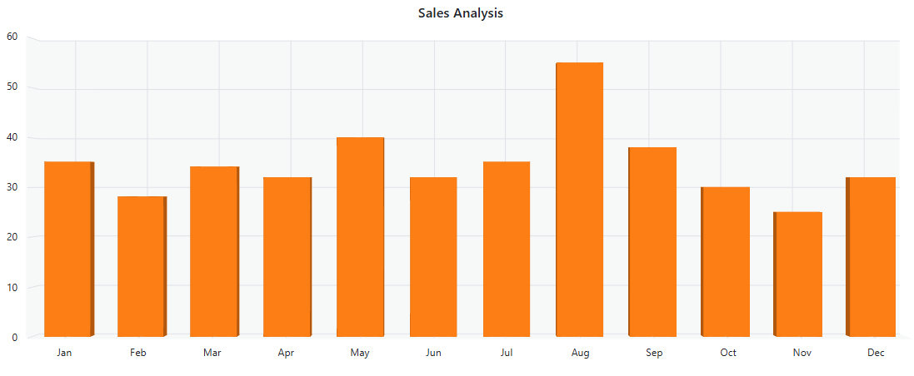

# Getting Started with the Vue 3D Chart Component in Vue 3

This article provides a step-by-step guide to setting up a [Vite](https://vite.dev/) project with JavaScript and integrating the Syncfusion<sup style="font-size:70%">&reg;</sup> Vue 3D Chart component using either the [Composition API](https://vuejs.org/guide/introduction.html#composition-api) or the [Options API](https://vuejs.org/guide/introduction.html#options-api).

The **Composition API** groups related logic into reusable functions and is suitable for larger code bases. The **Options API** organizes component logic with options such as `data`, `methods`, and life cycle hooks. Choose the API that best fits the application's structure and maintainability requirements.

## Prerequisites

Ensure that the development environment meets the [system requirements for Syncfusion Vue UI components](https://ej2.syncfusion.com/vue/documentation/system-requirements).

## Set Up the Vite Project

Create a Vite project using either npm or yarn.

**npm**

```bash
npm create vite@latest my-app -- --template vue
```

**yarn**

```bash
yarn create vite my-app --template vue
```

If Vite prompts you to install dependencies and start the project immediately, select **No**. The Syncfusion package is installed in a later step.

Navigate to the project directory:

```bash
cd my-app
```

Install the project dependencies using either npm or yarn.

**npm**

```bash
npm install
```

**yarn**

```bash
yarn install
```

Now that `my-app` is ready, add Syncfusion<sup style="font-size:70%">&reg;</sup> Vue components to the project.

> **Note:** To create a TypeScript project, use `npm create vite@latest my-app -- --template vue-ts` or `yarn create vite my-app --template vue-ts`.

## Add Syncfusion<sup style="font-size:70%">&reg;</sup> Vue Package

Syncfusion Vue packages are available on [npm](https://www.npmjs.com/search?q=ej2-vue).

Install the `@syncfusion/ej2-vue-charts` package. Use a package release that supports Vue 3 and the Node.js version used by the project.

**npm**

```bash
npm install @syncfusion/ej2-vue-charts
```

**yarn**

```bash
yarn add @syncfusion/ej2-vue-charts
```

> Note: npm v5+ saves packages to `dependencies` by default; `--save` is not required.

## Add Syncfusion<sup style="font-size:70%">&reg;</sup> Vue 3D Chart Component

Follow these steps to add the Vue 3D Chart component using the Composition API or Options API.

**Step 1:** Import and Register the Component

Import the 3D Chart component, its child directives, and the modules required by the example in the `script` section of **src/App.vue**.

The example uses these modules:

- `ColumnSeries3D` renders the 3D column series.
- `Category3D` supports category values on the horizontal axis.

When using the Composition API, alias the imported component and directive names so they match the custom elements used in the template. Components imported in `<script setup>` are available directly in the template.




<script setup>
import { provide } from 'vue';
import {
  Chart3DComponent as EjsChart3d,
  Chart3DSeriesCollectionDirective as EChart3dSeriesCollection,
  Chart3DSeriesDirective as EChart3dSeries,
  ColumnSeries3D,
  Category3D
} from '@syncfusion/ej2-vue-charts';

provide('chart3d', [ColumnSeries3D, Category3D]);
</script>




<script>
import {
  Chart3DComponent,
  Chart3DSeriesCollectionDirective,
  Chart3DSeriesDirective,
  ColumnSeries3D,
  Category3D
} from '@syncfusion/ej2-vue-charts';

export default {
  name: 'App',
  components: {
    'ejs-chart3d': Chart3DComponent,
    'e-chart3d-series-collection': Chart3DSeriesCollectionDirective,
    'e-chart3d-series': Chart3DSeriesDirective
  },
  provide: {
    chart3d: [ColumnSeries3D, Category3D]
  }
};
</script>




> **Note:** The module injection key must be `chart3d`. Register only the modules required by the features used in the application.

**Step 2:** Define the Data and Chart Configuration

Define the chart data and horizontal-axis configuration in the `script` section.

Because the `month` field contains category values, set `primaryXAxis.valueType` to `Category` and register the `Category3D` module.




<script setup>
const seriesData = [
  { month: 'Jan', sales: 35 },
  { month: 'Feb', sales: 28 },
  { month: 'Mar', sales: 34 },
  { month: 'Apr', sales: 32 },
  { month: 'May', sales: 40 },
  { month: 'Jun', sales: 32 },
  { month: 'Jul', sales: 35 },
  { month: 'Aug', sales: 55 },
  { month: 'Sep', sales: 38 },
  { month: 'Oct', sales: 30 },
  { month: 'Nov', sales: 25 },
  { month: 'Dec', sales: 32 }
];

const title = 'Sales Analysis';
const primaryXAxis = {
  valueType: 'Category'
};
</script>




<script>
export default {
  data() {
    return {
      seriesData: [
        { month: 'Jan', sales: 35 },
        { month: 'Feb', sales: 28 },
        { month: 'Mar', sales: 34 },
        { month: 'Apr', sales: 32 },
        { month: 'May', sales: 40 },
        { month: 'Jun', sales: 32 },
        { month: 'Jul', sales: 35 },
        { month: 'Aug', sales: 55 },
        { month: 'Sep', sales: 38 },
        { month: 'Oct', sales: 30 },
        { month: 'Nov', sales: 25 },
        { month: 'Dec', sales: 32 }
      ],
      title: 'Sales Analysis',
      primaryXAxis: {
        valueType: 'Category'
      }
    };
  }
};
</script>




**Step 3:** Define the 3D Chart in the Template

Add the 3D Chart and its series directives to the `template` section of **src/App.vue**.

The series uses the following properties:

- [`dataSource`](https://ej2.syncfusion.com/vue/documentation/api/chart3d/chart3dseriesmodel#datasource) specifies the array of data objects.
- [`xName`](https://ej2.syncfusion.com/vue/documentation/api/chart3d/chart3dseriesmodel#xname) maps the category field.
- [`yName`](https://ej2.syncfusion.com/vue/documentation/api/chart3d/chart3dseriesmodel#yname) maps the numeric field.
- [`type`](https://ej2.syncfusion.com/vue/documentation/api/chart3d/chart3dseriesmodel#type) specifies the series type.




<template>
  <div id="app">
    <ejs-chart3d
      id="container"
      :title="title"
      :primaryXAxis="primaryXAxis"
    >
      <e-chart3d-series-collection>
        <e-chart3d-series
          :dataSource="seriesData"
          type="Column"
          xName="month"
          yName="sales"
        ></e-chart3d-series>
      </e-chart3d-series-collection>
    </ejs-chart3d>
  </div>
</template>




The following examples combine component registration, module injection, data configuration, and template markup.




<template>
  <div id="app">
    <ejs-chart3d
      id="container"
      :title="title"
      :primaryXAxis="primaryXAxis"
    >
      <e-chart3d-series-collection>
        <e-chart3d-series
          :dataSource="seriesData"
          type="Column"
          xName="month"
          yName="sales"
        ></e-chart3d-series>
      </e-chart3d-series-collection>
    </ejs-chart3d>
  </div>
</template>

<script setup>
import { provide } from 'vue';
import {
  Chart3DComponent as EjsChart3d,
  Chart3DSeriesCollectionDirective as EChart3dSeriesCollection,
  Chart3DSeriesDirective as EChart3dSeries,
  ColumnSeries3D,
  Category3D
} from '@syncfusion/ej2-vue-charts';

const seriesData = [
  { month: 'Jan', sales: 35 },
  { month: 'Feb', sales: 28 },
  { month: 'Mar', sales: 34 },
  { month: 'Apr', sales: 32 },
  { month: 'May', sales: 40 },
  { month: 'Jun', sales: 32 },
  { month: 'Jul', sales: 35 },
  { month: 'Aug', sales: 55 },
  { month: 'Sep', sales: 38 },
  { month: 'Oct', sales: 30 },
  { month: 'Nov', sales: 25 },
  { month: 'Dec', sales: 32 }
];

const title = 'Sales Analysis';
const primaryXAxis = {
  valueType: 'Category'
};

provide('chart3d', [ColumnSeries3D, Category3D]);
</script>




<template>
  <div id="app">
    <ejs-chart3d
      id="container"
      :title="title"
      :primaryXAxis="primaryXAxis"
    >
      <e-chart3d-series-collection>
        <e-chart3d-series
          :dataSource="seriesData"
          type="Column"
          xName="month"
          yName="sales"
        ></e-chart3d-series>
      </e-chart3d-series-collection>
    </ejs-chart3d>
  </div>
</template>

<script>
import {
  Chart3DComponent,
  Chart3DSeriesCollectionDirective,
  Chart3DSeriesDirective,
  ColumnSeries3D,
  Category3D
} from '@syncfusion/ej2-vue-charts';

export default {
  name: 'App',
  components: {
    'ejs-chart3d': Chart3DComponent,
    'e-chart3d-series-collection': Chart3DSeriesCollectionDirective,
    'e-chart3d-series': Chart3DSeriesDirective
  },
  provide: {
    chart3d: [ColumnSeries3D, Category3D]
  },
  data() {
    return {
      seriesData: [
        { month: 'Jan', sales: 35 },
        { month: 'Feb', sales: 28 },
        { month: 'Mar', sales: 34 },
        { month: 'Apr', sales: 32 },
        { month: 'May', sales: 40 },
        { month: 'Jun', sales: 32 },
        { month: 'Jul', sales: 35 },
        { month: 'Aug', sales: 55 },
        { month: 'Sep', sales: 38 },
        { month: 'Oct', sales: 30 },
        { month: 'Nov', sales: 25 },
        { month: 'Dec', sales: 32 }
      ],
      title: 'Sales Analysis',
      primaryXAxis: {
        valueType: 'Category'
      }
    };
  }
};
</script>




## Run the Project

Save **src/App.vue**, and then start the development server.

**npm**

```bash
npm run dev
```

**yarn**

```bash
yarn run dev
```

Open the local URL displayed in the terminal, commonly `http://localhost:5173`, and verify that a 3D column chart titled **Sales Analysis** displays monthly sales values from January through December.



> **Sample:** Explore the [Vue 3D Chart getting-started project](https://github.com/SyncfusionExamples/getting-started-with-the-vue-3d-chart-component).

For information about migrating an application from Vue 2 to Vue 3, see the [Vue 3 Migration Guide](https://v3-migration.vuejs.org/).

## Troubleshooting

- **The 3D Chart is not rendered.** Verify that the component and both child directives are imported. In the Options API, also verify that they are registered in `components`. Check the browser console for component, module, data, or licensing errors.
- **The column series is not displayed.** Import `ColumnSeries3D` and add it to the array provided with the exact `chart3d` key.
- **Category values are not displayed correctly.** Set `primaryXAxis.valueType` to `Category`, import `Category3D`, and provide it with the `chart3d` key.
- **No data is displayed.** Verify that `dataSource` contains records, `xName` and `yName` match fields in each data object, and the field mapped by `yName` contains numeric values.
- **An import or runtime error is displayed.** Verify that `@syncfusion/ej2-vue-charts` is installed and that its version supports the project's Vue and Node.js versions.

For additional assistance, refer to the [Vue 3D Chart API documentation](https://ej2.syncfusion.com/vue/documentation/api/chart3d).

## See Also

- [Vue 3D Chart examples](https://ej2.syncfusion.com/vue/demos/#/material3/three-dimension-chart/column.html)
- [Getting Started with Vue UI Components using the Composition API and TypeScript](https://ej2.syncfusion.com/vue/documentation/getting-started/vue-3-ts-composition)
- [Getting Started with Vue UI Components using the Options API and TypeScript](https://ej2.syncfusion.com/vue/documentation/getting-started/vue-3-ts-options)
