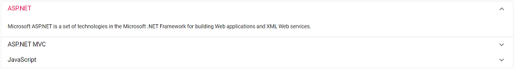

# Getting Started with Syncfusion Accordion Component in Vue 3

This section explains how to use Accordion component in Vue 3 application.

## Prerequisites

[System requirements for Syncfusion Vue UI components](https://ej2.syncfusion.com/vue/documentation/system-requirements/)

## Creating Vue application using Vue CLI

The easiest way to create a Vue application is to use the [`Vue CLI`](https://github.com/vuejs/vue-cli). Vue CLI versions above [`4.5.0`](https://v3.vuejs.org/guide/migration/introduction.html#vue-cli) are mandatory for creating applications using Vue 3. Use the following command to uninstall older versions of the Vue CLI.

```bash
npm uninstall vue-cli -g
```

Use the following commands to install the latest version of Vue CLI.

```bash
npm install -g @vue/cli
npm install -g @vue/cli-init
```

Create a new project using the command below.

```bash
vue create quickstart
cd quickstart

```

Initiating a new project prompts us to choose the type of project to be used for the current application. Select the option `Default (Vue 3)` from the menu.


## Adding Syncfusion Accordion package in the application

All the available Essential JS 2 packages are published in [`npmjs.com`](https://www.npmjs.com/~syncfusionorg) registry.

Install the `Accordion` component by using the below npm command.

```bash
npm install @syncfusion/ej2-vue-navigations --save
```

## Adding CSS reference for Syncfusion Vue Accordion component

Import the needed css styles for the Accordion component along with dependency styles in the `<style>` section of the `src/App.vue` file as follows.

```
<style>
    @import "../node_modules/@syncfusion/ej2-base/styles/material.css";
    @import "../node_modules/@syncfusion/ej2-vue-navigations/styles/material.css";
</style>
```

## Adding Syncfusion Vue Accordion in the application

You have completed all the necessary configurations needed for rendering the Syncfusion Vue component. Now, you are going to add the Accordion component using following steps.

1.Import the Accordion component in the `<script>` section of the `src/App.vue` file.

     ```
     <script>
       import { AccordionComponent, AccordionItemDirective, AccordionItemsDirective } from "@syncfusion/ej2-vue-navigations";
      </script>
     ```

2.Register the Accordion component along with the required child directives which are used in this example. Find the list of child directives and the tag names that can be used in the Accordion component in the following table.
  
     | Directive Name            | Tag Name           |
     | ------------------------- | ------------------ |
     | `AccordionComponent`      | `ejs-accordion`    |
     | `AccordionItemsDirective` | `e-accordionitems` |
     | `AccordionItemDirective`  | `e-accordionitem`  |

    ```js
        import { AccordionComponent, AccordionItemDirective, AccordionItemsDirective } from "@syncfusion/ej2-vue-navigations";
        //Component registeration
        export default {
            name: "App",
            components: {
            "ejs-accordion": AccordionComponent,
            "e-accordionitems": AccordionItemsDirective,
            "e-accordionitem": AccordionItemDirective,
            }
        }
    ```

   In the above code snippet, you have registered Accordion and its child directives. AccordionItem Directive is  used for defining the accordion item.

3.Add the component definition in template section.

    ```
    <template>
        <ejs-accordion>
            <e-accordionitems>
                <e-accordionitem
                expanded="true"
                header="ASP.NET"
                content="Microsoft ASP.NET is a set of technologies in the Microsoft .NET Framework for building Web applications and XML Web services."
                ></e-accordionitem>
                <e-accordionitem
                header="ASP.NET MVC"
                content="The Model-View-Controller (MVC) architectural pattern separates an application into three main components: the model, the view, and the controller."
                ></e-accordionitem>
                <e-accordionitem
                header="JavaScript"
                content="JavaScript (JS) is an interpreted computer programming language.It was originally implemented as part of web browsers so that client-side scripts could interact with the user, control the browser, communicate asynchronously, and alter the document content that was displayed."
                ></e-accordionitem>
            </e-accordionitems>
        </ejs-accordion>
    </template>
    ```

4.Summarizing the above steps, update the `src/App.vue` file with following code.

    ```
    <template>
        <ejs-accordion>
            <e-accordionitems>
                <e-accordionitem
                    expanded="true"
                    header="ASP.NET"
                    content="Microsoft ASP.NET is a set of technologies in the Microsoft .NET Framework for building Web applications and XML Web services."
                ></e-accordionitem>
                <e-accordionitem
                    header="ASP.NET MVC"
                    content="The Model-View-Controller (MVC) architectural pattern separates an application into three main components: the model, the view, and the controller."
                ></e-accordionitem>
                <e-accordionitem
                    header="JavaScript"
                    content="JavaScript (JS) is an interpreted computer programming language.It was originally implemented as part of web browsers so that client-side scripts could interact with the user, control the browser, communicate asynchronously, and alter the document content that was displayed."
                ></e-accordionitem>
            </e-accordionitems>
        </ejs-accordion>
    </template>

    <script>
    import {AccordionComponent, AccordionItemDirective, AccordionItemsDirective} from "@syncfusion/ej2-vue-navigations";

        //Component registeration
    export default {
        name: "App",
        components: {
            "ejs-accordion": AccordionComponent,
            "e-accordionitems": AccordionItemsDirective,
            "e-accordionitem": AccordionItemDirective,
        }
    }
    </script>
    <style>
        @import "../node_modules/@syncfusion/ej2-base/styles/material.css";
        @import "../node_modules/@syncfusion/ej2-vue-navigations/styles/material.css";
    </style>
    ```

## Running the application

Run the application using the following command.

```bash

npm run serve

```

Web server will be initiated, Open the quick start app in the browser at port [`localhost:8080`](http://localhost:8080/).



Refer the sample [Vue 3 accordion getting started](https://github.com/SyncfusionExamples/vue3-accordion-getting-started)
