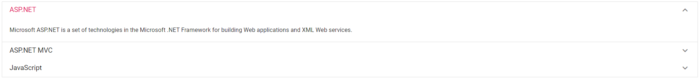

# Getting Started with Vue Accordion in Vue 3

This article provides a step-by-step guide for setting up a [Vite](https://vitejs.dev/) project with a JavaScript environment and integrating the Syncfusion<sup style="font-size:70%">&reg;</sup> Vue Accordion component using the [Composition API](https://vuejs.org/guide/introduction.html#composition-api) / [Options API](https://vuejs.org/guide/introduction.html#options-api).

The `Composition API` is a new feature introduced in Vue.js 3 that provides an alternative way to organize and reuse component logic. It allows developers to write components as functions that use smaller, reusable functions called composition functions to manage their properties and behavior.

The `Options API` is the traditional way of writing Vue.js components, where the component logic is organized into a series of options that define the component's properties and behavior. These options include data, methods, computed properties, watchers, lifecycle hooks, and more.

## Prerequisites

[System requirements for Syncfusion<sup style="font-size:70%">&reg;</sup> Vue UI components](https://ej2.syncfusion.com/vue/documentation/system-requirements)

## Setup for local development

Easily set up a Vue 3 application using [Vite](https://vitejs.dev), which provides a faster development environment, smaller bundle sizes, and optimized builds compared to traditional tools. For detailed steps, refer to the Vite [installation instructions](https://vitejs.dev/guide). Vite sets up your environment using JavaScript and optimizes your application for production.

> **Note:** To create a Vue application using `create-vue`, refer to this [documentation](https://ej2.syncfusion.com/vue/documentation/getting-started) for more details.

To create a new Vue 3 application, run one of the following commands based on your preferred language:

***Vue with JavaScript***

```bash
npm create vite@latest my-app -- --template vue
```

***Vue with TypeScript***

```bash
npm create vite@latest my-app -- --template vue-ts
```

During the setup process, the CLI will prompt you for a few configuration options. Select the following:

- **Which linter to use?** → **Default ([Vue 3] babel, eslint)**
- **Install with npm and start now?** → **Yes**

Selecting **Yes** automatically installs the project dependencies and starts the development server.

After verifying that the application starts successfully, terminate the development server in the terminal and proceed to the next step.

Then, navigate to the project directory:

```bash
cd my-app
```

## Add Vue Accordion packages

To install the Accordion packages, use the following command:

```bash
npm install @syncfusion/ej2-vue-navigations
```

or

```bash
yarn add @syncfusion/ej2-vue-navigations
```

## Adding CSS reference

Themes for Syncfusion<sup style="font-size:70%">&reg;</sup> components can be applied using CSS files provided through [npm theme packages](https://www.npmjs.com/package/@syncfusion/ej2-material3-theme). For available themes, refer to the [Themes](https://ej2.syncfusion.com/vue/documentation/appearance/theme) documentation.
 
Install the **Material 3** theme package using the following command:



 
npm install @syncfusion/ej2-material3-theme --save
 


 
Then add the following CSS reference to the **src/App.vue** file:




<style>
  @import "../node_modules/@syncfusion/ej2-material3-theme/styles/accordion/index.css";
</style>




## Adding Vue Accordion  component

The Accordion code should be added in the **src/App.vue** file.



<template>
  <ejs-accordion>
    <e-accordionitems>
      <e-accordionitem expanded="true" header="ASP.NET"
        content="Microsoft ASP.NET is a set of technologies in the Microsoft .NET Framework for building Web applications and XML Web services."></e-accordionitem>
      <e-accordionitem header="ASP.NET MVC"
        content="The Model-View-Controller (MVC) architectural pattern separates an application into three main components: the model, the view, and the controller."></e-accordionitem>
      <e-accordionitem header="JavaScript"
        content="JavaScript (JS) is an interpreted computer programming language.It was originally implemented as part of web browsers so that client-side scripts could interact with the user, control the browser, communicate asynchronously, and alter the document content that was displayed."></e-accordionitem>
    </e-accordionitems>
  </ejs-accordion>
</template>

<script setup>
import {
  AccordionComponent as EjsAccordion, 
  AccordionItemsDirective as EAccordionitems, 
  AccordionItemDirective as EAccordionitem
} from "@syncfusion/ej2-vue-navigations";
</script>

<style>
  @import "../node_modules/@syncfusion/ej2-material3-theme/styles/accordion/index.css";
</style>



<template>
  <ejs-accordion>
    <e-accordionitems>
      <e-accordionitem expanded="true" header="ASP.NET"
        content="Microsoft ASP.NET is a set of technologies in the Microsoft .NET Framework for building Web applications and XML Web services."></e-accordionitem>
      <e-accordionitem header="ASP.NET MVC"
        content="The Model-View-Controller (MVC) architectural pattern separates an application into three main components: the model, the view, and the controller."></e-accordionitem>
      <e-accordionitem header="JavaScript"
        content="JavaScript (JS) is an interpreted computer programming language.It was originally implemented as part of web browsers so that client-side scripts could interact with the user, control the browser, communicate asynchronously, and alter the document content that was displayed."></e-accordionitem>
    </e-accordionitems>
  </ejs-accordion>
</template>

<script>
import {
  AccordionComponent,
  AccordionItemsDirective,
  AccordionItemDirective
} from "@syncfusion/ej2-vue-navigations";

export default {
  name: "App",
  components: {
    "ejs-accordion": AccordionComponent,
    "e-accordionitems": AccordionItemsDirective,
    "e-accordionitem": AccordionItemDirective
  }
}
</script>

<style>
  @import "../node_modules/@syncfusion/ej2-material3-theme/styles/accordion/index.css";
</style>



## Run the project

To run the project, use the following command:

```bash
npm run dev
```

or

```bash
yarn run dev
```



Refer the sample [Vue 3 using Composition API Accordion getting started](https://github.com/SyncfusionExamples/vue3-accordion-getting-started)

## See also

* [Getting Started with Vue UI Components with the Nuxt Framework](https://ej2.syncfusion.com/vue/documentation/getting-started/nuxt-3)
* [Getting Started with Vue UI Components with Vite and PNPM](https://ej2.syncfusion.com/vue/documentation/getting-started/pnpm)
* [Getting started with testing Vue UI components in the Vitest project](https://ej2.syncfusion.com/vue/documentation/getting-started/vitest)
* [Getting Started with Syncfusion<sup style="font-size:70%">&reg;</sup> Vue UI Components using direct scripts](https://ej2.syncfusion.com/vue/documentation/getting-started/direct-scripts)