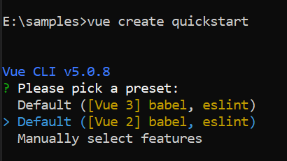

# Getting Started with the Vue Accordion Component in Vue 2

This article provides a step-by-step guide for setting up a Vue 2 project using [Vue CLI](https://cli.vuejs.org) and integrating the Syncfusion<sup style="font-size:70%">&reg;</sup> Vue Accordion component using either the [Composition API](https://vuejs.org/guide/introduction.html#composition-api) or the [Options API](https://vuejs.org/guide/introduction.html#options-api).

To quickly get started with the Vue Accordion, watch this video:



## Prerequisites

Refer to the [system requirements for Syncfusion<sup style="font-size:70%">&reg;</sup> Vue UI components](https://ej2.syncfusion.com/vue/documentation/system-requirements).

## Dependencies

The following dependencies are required to use the Accordion component in your application:

```javascript
|-- @syncfusion/ej2-vue-navigations
  |-- @syncfusion/ej2-base
  |-- @syncfusion/ej2-vue-base
  |-- @syncfusion/ej2-navigations
    |-- @syncfusion/ej2-inputs
    |-- @syncfusion/ej2-buttons
```

## Set Up the Vue 2 Project

To generate a Vue 2 project using Vue CLI, use the [vue create](https://cli.vuejs.org#getting-started) command. Follow these steps to install Vue CLI and create a new project:

```bash
npm install -g @vue/cli
vue create quickstart
cd quickstart
npm run serve
```

or

```bash
yarn global add @vue/cli
vue create quickstart
cd quickstart
yarn run serve
```

When creating a new project, choose the option `Default ([Vue 2] babel, eslint)` from the menu.



Once the `quickstart` project is set up with default settings, proceed to add Syncfusion<sup style="font-size:70%">&reg;</sup> components to the project.

## Adding Syncfusion<sup style="font-size:70%">&reg;</sup> Packages

All available Essential<sup style="font-size:70%">&reg;</sup> JS 2 packages are published in the [`npmjs.com`](https://www.npmjs.com/~syncfusionorg) registry. You can choose the component that you want to install. For this application, we are going to use the Accordion component.

To install the Accordion component, use the following command:

```bash
npm install @syncfusion/ej2-vue-navigations --save
```
or

```bash
yarn add @syncfusion/ej2-vue-navigations
```

## Import Syncfusion<sup style="font-size:70%">&reg;</sup> CSS styles

Add the Accordion component's styles in the `<style>` section of the `App.vue` file.

In this article, the `Material3` theme is applied using CSS styles, which are available in the installed packages. The necessary `Material3` CSS styles for the Accordion component and its dependents should be imported into the `<style>` section of **src/App.vue** file.




<style>
  @import "../node_modules/@syncfusion/ej2-base/styles/material3.css";
  @import "../node_modules/@syncfusion/ej2-vue-navigations/styles/material3.css";
</style>




## Add Syncfusion<sup style="font-size:70%">&reg;</sup> Vue component

Follow the steps below to add the Vue Accordion component using the `Composition API` or `Options API`:

1. Import and register the Accordion component in the `script` section of the **src/App.vue** file. If you are using the `Composition API`, add the `setup` attribute to the `script` tag to indicate that Vue will be using the `Composition API`.




<script setup>
import {
  AccordionComponent as EjsAccordion, AccordionItemsDirective as EAccordionitems, AccordionItemDirective as EAccordionitem
} from "@syncfusion/ej2-vue-navigations";
</script>




<script>
import { AccordionComponent, AccordionItemDirective, AccordionItemsDirective } from '@syncfusion/ej2-vue-navigations';

export default {
  name: 'app',
  components: {
    'ejs-accordion': AccordionComponent
  },
}
</script>




2. Add the EJ2 Vue Accordion using `<ejs-accordion>` to the `<template>` section of the `App.vue` file in the `src` directory.




<template>
    <div id="app">
    <ejs-accordion>
            <e-accordionitems>
        <e-accordionitem expanded='true' header='ASP.NET' content='Microsoft ASP.NET is a set of technologies in the Microsoft .NET Framework for building Web applications and XML Web services.'></e-accordionitem>
        <e-accordionitem header='ASP.NET MVC' content='The Model-View-Controller (MVC) architectural pattern separates an application into three main components: the model, the view, and the controller.'></e-accordionitem>
        <e-accordionitem header='JavaScript' content='JavaScript (JS) is an interpreted computer programming language.It was originally implemented as part of web browsers so that client-side scripts could interact with the user, control the browser, communicate asynchronously, and alter the document content that was displayed.'></e-accordionitem>
      </e-accordionitems>
    </ejs-accordion>
  </div>
</template>




## Running the Application

Run the following command in the console to build your application and open it in the browser:

```bash
npm run dev
```









        


## Initialize the Accordion using HTML elements

The Accordion component can be rendered based on the given HTML element using `<ejs-accordion>`. Follow the structure below to render the Accordion inside the `<ejs-accordion>` tag:

```
  <ejs-accordion>   --> Root Accordion Element
       <div>      --> Accordion Item Container
            <div>   --> Accordion Header Container
                <div> </div> --> Accordion Header
            </div>
            <div>  --> Accordion Panel Container
                <div> </div> --> Accordion Content
             </div>
        </div>
  </ejs-accordion>
```









        


N> You can refer to our [Vue Accordion](https://www.syncfusion.com/vue-components/vue-accordion) feature tour page for its groundbreaking feature representations. You can also explore our [Vue Accordion Component example](https://ej2.syncfusion.com/vue/demos/#/material/accordion/default.html) that shows how to render the Accordion in Vue.
