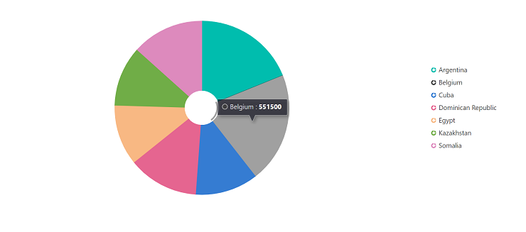

# Getting Started with the Vue Accumulation Chart Component in Vue 3

This article provides a step-by-step guide for setting up a [Vite](https://vitejs.dev/) project with JavaScript and integrating the Syncfusion<sup style="font-size:70%">&reg;</sup> Vue Accumulation Chart component using either the [Composition API](https://vuejs.org/guide/introduction.html#composition-api) or the [Options API](https://vuejs.org/guide/introduction.html#options-api).

The Composition API organizes related logic into reusable composition functions and is recommended for larger or composition-oriented code bases. The Options API organizes component logic with `data`, `methods`, and life cycle hooks and may be preferable for smaller components or teams familiar with Vue 2 patterns.

## Prerequisites

[System requirements for Syncfusion<sup style="font-size:70%">&reg;</sup> Vue UI components](https://ej2.syncfusion.com/vue/documentation/system-requirements)

## Set up the Vite project

A recommended approach for beginning with Vue is to scaffold a project using [Vite](https://vitejs.dev/). To create a new Vite project, use one of the commands that are specific to either NPM or Yarn.

```bash
npm create vite@latest
```

or

```bash
yarn create vite
```

Use the interactive setup and follow these steps:

1. Define the project name. For this article, use `my-project`.
```bash
? Project name: » my-project
```

2. Select `Vue` as the framework to create a Vue 3 project.

```bash
? Select a framework: » - Use arrow-keys. Return to submit.
Vanilla
> Vue
  React
  Preact
  Lit
  Svelte
  Others
```

3. Choose `JavaScript` as the project variant.

```bash
? Select a variant: » - Use arrow-keys. Return to submit.
> JavaScript
  TypeScript
  Customize with create-vue ↗
  Nuxt ↗
```

4. After creating the project, install dependencies by running:
```bash
cd my-project
npm install
```

or

```bash
cd my-project
yarn install
```

Now that `my-project` is ready to run with default settings, let's add Syncfusion<sup style="font-size:70%">&reg;</sup> components to the project.

## Add Syncfusion<sup style="font-size:70%">&reg;</sup> Vue packages

Syncfusion<sup style="font-size:70%">&reg;</sup> Vue component packages are available at [npmjs.com](https://www.npmjs.com/search?q=ej2-vue). To use Syncfusion<sup style="font-size:70%">&reg;</sup> Vue components in the project, install the corresponding npm package.

This article uses the [Vue Accumulation Chart component](https://www.syncfusion.com/vue-components/vue-charts) as an example. To use the Vue Accumulation Chart component in the project, the `@syncfusion/ej2-vue-charts` package needs to be installed using the following command:

```bash
npm install @syncfusion/ej2-vue-charts --save
```

or

```bash
yarn add @syncfusion/ej2-vue-charts
```

## Add Syncfusion<sup style="font-size:70%">&reg;</sup> Vue component

Follow the below steps to add the Vue Accumulation Chart component using `Composition API` or `Options API`:

1.First, import and register the Accumulation Chart component and its child directives in the `script` section of the **src/App.vue** file. If you are using the `Composition API`, you should add the `setup` attribute to the `script` tag to indicate that Vue will be using the `Composition API`.




<script setup>
import { AccumulationChartComponent as EjsAccumulationchart, AccumulationSeriesCollectionDirective as EAccumulationSeriesCollection, AccumulationSeriesDirective as EAccumulationSeries, AccumulationLegend,
PieSeries, AccumulationTooltip } from "@syncfusion/ej2-vue-charts";
</script>




<script>
import { AccumulationChartComponent, AccumulationSeriesCollectionDirective, AccumulationSeriesDirective, AccumulationLegend,
PieSeries, AccumulationTooltip } from "@syncfusion/ej2-vue-charts";
//Component registration
export default {
  name: "App",
  components: {
    "ejs-accumulationchart": AccumulationChartComponent,
    "e-accumulation-series-collection": AccumulationSeriesCollectionDirective,
    "e-accumulation-series":  AccumulationSeriesDirective
  }
}
</script>




2. In the `template` section, define the Accumulation Chart component with the [`dataSource`](https://ej2.syncfusion.com/vue/documentation/api/accumulation-chart#datasource) property.




<template>
    <ejs-accumulationchart id="container" :legendSettings="legendSettings" :tooltip="tooltip">
        <e-accumulation-series-collection>
            <e-accumulation-series :dataSource='data' xName='x' yName='y' innerRadius="20%"> </e-accumulation-series>
        </e-accumulation-series-collection>
    </ejs-accumulationchart>
</template>




3.Declare the values for the `dataSource` property in the `script` section.




<script setup>
const data = [
    { x: 'Argentina', y: 505370 },
    { x: 'Belgium', y: 551500 },
    { x: 'Cuba', y: 312685 },
    { x: 'Dominican Republic', y: 350000 },
    { x: 'Egypt', y: 301000 },
    { x: 'Kazakhstan', y: 300000 },
    { x: 'Somalia', y: 357022 }
];
const legendSettings = { visible: true };
const tooltip = { enable: true };
</script>




<script>
data() {
    return {
        data: [
            { x: 'Argentina', y: 505370 },
            { x: 'Belgium', y: 551500 },
            { x: 'Cuba', y: 312685 },
            { x: 'Dominican Republic', y: 350000 },
            { x: 'Egypt', y: 301000 },
            { x: 'Kazakhstan', y: 300000 },
            { x: 'Somalia', y: 357022 }
        ],
        legendSettings: { visible: true },
        tooltip: {
            enable: true
        }
    };
}
</script>




Here is the summarized code for the above steps in the **src/App.vue** file:




<template>
    <ejs-accumulationchart id="container" :legendSettings="legendSettings" :tooltip="tooltip">
        <e-accumulation-series-collection>
            <e-accumulation-series :dataSource='data' xName='x' yName='y' innerRadius="20%"> </e-accumulation-series>
        </e-accumulation-series-collection>
    </ejs-accumulationchart>
</template>

<script setup>
import { provide } from 'vue';
import { AccumulationChartComponent as EjsAccumulationchart, AccumulationSeriesCollectionDirective as EAccumulationSeriesCollection, AccumulationSeriesDirective as EAccumulationSeries, AccumulationLegend,
PieSeries, AccumulationTooltip } from "@syncfusion/ej2-vue-charts";

const data = [
    { x: 'Argentina', y: 505370 },
    { x: 'Belgium', y: 551500 },
    { x: 'Cuba', y: 312685 },
    { x: 'Dominican Republic', y: 350000 },
    { x: 'Egypt', y: 301000 },
    { x: 'Kazakhstan', y: 300000 },
    { x: 'Somalia', y: 357022 }
];
const legendSettings = { visible: true };
const tooltip = { enable: true };
const accumulationchart = [PieSeries, AccumulationLegend, AccumulationTooltip];
provide('accumulationchart', accumulationchart);
</script>




<template>
    <ejs-accumulationchart id="container" :legendSettings="legendSettings" :tooltip="tooltip">
        <e-accumulation-series-collection>
            <e-accumulation-series :dataSource='data' xName='x' yName='y' innerRadius="20%"> </e-accumulation-series>
        </e-accumulation-series-collection>
    </ejs-accumulationchart>
</template>

<script>
import { AccumulationChartComponent, AccumulationSeriesCollectionDirective, AccumulationSeriesDirective, AccumulationLegend,
PieSeries, AccumulationTooltip } from "@syncfusion/ej2-vue-charts";
//Component registration
export default {
  name: "App",
  components: {
    "ejs-accumulationchart": AccumulationChartComponent,
    "e-accumulation-series-collection": AccumulationSeriesCollectionDirective,
    "e-accumulation-series":  AccumulationSeriesDirective
  },
    data() {
    return {
        data: [
            { x: 'Argentina', y: 505370 },
            { x: 'Belgium', y: 551500 },
            { x: 'Cuba', y: 312685 },
            { x: 'Dominican Republic', y: 350000 },
            { x: 'Egypt', y: 301000 },
            { x: 'Kazakhstan', y: 300000 },
            { x: 'Somalia', y: 357022 }
        ],
        legendSettings: { visible: true },
        tooltip: {
            enable: true
        },
    };
 },
    provide: {
        accumulationchart: [ PieSeries, AccumulationLegend, AccumulationTooltip ]
    },
};
</script>




## Run the project

To run the project, use the following command:

```bash
npm run dev
```

or

```bash
yarn run dev
```


The output will appear as follows:



## Verify the chart

After starting the development server, confirm the chart renders correctly:

- Start the development server with `npm run dev` or `yarn run dev`.
- Open the project URL shown in the terminal (commonly `http://localhost:5173`) and verify the chart displays with legend and tooltip.
- If the chart does not render, open the browser console and check for errors related to missing modules, incorrect imports, or incompatible Vue versions.

## Troubleshooting (common issues)

- Chart not rendering: ensure chart modules (for example, `PieSeries`, `AccumulationLegend`, `AccumulationTooltip`) are provided via `provide` (Composition API) or `provide`/`provide:` (Options API).
- Wrong package version: confirm `@syncfusion/ej2-vue-charts` matches the project's Vue version.
- Missing child directives: ensure `AccumulationSeriesCollectionDirective` and `AccumulationSeriesDirective` are registered when using directives.
- Console errors: inspect import paths and verify dependencies are installed.

> **Sample**: [vue-3-accumulation-chart-getting-started](https://github.com/SyncfusionExamples/vue3-accumulation-chart-getting-started).
For migrating from Vue 2 to Vue 3, refer to the `migration` documentation.

## See also

* [Getting Started with Vue UI Components using Composition API and TypeScript](../getting-started/vue-3-ts-composition.md)
* [Getting Started with Vue UI Components using Options API and TypeScript](../getting-started/vue-3-ts-options.md)