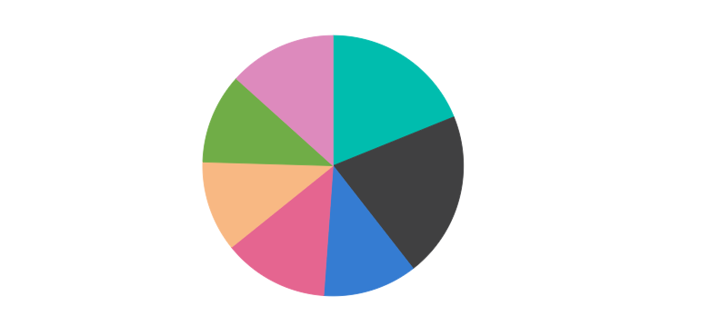

# Getting Started with the Vue Accumulation chart Component in Vue 3

This article provides a step-by-step guide for setting up a [Vite](https://vitejs.dev/) project with JavaScript and integrating the Syncfusion<sup style="font-size:70%">&reg;</sup> Vue Accumulation Chart component using either the [Composition API](https://vuejs.org/guide/introduction.html#composition-api) or the [Options API](https://vuejs.org/guide/introduction.html#options-api).

The Composition API organizes related logic into reusable composition functions and is recommended for larger or composition-oriented code bases. The Options API organizes component logic with `data`, `methods`, and life cycle hooks and may be preferable for smaller components or teams familiar with Vue 2 patterns.

## Prerequisites

Ensure that the development environment meets the required criteria listed in [System requirements for Syncfusion<sup style="font-size:70%">&reg;</sup> Vue UI components](https://ej2.syncfusion.com/vue/documentation/system-requirements).

## Set Up the Vite Project

A recommended approach for beginning with Vue is to scaffold a project using [Vite](https://vitejs.dev/). To create a new Vite project, use one of the commands that are specific to either NPM or Yarn.

### Using npm

```bash
npm create vite@latest
```

### Using Yarn

```bash
yarn create vite
```

Use the interactive setup and follow these steps:

**Step 1:** Define the project name. For this article, use `my-project`.
```bash
? Project name: » my-project
```

**Step 2:** Select `Vue` as the framework to create a Vue 3 project.

```bash
? Select a framework: » - Use arrow-keys. Return to submit.
Vanilla
> Vue
  React
  Preact
  Lit
  Svelte
  Others
```

**Step 3:** Choose `JavaScript` as the project variant.

```bash
? Select a variant: » - Use arrow-keys. Return to submit.
> JavaScript
  TypeScript
  Customize with create-vue ↗
  Nuxt ↗
```

**Step 4:** After creating the project, install dependencies by running:

Once the project is created, navigate to the project directory:

```bash
cd my-project
```

Install the project dependencies using either npm or Yarn:

### Using npm

```bash
npm install
```

### Using Yarn

```bash
yarn install
```

Now that `my-project` is ready to run with default settings, let's add Syncfusion<sup style="font-size:70%">&reg;</sup> components to the project.

## Add Syncfusion<sup style="font-size:70%">&reg;</sup> Vue Packages

Syncfusion<sup style="font-size:70%">&reg;</sup> Vue component packages are available at [npmjs.com](https://www.npmjs.com/search?q=ej2-vue). To use Syncfusion<sup style="font-size:70%">&reg;</sup> Vue components in the project, install the corresponding npm package.

This article uses the [Vue Accumulation Chart component](https://www.syncfusion.com/vue-components/vue-charts) as an example. To use the Vue Accumulation Chart component in the project, install the `@syncfusion/ej2-vue-charts` package using either npm or Yarn:

### Using npm

```bash
npm install @syncfusion/ej2-vue-charts
```

### Using Yarn

```bash
yarn add @syncfusion/ej2-vue-charts
```

> Note: npm v5+ saves packages to `dependencies` by default; `--save` is not required.

## Add Syncfusion<sup style="font-size:70%">&reg;</sup> Vue Accumulation Chart Component

Follow the steps below to add the Vue Accumulation Chart component using `Composition API` or `Options API`:

**Step 1:** First, import and register the Accumulation Chart component and its child directives in the `script` section of the **src/App.vue** file. If you are using the `Composition API`, you should add the `setup` attribute to the `script` tag to indicate that Vue will be using the `Composition API`.




<script setup>
import { provide } from 'vue';
import { AccumulationChartComponent as EjsAccumulationchart, AccumulationSeriesCollectionDirective as EAccumulationSeriesCollection, AccumulationSeriesDirective as EAccumulationSeries,
PieSeries } from "@syncfusion/ej2-vue-charts";

let accumulationchart = [PieSeries];
provide('accumulationchart', accumulationchart);
</script>




<script>
import { AccumulationChartComponent, AccumulationSeriesCollectionDirective, AccumulationSeriesDirective,
PieSeries } from "@syncfusion/ej2-vue-charts";
// Register Chart component and its child directives
export default {
  name: "App",
  components: {
    "ejs-accumulationchart": AccumulationChartComponent,
    "e-accumulation-series-collection": AccumulationSeriesCollectionDirective,
    "e-accumulation-series":  AccumulationSeriesDirective
  }
}
</script>





**Step 2:** Declare the values for the `dataSource` property in the `script` section.




<script setup>
let data = [
    { x: 'Argentina', y: 505370 },
    { x: 'Belgium', y: 551500 },
    { x: 'Cuba', y: 312685 },
    { x: 'Dominican Republic', y: 350000 },
    { x: 'Egypt', y: 301000 },
    { x: 'Kazakhstan', y: 300000 },
    { x: 'Somalia', y: 357022 }
];
</script>




<script>
data() {
    return {
        data: [
            { x: 'Argentina', y: 505370 },
            { x: 'Belgium', y: 551500 },
            { x: 'Cuba', y: 312685 },
            { x: 'Dominican Republic', y: 350000 },
            { x: 'Egypt', y: 301000 },
            { x: 'Kazakhstan', y: 300000 },
            { x: 'Somalia', y: 357022 }
        ],
    };
}
</script>




**Step 3:** In the `template` section, define the Accumulation Chart component with the [`dataSource`](https://ej2.syncfusion.com/vue/documentation/api/accumulation-chart/accumulationseries#datasource) property.




<template>
    <ejs-accumulationchart id="container">
        <e-accumulation-series-collection>
            <e-accumulation-series :dataSource='data' xName='x' yName='y'> </e-accumulation-series>
        </e-accumulation-series-collection>
    </ejs-accumulationchart>
</template>




Here is the summarized code for the above steps in the **src/App.vue** file:




<template>
    <ejs-accumulationchart id="container">
        <e-accumulation-series-collection>
            <e-accumulation-series :dataSource='data' xName='x' yName='y'> </e-accumulation-series>
        </e-accumulation-series-collection>
    </ejs-accumulationchart>
</template>

<script setup>
import { provide } from 'vue';
import { AccumulationChartComponent as EjsAccumulationchart, AccumulationSeriesCollectionDirective as EAccumulationSeriesCollection, AccumulationSeriesDirective as EAccumulationSeries,
PieSeries } from "@syncfusion/ej2-vue-charts";

let data = [
    { x: 'Argentina', y: 505370 },
    { x: 'Belgium', y: 551500 },
    { x: 'Cuba', y: 312685 },
    { x: 'Dominican Republic', y: 350000 },
    { x: 'Egypt', y: 301000 },
    { x: 'Kazakhstan', y: 300000 },
    { x: 'Somalia', y: 357022 }
];
let accumulationchart = [PieSeries];
provide('accumulationchart', accumulationchart);
</script>




<template>
    <ejs-accumulationchart id="container">
        <e-accumulation-series-collection>
            <e-accumulation-series :dataSource='data' xName='x' yName='y'> </e-accumulation-series>
        </e-accumulation-series-collection>
    </ejs-accumulationchart>
</template>

<script>
import { AccumulationChartComponent, AccumulationSeriesCollectionDirective, AccumulationSeriesDirective, PieSeries } from "@syncfusion/ej2-vue-charts";
//Component registration
export default {
  name: "App",
  components: {
    "ejs-accumulationchart": AccumulationChartComponent,
    "e-accumulation-series-collection": AccumulationSeriesCollectionDirective,
    "e-accumulation-series":  AccumulationSeriesDirective
  },
    data() {
    return {
        data: [
            { x: 'Argentina', y: 505370 },
            { x: 'Belgium', y: 551500 },
            { x: 'Cuba', y: 312685 },
            { x: 'Dominican Republic', y: 350000 },
            { x: 'Egypt', y: 301000 },
            { x: 'Kazakhstan', y: 300000 },
            { x: 'Somalia', y: 357022 }
        ],
    };
    },
    provide: {
        accumulationchart: [ PieSeries ]
    },
};
</script>




## Run the Project

To run the project, use either npm or Yarn:

### Using npm

```bash
npm run dev
```

### Using Yarn

```bash
yarn run dev
```

- Open the project URL shown in the terminal (commonly `http://localhost:5173`) and verify the accumulation chart displays correctly.

The output will appear as follows:




## Troubleshooting (Common Issues)

- **Chart not rendering**: Ensure that the required chart modules, such as `PieSeries`, are injected using `provide()` in the Composition API or the `provide` option in the Options API.

- **Incorrect package version**: Verify that the installed `@syncfusion/ej2-vue-charts` package is compatible with the Vue version used in your project.

- **Missing child directives**: When using accumulation series directives, ensure that `AccumulationSeriesCollectionDirective` and `AccumulationSeriesDirective` are imported and registered correctly.

- **Console errors**: Check the browser console for import or runtime errors, and verify that the required dependencies are installed correctly.


> **Sample**: You can explore the complete sample project in the [`vue-3-accumulation-chart-getting-started`](https://github.com/SyncfusionExamples/vue3-accumulation-chart-getting-started).
For migrating from Vue 2 to Vue 3, refer to the [Vue 3 Migration Guide](https://v3-migration.vuejs.org/).

## See Also

* [Getting Started with Vue UI Components using Composition API and TypeScript](../getting-started/vue-3-ts-composition.md)
* [Getting Started with Vue UI Components using Options API and TypeScript](../getting-started/vue-3-ts-options.md)