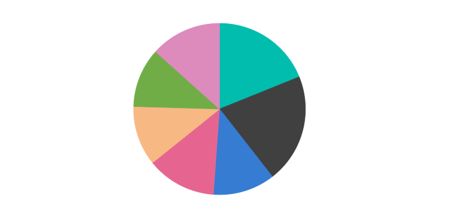

# Getting Started with the Vue Accumulation Chart Component in Vue 3

This article provides a step-by-step guide to setting up a [`Vite`](https://vitejs.dev) project using JavaScript and integrating the Syncfusion<sup style="font-size:70%">&reg;</sup> Vue Accumulation Chart component with either the [`Composition API`](https://vuejs.org/guide/introduction.html#composition-api) or the [`Options API`](https://vuejs.org/guide/introduction.html#options-api).

The **Composition API** groups related logic into reusable functions and is recommended for larger, composition-friendly code bases. The **Options API** uses `data`, `methods`, and life cycle options and may be preferable for smaller components or teams familiar with Vue 2 patterns. Choose the API that best fits your project's structure and long-term maintainability.

## Prerequisites

Ensure that the development environment meets the required criteria listed in [System requirements for Syncfusion<sup style="font-size:70%">&reg;</sup> Vue UI components](https://ej2.syncfusion.com/vue/documentation/system-requirements).

## Set Up the Vite Project

The recommended way to start a Vue 3 application is by scaffolding a project using [`Vite`](https://vitejs.dev). Create a new Vite project using one of the following commands:

**npm**

```bash
npm create vite@latest
```

**yarn**

```bash
yarn create vite
```

The setup prompts will request a few project options. Example responses used in this article:

**Step 1:** Define the project name. For this article, use `my-project`.
```bash
? Project name: » my-project
```

**Step 2:** Select `Vue` as the framework.

```bash
? Select a framework: » - Use arrow-keys. Return to submit.
Vanilla
> Vue
  React
  Preact
  Lit
  Svelte
  Others
```

**Step 3:** Choose `JavaScript` as the project variant.

```bash
? Select a variant: » - Use arrow-keys. Return to submit.
> JavaScript
  TypeScript
  Customize with create-vue ↗
  Nuxt ↗
```

**Step 4:** Install dependencies and start the development server.

After the project is created, the CLI prompts you to install dependencies and start the development server:

```bash
? Install with <package-manager> and start now?
❯ Yes / No
```

Select **No** and navigate to the project directory:

```bash
cd my-project
```

Then install the base dependencies using either package manager:

**npm**

```bash
npm install
```

**yarn**

```bash
yarn install
```

Now that `my-project` is ready, add Syncfusion<sup style="font-size:70%">&reg;</sup> Vue components to the project.

## Add Syncfusion<sup style="font-size:70%">&reg;</sup> Vue Packages

Syncfusion<sup style="font-size:70%">&reg;</sup> Vue component packages are available at [npmjs.com](https://www.npmjs.com/search?q=ej2-vue). To use Syncfusion<sup style="font-size:70%">&reg;</sup> Vue components in the project, install the corresponding npm package.

This article uses the [`Vue Accumulation Chart component`](https://www.syncfusion.com/vue-components/vue-charts) as an example. To use the Vue Accumulation Chart component in the project, install the `@syncfusion/ej2-vue-charts` package using either npm or Yarn. The package is compatible with Vue 3.0 and later versions.

**npm**

```bash
npm install @syncfusion/ej2-vue-charts
```

**yarn**

```bash
yarn add @syncfusion/ej2-vue-charts
```

> **Note:** For TypeScript support, refer to [Getting Started with Vue UI Components using Composition API and TypeScript](https://ej2.syncfusion.com/vue/documentation/getting-started/vue-3-ts-composition) or [Getting Started with Vue UI Components using Options API and TypeScript](https://ej2.syncfusion.com/vue/documentation/getting-started/vue-3-ts-options).

## Add Syncfusion<sup style="font-size:70%">&reg;</sup> Vue Accumulation Chart Component

Follow the steps below to add the Vue Accumulation Chart component using the `Composition API` or `Options API`:

**Step 1:** First, import and register the Accumulation Chart component and its child directives in the `script` section of **src/App.vue**. If using the `Composition API`, add the `setup` attribute to the `script` tag.




<script setup>
import { provide } from 'vue';
import { AccumulationChartComponent as EjsAccumulationchart, AccumulationSeriesCollectionDirective as EAccumulationSeriesCollection, AccumulationSeriesDirective as EAccumulationSeries, PieSeries } from "@syncfusion/ej2-vue-charts";

let accumulationchart = [PieSeries];
provide('accumulationchart', accumulationchart);
</script>




<script>
import { AccumulationChartComponent, AccumulationSeriesCollectionDirective, AccumulationSeriesDirective, PieSeries } from '@syncfusion/ej2-vue-charts';
// Register Accumulation Chart component and its child directives
export default {
  name: "App",
  components: {
    'ejs-accumulationchart' : AccumulationChartComponent,
    'e-accumulation-series-collection' : AccumulationSeriesCollectionDirective,
    'e-accumulation-series' : AccumulationSeriesDirective
  },
  provide: {
    accumulationchart: [PieSeries]
  }
}
</script>





**Step 2:** Declare the data for the `dataSource` property in the `script` section.




<script setup>
let chartData = [
    { x: 'Argentina', y: 505370 },
    { x: 'Belgium', y: 551500 },
    { x: 'Cuba', y: 312685 },
    { x: 'Dominican Republic', y: 350000 },
    { x: 'Egypt', y: 301000 },
    { x: 'Kazakhstan', y: 300000 },
    { x: 'Somalia', y: 357022 }
];
</script>




<script>
data() {
  return {
    chartData: [
        { x: 'Argentina', y: 505370 },
        { x: 'Belgium', y: 551500 },
        { x: 'Cuba', y: 312685 },
        { x: 'Dominican Republic', y: 350000 },
        { x: 'Egypt', y: 301000 },
        { x: 'Kazakhstan', y: 300000 },
        { x: 'Somalia', y: 357022 }
    ]
  };
}
</script>




**Step 3:** In the `template` section, define the Accumulation Chart component with the [`dataSource`](https://ej2.syncfusion.com/vue/documentation/api/accumulation-chart/accumulationseries#datasource) property.



<template>
  <ejs-accumulationchart id="container">
      <e-accumulation-series-collection>
          <e-accumulation-series :dataSource='chartData' xName='x' yName='y'></e-accumulation-series>
      </e-accumulation-series-collection>
  </ejs-accumulationchart>
</template>



Here is the summarized code for the above steps in the **src/App.vue** file.

**Note**: The Composition API example uses an import alias for `AccumulationChartComponent`, while the Options API example uses `AccumulationChartComponent` directly. The names shown in each example match the corresponding imports.



<template>
  <ejs-accumulationchart id="container">
      <e-accumulation-series-collection>
          <e-accumulation-series :dataSource='chartData' xName='x' yName='y'></e-accumulation-series>
      </e-accumulation-series-collection>
  </ejs-accumulationchart>
</template>
<script setup>
import { provide } from 'vue';
import { AccumulationChartComponent as EjsAccumulationchart, AccumulationSeriesCollectionDirective as EAccumulationSeriesCollection, AccumulationSeriesDirective as EAccumulationSeries, PieSeries } from "@syncfusion/ej2-vue-charts";

let chartData = [
  { x: "Argentina", y: 505370 },
  { x: "Belgium", y: 551500 },
  { x: "Cuba", y: 312685 },
  { x: "Dominican Republic", y: 350000 },
  { x: "Egypt", y: 301000 },
  { x: "Kazakhstan", y: 300000 },
  { x: "Somalia", y: 357022 }
];
const accumulationchart = [PieSeries];
provide('accumulationchart', accumulationchart);
</script>




<template>
  <ejs-accumulationchart id="container">
    <e-accumulation-series-collection>
      <e-accumulation-series :dataSource="chartData" xName="x" yName="y"></e-accumulation-series>
    </e-accumulation-series-collection>
  </ejs-accumulationchart>
</template>

<script>
import { AccumulationChartComponent, AccumulationSeriesCollectionDirective, AccumulationSeriesDirective, PieSeries } from "@syncfusion/ej2-vue-charts";

export default {
    name: "App",
    components: {
        'ejs-accumulationchart': AccumulationChartComponent,
        'e-accumulation-series-collection': AccumulationSeriesCollectionDirective,
        'e-accumulation-series': AccumulationSeriesDirective
    },
    data() {
        return {
            chartData: [
                { x: "Argentina", y: 505370 },
                { x: "Belgium", y: 551500 },
                { x: "Cuba", y: 312685 },
                { x: "Dominican Republic", y: 350000 },
                { x: "Egypt", y: 301000 },
                { x: "Kazakhstan", y: 300000 },
                { x: "Somalia", y: 357022 }
            ]
        };
    },
    provide: {
        accumulationchart: [PieSeries]
    }
};
</script>




## Run the Project

To run the project, use either npm or Yarn:

**npm**

```bash
npm run dev
```

**yarn**

```bash
yarn run dev
```

Open your browser and navigate to `http://localhost:5173`. Verify that the pie chart displays correctly with the sample data.

The output will appear as follows:




## Troubleshooting

The following are common issues and solutions when integrating the Accumulation Chart component:

- **Chart not rendering**: Ensure that the required `PieSeries` module is injected using `provide()` in the Composition API or the `provide` option in the Options API.

- **Incorrect package version**: Verify that the installed `@syncfusion/ej2-vue-charts` package is compatible with the Vue version used in your project.

- **Missing child directives**: When using accumulation series directives, ensure that `AccumulationSeriesCollectionDirective` and `AccumulationSeriesDirective` are imported and registered correctly.

- **Module import errors**: Confirm that all required modules (`AccumulationChartComponent`, `AccumulationSeriesCollectionDirective`, `AccumulationSeriesDirective`, `PieSeries`) are imported from `@syncfusion/ej2-vue-charts`.

- **Console errors**: Check the browser console for import or runtime errors, and verify that the required dependencies are installed correctly.


> **Sample**: You can explore the complete sample project in the [`vue-3-accumulation-chart-getting-started`](https://github.com/SyncfusionExamples/vue3-accumulation-chart-getting-started).

For migrating from Vue 2 to Vue 3, refer to the [Vue 3 Migration Guide](https://v3-migration.vuejs.org/).

## See Also

* [Getting Started with Vue UI Components using Composition API and TypeScript](https://ej2.syncfusion.com/vue/documentation/getting-started/vue-3-ts-composition)
* [Getting Started with Vue UI Components using Options API and TypeScript](https://ej2.syncfusion.com/vue/documentation/getting-started/vue-3-ts-options)