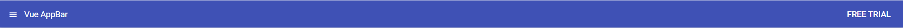

# Getting Started with Syncfusion Vue AppBar Component in Vue 3 using Composition API

This article provides a step-by-step guide for setting up a [Vite](https://vitejs.dev/) project with a JavaScript environment and integrating the Syncfusion Vue AppBar component using the [Composition API](https://vuejs.org/guide/introduction.html#composition-api).

The `Composition API` is a new feature introduced in Vue.js 3 that provides an alternative way to organize and reuse component logic. It allows developers to write components as functions that use smaller, reusable functions called composition functions to manage their properties and behavior.

## Prerequisites

[System requirements for Syncfusion Vue UI components](https://ej2.syncfusion.com/vue/documentation/system-requirements/)

## Setup the Vite project

A recommended approach for beginning with Vue is to scaffold a project using [Vite](https://vitejs.dev/). To create a new Vite project, use the below command.

```bash
npm create vite@latest
```

Using the above command will lead you to set up additional configurations for the project as below:

1.Define the project name: We can specify the name of the project directly. Let's specify the name of the project as `my-project` for this article.

```bash
? Project name: » my-project
```

2.Select `Vue` as the framework. It will creates a Vue 3 project.

```bash
? Select a framework: » - Use arrow-keys. Return to submit.
Vanilla
> Vue
  React
  Preact
  Lit
  Svelte
  Others
```

3.Choose `JavaScript` as framework variant to build this Vite project using JavaScript and Vue.

```bash
? Select a variant: » - Use arrow-keys. Return to submit.
> JavaScript
  TypeScript
  Customize with create-vue ↗
  Nuxt ↗
```

4.Upon completing the aforementioned steps to create the `my-project`, run the following command to install its dependencies:

```bash
cd my-project
npm install
```
Now that `my-project` is ready to run with default settings, let's add Syncfusion Vue AppBar component to the project.

## Adding Syncfusion Vue AppBar package in the application

All the available Essential JS 2 packages are published in [`npmjs.com`](https://www.npmjs.com/~syncfusionorg) registry.

Install the `AppBar` component by using the below npm command.

```bash
npm install @syncfusion/ej2-vue-navigations --save
```

## Adding CSS reference for Syncfusion Vue AppBar component

Import the needed css styles for the AppBar component along with dependency styles in the `<style>` section of the `src/App.vue` file as follows.

```html
<style>
@import "../node_modules/@syncfusion/ej2-base/styles/material.css";
@import "../node_modules/@syncfusion/ej2-vue-navigations/styles/material.css";
</style>
```

## Adding Syncfusion Vue AppBar component in the application

Follow the below steps to add the Vue AppBar component using `Composition API`:

1.First, add the `setup` attribute to the `script` tag to indicate that Vue will be using the `Composition API`. And import the AppBar component in the `script` section of the **src/App.vue** file.

```html
<script setup>
import { AppBarComponent as EjsAppbar } from '@syncfusion/ej2-vue-navigations';
</script>
```
   
2.Add the component definition in template section.

```html
<template>
  <ejs-appbar colorMode="Primary">
    <ejs-button cssClass="e-inherit" iconCss="e-icons e-menu"></ejs-button>
    <span class="regular" style="margin:0 5px">Vue AppBar</span>
    <div class="e-appbar-spacer"></div>
    <ejs-button cssClass="e-inherit">FREE TRIAL</ejs-button>
  </ejs-appbar>
</template>
```

Here is the summarized code for the above steps in the **src/App.vue** file:

```html
<template>
  <ejs-appbar colorMode="Primary">
    <ejs-button cssClass="e-inherit" iconCss="e-icons e-menu"></ejs-button>
    <span class="regular" style="margin:0 5px">Vue AppBar</span>
    <div class="e-appbar-spacer"></div>
    <ejs-button cssClass="e-inherit">FREE TRIAL</ejs-button>
  </ejs-appbar>
</template>

<script setup>
import { AppBarComponent as EjsAppbar } from '@syncfusion/ej2-vue-navigations';
import { ButtonComponent as EjsButton } from "@syncfusion/ej2-vue-buttons";
</script>

<style>
@import "../node_modules/@syncfusion/ej2-base/styles/material.css";
@import "../node_modules/@syncfusion/ej2-buttons/styles/material.css";
@import "../node_modules/@syncfusion/ej2-vue-navigations/styles/material.css";
</style>
```

## Run the project

To run the project, use the following command:

```bash
npm run dev
```

The output will appear as follows:



Refer the sample [Vue 3 using Composition API AppBar getting started](https://github.com/SyncfusionExamples/vue3-schedule-getting-started)