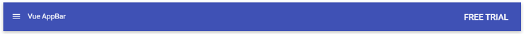

# Getting Started with Syncfusion AppBar Component in Vue 3

This section explains how to use AppBar component in Vue 3 application.

## Prerequisites

[System requirements for Syncfusion Vue UI components](https://ej2.syncfusion.com/vue/documentation/system-requirements/)

## Creating Vue application using Vue CLI

The easiest way to create a Vue application is to use the [`Vue CLI`](https://github.com/vuejs/vue-cli). Vue CLI versions above [`4.5.0`](https://v3.vuejs.org/guide/migration/introduction.html#vue-cli) are mandatory for creating applications using Vue 3. Use the following command to uninstall older versions of the Vue CLI.

```bash
npm uninstall vue-cli -g

```

Use the following commands to install the latest version of Vue CLI.

```bash
npm install -g @vue/cli
npm install -g @vue/cli-init
```

Create a new project using the command below.

```bash
vue create quickstart

```

Initiating a new project prompts us to choose the type of project to be used for the current application. Select the option `Default (Vue 3)` from the menu.


## Adding Syncfusion AppBar package in the application

 Syncfusion Vue packages are maintained in the [`npmjs.com`](https://www.npmjs.com/~syncfusionorg) registry. The AppBar component will be used in this example. To install it use the following command.

```bash
npm install @syncfusion/ej2-vue-navigations --save
```

## Adding CSS reference for Syncfusion Vue AppBar component

Import the needed CSS styles for the AppBar component along with dependency styles in the `<style>` section of the `src/App.vue` file as follows.

```
<style>
  @import "../node_modules/@syncfusion/ej2-base/styles/material.css";
  @import "../node_modules/@syncfusion/ej2-vue-navigations/styles/material.css";
</style>
```

## Adding Syncfusion Vue AppBar component in the application

You have completed all the necessary configurations needed for rendering the Syncfusion Vue component. Now, you are going to add the AppBar component using following steps.

  1.Import the AppBar component in the `<script>` section of the `src/App.vue` file.

     ```
      <script>
      import { AppBarComponent } from '@syncfusion/ej2-vue-navigations';
      </script>

     ```
  2.Register the AppBar component in `src/App.vue` file which are used in this example.

     ```js
      import { AppBarComponent } from '@syncfusion/ej2-vue-navigations';
        //Component registeration
      export default {
          name: "App",
          components: {
            'ejs-appbar' : AppBarComponent
          }
      }
     ```

     In the above code snippet, you have registered AppBar component.

  3.Add the component definition in template section.

     ```
      <template>
        <div id="app">
          <ejs-appbar colorMode="Primary">
            <ejs-button cssClass="e-inherit" iconCss="e-icons e-menu"></ejs-button>
            <span class="regular" style="margin:0 5px">Vue AppBar</span>
            <div class="e-appbar-spacer"></div>
            <ejs-button cssClass="e-inherit">FREE TRIAL</ejs-button>
          </ejs-appbar>
        </div>
      </template>
     ```
  4.Summarizing the above steps, update the `src/App.vue` file with following code.
  
     ```
      <template>
        <div id="app">
          <ejs-appbar colorMode="Primary">
            <ejs-button cssClass="e-inherit" iconCss="e-icons e-menu"></ejs-button>
            <span class="regular" style="margin:0 5px">Vue AppBar</span>
            <div class="e-appbar-spacer"></div>
            <ejs-button cssClass="e-inherit">FREE TRIAL</ejs-button>
          </ejs-appbar>
        </div>
      </template>
      <script>
      import { AppBarComponent } from '@syncfusion/ej2-vue-navigations';
      import { ButtonComponent } from "@syncfusion/ej2-vue-buttons";

      export default {
        name: 'App',
        components: {
          'ejs-appbar' : AppBarComponent,
          "ejs-button": ButtonComponent
        }
      };
      </script>
      <style>
        @import "../node_modules/@syncfusion/ej2-base/styles/material.css";
        @import "../node_modules/@syncfusion/ej2-buttons/styles/material.css";
        @import "../node_modules/@syncfusion/ej2-vue-navigations/styles/material.css";
      </style>
     ```

## Running the application

Run the application using the following command.

```bash
npm run serve
```

Web server will be initiated, Open the quick start app in the browser at port `localhost:8080`.


