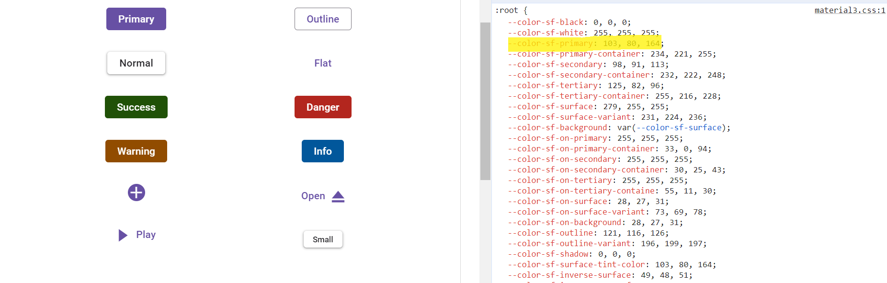
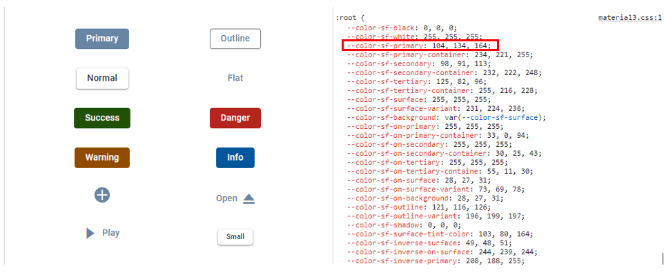
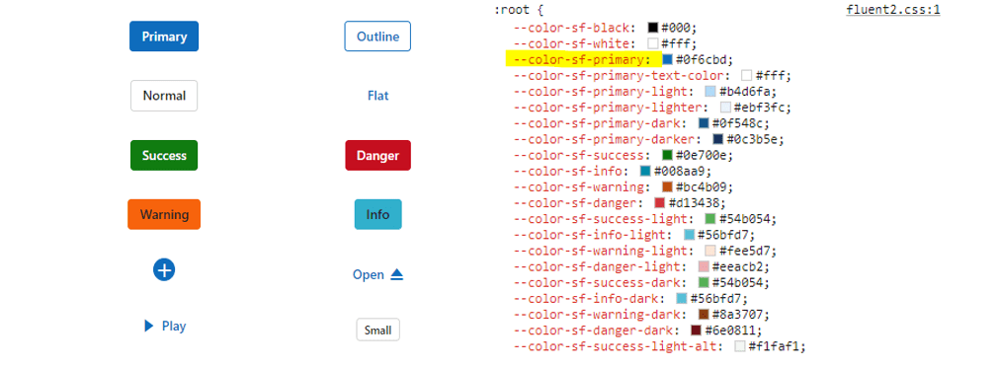
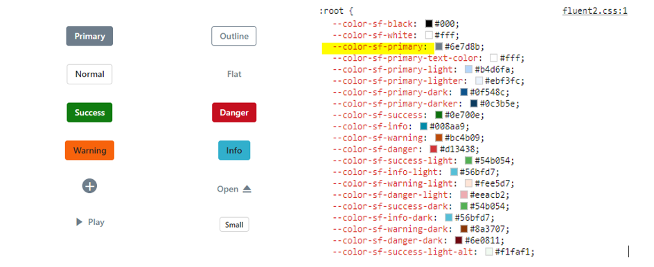
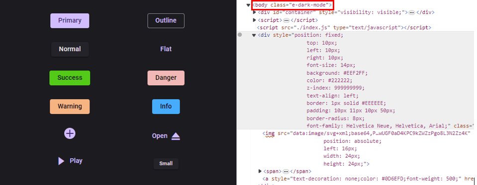
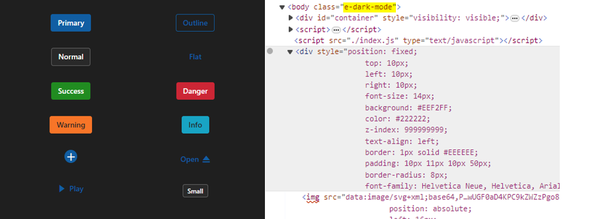

# About CSS Variables in themes

[CSS variables](https://developer.mozilla.org/en-US/docs/Web/CSS/Using_CSS_custom_properties), also known as custom properties, are entities defined by CSS authors that contain specific values that can be reused throughout a CSS file. They are identified by their name, which must begin with two hyphens (--) followed by an identifier. These variables can be assigned any valid CSS value, such as colors, lengths, or fonts. To retrieve the value of a CSS variable, the var() function is used.

Syncfusion currently offers two modern and highly customizable themes using CSS variables. These themes are designed to provide a consistent and visually appealing look and feel across all Syncfusion components. The themes available are:

* Material 3 Theme
* Fluent 2 Theme

## CSS themes - Syncfusion Vue components

Syncfusion has introduced [Material 3](https://m3.material.io/) and [Fluent 2](https://fluent2.microsoft.design/get-started/whatisnew) themes across all EJ2 Controls, featuring both `light` and `dark` variants. This themes utilizes `CSS variables` to allow easy customization of control colors in CSS format. With this implementation, users can seamlessly switch between light and dark color schemes, providing a flexible solution to meet their preferences and application needs.

> Kindly note that in the Material 3 theme, Syncfusion utilizes CSS variables with rgb() values for color variables. The use of hex values in this context may lead to improper functionality. For example, in previous versions of the Material theme or other themes, the primary color variable was defined as follows: $primary: #6200ee;. However, in the Material 3 theme, the primary color variable is defined as follows: --color-sf-primary: 98, 0, 238;.

### How does Syncfusion themes utilize CSS Variables?

Now our themes incorporate support for CSS variables, where `Material 3` utilizes `rgb()` values for customizing colors and `Fluent 2` uses `hex` values for color customization. For more information you can refer this [documentation](./theme#syncfusion-material-3-theme) for color variables of our themes.  The examples below shows CSS variables with their values used for the respective themes.

Material 3 uses `rgb()` values to customize the colors

```CSS
:root {
  --color-sf-black: 0, 0, 0;
  --color-sf-white: 255, 255, 255;
  --color-sf-primary: 103, 80, 164;
  --color-sf-primary-container: 234, 221, 255;
  --color-sf-secondary: 98, 91, 113;
  --color-sf-secondary-container: 232, 222, 248;
  --color-sf-tertiary: 125, 82, 96;
  --color-sf-tertiary-container: 255, 216, 228;
  --color-sf-surface: 255, 255, 255;
  --color-sf-surface-variant: 231, 224, 236;
  --color-sf-background: var(--color-sf-surface);
  --color-sf-on-primary: 255, 255, 255;
  --color-sf-on-primary-container: 33, 0, 94;
  --color-sf-on-secondary: 255, 255, 255;
  --color-sf-on-secondary-container: 30, 25, 43;
  --color-sf-on-tertiary: 255, 255, 255;
}
```
Fluent 2 uses `hex` values for customization

```CSS
:root {
  --color-sf-black: #000;
  --color-sf-white: #fff;
  --color-sf-primary: #0f6cbd;
  --color-sf-primary-text-color: #fff;
  --color-sf-primary-light: #b4d6fa;
  --color-sf-primary-lighter: #ebf3fc;
  --color-sf-primary-dark: #0f548c;
  --color-sf-primary-darker: #0c3b5e;
  --color-sf-success: #0e700e;
  --color-sf-info: #008aa9;
  --color-sf-warning: #bc4b09;
  --color-sf-danger: #d13438;
  --color-sf-success-light: #54b054;
  --color-sf-info-light: #56bfd7;
  --color-sf-warning-light: #fee5d7;
  --color-sf-danger-light: #eeacb2;
  --color-sf-success-dark: #54b054;
  --color-sf-info-dark: #56bfd7;
  --color-sf-warning-dark: #8a3707;
  --color-sf-danger-dark: #6e0811;
}
```

### How to get these themes?

To access themes provided by Syncfusion, you have two primary options,

* Package
* CDN links

|    |  Light  |  Dark  |
|-----------|---------|--------|
|Package  | [Material 3 Light](https://www.npmjs.com/package/@syncfusion/ej2-material3-theme) | [Material 3 Dark](https://www.npmjs.com/package/@syncfusion/ej2-material3-dark-theme) |
|  | [Fluent 2 Light](https://www.npmjs.com/package/@syncfusion/ej2-fluent2-theme) | [Fluent 2 Dark](https://www.npmjs.com/package/@syncfusion/ej2-fluent2-dark-theme) |
| CDN  | [Material 3 Light](https://cdn.syncfusion.com/ej2/24.2.8/material3.css)  |  [Material 3 Dark](https://cdn.syncfusion.com/ej2/24.2.8/material3-dark.css)  |
|  |  [Fluent 2 light](https://cdn.syncfusion.com/ej2/26.1.35/fluent2.css)  |  [Fluent 2 Dark](https://cdn.syncfusion.com/ej2/26.1.35/fluent2-dark.css)  |

### Color Customization in themes

CSS variables allows you to dynamically change color values in real-time using JavaScript. This flexibility enables you to create interactive experiences where colors can adjust based on user interactions or other dynamic factors.

#### Customization using CSS

Here you can find the example for `Material 3` customization using CSS class.






        


**Default primary value**



**Customized primary value**



Example for `Fluent 2` customization using CSS class.






        


**Default primary value**



**Customized primary value**



With this CSS variable support, you can effortlessly customize the color variable values for Syncfusion Vue Components.

### Switching Light and Dark mode with CSS variables

Syncfusion has implemented the Material 3 theme, offering both Light and Dark variants. In the Material 3 light theme, there are distinct class variables for both light and dark modes, providing flexibility for seamless switching between the two modes within your application.






        


### Mode switching in Fluent 2 theme






        


### How to switch dark mode?

With CSS variable support, transitioning between light and dark theme modes has become effortless. To activate dark mode, just append the `e-dark-mode` class to the body section of your application for both `Material 3` and `Fluent 2` theme. Once applied, the theme seamlessly switches to dark mode. Please refer to the example image below for visual guidance.



### Fluent 2 dark mode



### ThemeStudio Application

The ThemeStudio application now includes seamless integration with the Material 3 and Fluent 2 themes, offering a comprehensive solution for customization requirements. This enhancement enables users to effortlessly customize and personalize their themes.

Access the Syncfusion ThemeStudio application, featuring our themes, via the following link: [Link to Syncfusion ThemeStudio](https://ej2.syncfusion.com/themestudio/?theme=material3)