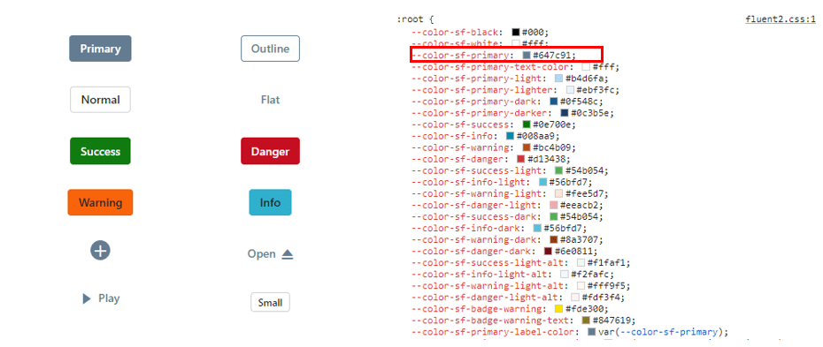

# About CSS variables in themes

[CSS variables](https://developer.mozilla.org/en-US/docs/Web/CSS/Using_CSS_custom_properties), also known as custom properties, are entities defined by CSS authors that contain specific values that can be reused throughout a CSS file. They are identified by their name, which must begin with two hyphens (--) followed by an identifier. These variables can be assigned any valid CSS value, such as colors, lengths, or fonts. To retrieve the value of a CSS variable, the var() function is used.

Syncfusion currently offers two modern and highly customizable themes using CSS variables. These themes are designed to provide a consistent and visually appealing look and feel across all Syncfusion components. The themes available are:

* Material 3 Theme
* Fluent 2 Theme
* Bootstrap 5.3 Theme

## CSS themes - Syncfusion Vue components

[Material 3](https://m3.material.io/), [Fluent 2](https://fluent2.microsoft.design/get-started/whatisnew) and [Bootstrap 5.3](https://getbootstrap.com/docs/5.3/getting-started/introduction/) themes have been introduced across all EJ2 Controls, featuring both `light` and `dark` variants. This themes utilizes `CSS variables` to allow easy customization of control colors in CSS format. With this implementation, users can seamlessly switch between light and dark color schemes, providing a flexible solution to meet their preferences and application needs.

> Kindly note that in the Material 3 theme, CSS variables with rgb() values are used for color variables. The use of hex values in this context may lead to improper functionality. For example, in previous versions of the Material theme or other themes, the primary color variable was defined as follows: $primary: #6200ee;. However, in the Material 3 theme, the primary color variable is defined as follows: --color-sf-primary: 98, 0, 238;.

### Utilization of CSS variables in modern themes

Modern themes like Material 3, Fluent 2 and Bootstrap 5.3 incorporate support with CSS variables, where `Material 3` utilizes `rgb()` values for customizing colors while `Fluent 2` uses `hex` values for color customization. `Bootstrap 5.3` allows color customization with both  `rgb()` and `hex` values. For more information you can refer this [documentation](./theme#syncfusion-material-3-theme) for color variables of these themes.  The examples below shows CSS variables with their values used for the respective themes.













### How to get these themes?

To access themes provided by Syncfusion, you have two primary options,

* Package
* CDN links

|    |  Light  |  Dark  |
|-----------|---------|--------|
|Package  | [Material 3 Light](https://www.npmjs.com/package/@syncfusion/ej2-material3-theme) | [Material 3 Dark](https://www.npmjs.com/package/@syncfusion/ej2-material3-dark-theme) |
|  | [Fluent 2 Light](https://www.npmjs.com/package/@syncfusion/ej2-fluent2-theme) | [Fluent 2 Dark](https://www.npmjs.com/package/@syncfusion/ej2-fluent2-dark-theme) |
|  | [Bootstrap 5.3 Light](https://www.npmjs.com/package/@syncfusion/ej2-bootstrap5.3-theme) | [Bootstrap 5.3 Dark](https://www.npmjs.com/package/@syncfusion/ej2-bootstrap5.3-dark-theme) |
| CDN  | [Material 3 Light](https://cdn.syncfusion.com/ej2/27.1.48/material3.css)  |  [Material 3 Dark](https://cdn.syncfusion.com/ej2/27.1.48/material3-dark.css)  |
|  |  [Fluent 2 light](https://cdn.syncfusion.com/ej2/27.1.48/fluent2.css)  |  [Fluent 2 Dark](https://cdn.syncfusion.com/ej2/27.1.48/fluent2-dark.css)  |
|  |  [Bootstrap5.3 light](https://cdn.syncfusion.com/ej2/27.1.48/bootstrap5.3.css)  |  [Bootstrap 5.3 Dark](https://cdn.syncfusion.com/ej2/27.1.48/bootstrap5.3-dark.css)  |

### Color Customization in themes

CSS variables allows you to dynamically change color values in real-time using JavaScript. This flexibility enables you to create interactive experiences where colors can adjust based on user interactions or other dynamic factors.

#### Customization using CSS

Here you can find the example for `Material 3` customization using CSS class.






        


**Default primary value**

**Customized primary value**

Example for `Fluent 2` customization using CSS class.






        


**Default primary value**

**Customized primary value**

Example for `Bootstrap 5.3` customization using CSS class.






        


**Default primary value**

**Customized primary value**

With this CSS variable support, you can effortlessly customize the color variable values for Syncfusion Vue Components.

### Switching Light and Dark mode with CSS variables

Switching between modes has become easier with the updated modern themes, which offer Light and Dark variants. In both the `Material 3` and `Fluent 2` light themes, there are distinct class variables for light and dark modes in a `single file`, providing flexibility for seamless switching between the two modes within your application.






        


### Mode switching in Fluent 2 theme

Similar to `Material 3`, we offer both Light and Dark variants with `Fluent 2`. In the Fluent 2 theme, there are distinct class variables for light and dark modes, as shown in the preview below.






        


### Mode switching in Bootstrap 5.3 theme

Similar to `Fluent 2`, we offer both Light and Dark variants with `Bootstrap 5.3`. In the Bootstrap 5.3 theme, there are distinct class variables for light and dark modes, as shown in the preview below.






        


### How to switch dark mode?

To activate dark mode, just append the `e-dark-mode` class to the body section of your application for both `Material 3`, `Fluent 2` and `Bootstrap 5.3` themes. Once applied, the theme seamlessly switches to dark mode. Please refer to the example image below for visual guidance.

`Material 3` dark mode

`Fluent 2` dark mode

`Bootstrap 5.3` dark mode

### ThemeStudio Application

The ThemeStudio application now includes seamless integration with the Material 3, Fluent 2 and Bootstrap 5.3 themes, offering a comprehensive solution for customization requirements. This enhancement enables users to effortlessly customize and personalize their themes.

Access the Syncfusion ThemeStudio application, featuring our themes, via the following link: [Link to Syncfusion ThemeStudio](https://ej2.syncfusion.com/themestudio/?theme=material3)