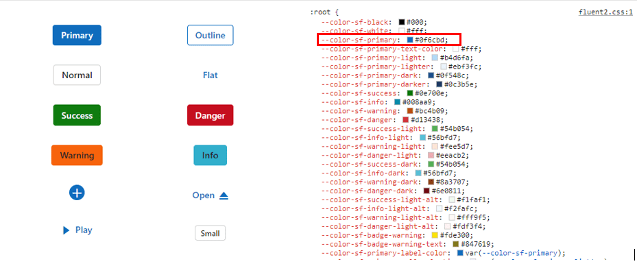
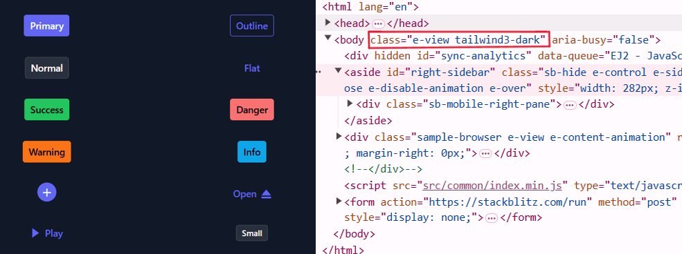

# About CSS variables in themes

[CSS variables](https://developer.mozilla.org/en-US/docs/Web/CSS/Using_CSS_custom_properties), also known as custom properties, are author-defined entities that store values for reuse throughout a stylesheet. Variable names begin with two hyphens (--) followed by an identifier. Any valid CSS value can be assigned (colors, lengths, fonts, etc.). Retrieve a variable value using the var() function.

Syncfusion&reg; provides four modern, highly customizable themes that use CSS variables to enable consistent styling across all Syncfusion&reg; Vue components:

* Material 3 Theme
* Fluent 2 Theme
* Bootstrap 5.3 Theme
* Tailwind 3.4 Theme

## CSS themes - Syncfusion&reg; Vue components

Material 3, Fluent 2, Bootstrap 5.3, and Tailwind 3.4 themes are available across EJ2 controls. Each theme includes both light and dark variants and exposes CSS variables so control colors can be adjusted directly in CSS. This implementation enables easy switching between light and dark color schemes and simplifies theme customization across an application.

> Kindly note that in the Material 3 theme, CSS variables with rgb() values are used for color variables. The use of hex values in this context may lead to improper functionality. For example, in previous versions of the Material theme or other themes, the primary color variable was defined as follows: $primary: #6200ee;. However, in the Material 3 theme, the primary color variable is defined as follows: --color-sf-primary: 98, 0, 238;.

### Utilization of CSS variables in modern themes

Modern themes make it easy to change the colors of controls using CSS variables. Each theme has its own way of setting these variables, so it's important to follow the specific instructions for each theme. Doing this helps keep the styling consistent and efficient across different parts of your application.

Below are examples of how CSS variables can be defined for these themes:
















### How to get these themes?

To access themes provided by Syncfusion&reg;, you have two primary options,

* Package
* CDN links

|    |  Light  |  Dark  |
|-----------|---------|--------|
|Package  | [Material 3 Light](https://www.npmjs.com/package/@syncfusion/ej2-material3-theme) | [Material 3 Dark](https://www.npmjs.com/package/@syncfusion/ej2-material3-dark-theme) |
|  | [Fluent 2 Light](https://www.npmjs.com/package/@syncfusion/ej2-fluent2-theme) | [Fluent 2 Dark](https://www.npmjs.com/package/@syncfusion/ej2-fluent2-dark-theme) |
|  | [Bootstrap 5.3 Light](https://www.npmjs.com/package/@syncfusion/ej2-bootstrap5.3-theme) | [Bootstrap 5.3 Dark](https://www.npmjs.com/package/@syncfusion/ej2-bootstrap5.3-dark-theme) |
|  | [Tailwind 3.4 Light](https://www.npmjs.com/package/@syncfusion/ej2-tailwind3-theme) | [Tailwind 3.4 Dark](https://www.npmjs.com/package/@syncfusion/ej2-tailwind3-dark-theme) |
| CDN  | [Material 3 Light](https://cdn.syncfusion.com/ej2/32.1.19/material3.css)  |  [Material 3 Dark](https://cdn.syncfusion.com/ej2/32.1.19/material3-dark.css)  |
|  |  [Fluent 2 light](https://cdn.syncfusion.com/ej2/32.1.19/fluent2.css)  |  [Fluent 2 Dark](https://cdn.syncfusion.com/ej2/32.1.19/fluent2-dark.css)  |
|  |  [Bootstrap5.3 light](https://cdn.syncfusion.com/ej2/32.1.19/bootstrap5.3.css)  |  [Bootstrap 5.3 Dark](https://cdn.syncfusion.com/ej2/32.1.19/bootstrap5.3-dark.css)  |
|  | [Tailwind 3.4 Light](https://cdn.syncfusion.com/ej2/32.1.19/tailwind3.css) | [Tailwind 3.4 Dark](https://cdn.syncfusion.com/ej2/32.1.19/tailwind3-dark.css) |

### Color Customization in themes

CSS variables allows you to dynamically change color values in real-time using JavaScript. This flexibility enables you to create interactive experiences where colors can adjust based on user interactions or other dynamic factors.

#### Customization using CSS

Here you can find the example for `Material 3` customization using CSS class.






        


**Default primary value**

**Customized primary value**

Example for `Fluent 2` customization using CSS class.






        


**Default primary value**

**Customized primary value**

Example for `Bootstrap 5.3` customization using CSS class.






        


**Default primary value**

**Customized primary value**

Example for `Tailwind 3.4` customization using CSS class.






        


**Default primary value**

**Customized primary value**

With this CSS variable support, you can effortlessly customize the color variable values for Syncfusion&reg; Vue Components.

### Switching Light and Dark mode with CSS variables

Modern themes provide light and dark variants and expose class-level variables to switch modes. Use the theme-provided classes or update root-level variables to toggle between light and dark palettes.






        


### Mode switching in Fluent 2 theme

Similar to `Material 3`, we offer both Light and Dark variants with `Fluent 2`. In the Fluent 2 theme, there are distinct class variables for light and dark modes, as shown in the preview below.






        


### Mode switching in Bootstrap 5.3 theme

Similar to `Fluent 2`, we offer both Light and Dark variants with `Bootstrap 5.3`. In the Bootstrap 5.3 theme, there are distinct class variables for light and dark modes, as shown in the preview below.






        


### Mode switching in Tailwind 3.4 theme

Similar to `Fluent 2`, we offer both Light and Dark variants with `Tailwind 3.4`. In the Tailwind 3.4 theme, there are distinct class variables for light and dark modes, as shown in the preview below.






        


### How to switch dark mode?

To enable dark mode for Material 3, Fluent 2, Bootstrap 5.3, or Tailwind 3.4 themes, append the e-dark-mode class to the application's body element. Applying the class switches the theme to its dark variant.

`Material 3` dark mode

`Fluent 2` dark mode

`Bootstrap 5.3` dark mode

`Tailwind 3.4` dark mode

### ThemeStudio Application

The ThemeStudio application now includes seamless integration with the Material 3, Fluent 2 and Bootstrap 5.3 themes, offering a comprehensive solution for customization requirements. This enhancement enables users to effortlessly customize and personalize their themes.

Access the Syncfusion&reg; ThemeStudio application, featuring our themes, via the following link: [Link to Syncfusion&reg; ThemeStudio](https://ej2.syncfusion.com/themestudio/?theme=material3)