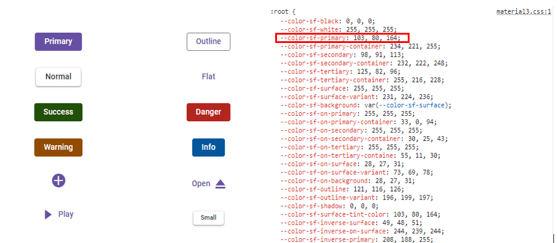

# Material 3 Theme with CSS Variables

[Material 3](https://m3.material.io/) is the latest version of Google's open-source design system, Material Design. It's the successor to [Material 2](https://m2.material.io/), which is a popular design system used in many apps. It has been specifically designed to align seamlessly with the new visual style and system UI introduced in Android 12 and above.

[CSS variables](https://developer.mozilla.org/en-US/docs/Web/CSS/Using_CSS_custom_properties), also known as custom properties, are entities defined by CSS authors that contain specific values that can be reused throughout a CSS file. They are identified by their name, which must begin with two hyphens (--) followed by an identifier. These variables can be assigned any valid CSS value, such as colors, lengths, or fonts. To retrieve the value of a CSS variable, the var() function is used.

## Material 3 - Syncfusion Vue Components

Syncfusion has introduced the Material 3 theme across all EJ2 Components, featuring both `light` and `dark` variants. This theme utilizes `CSS variables` to allow easy customization of Component colors in CSS format. With this implementation, users can seamlessly switch between light and dark color schemes, providing a flexible solution to meet their preferences and application needs.

> Kindly note that in the Material 3 theme, Syncfusion utilizes CSS variables with rgb() values for color variables. The use of hex values in this context may lead to improper functionality. For example, in previous versions of the Material theme or other themes, the primary color variable was defined as follows: $primary: #6200ee;. However, in the Material 3 theme, the primary color variable is defined as follows: --color-sf-primary: 98, 0, 238;.

### How does Syncfusion Material 3 theme utilize CSS Variables?

Syncfusion's Material 3 theme incorporates support for CSS variables, utilizing rgb() values for customizing colors. For more information you can refer this [documentation](./theme#syncfusion-material-3-theme) for color variables of material 3 theme.

```CSS
:root {
  --color-sf-black: 0, 0, 0;
  --color-sf-white: 255, 255, 255;
  --color-sf-primary: 103, 80, 164;
  --color-sf-primary-container: 234, 221, 255;
  --color-sf-secondary: 98, 91, 113;
  --color-sf-secondary-container: 232, 222, 248;
  --color-sf-tertiary: 125, 82, 96;
  --color-sf-tertiary-container: 255, 216, 228;
  --color-sf-surface: 255, 255, 255;
  --color-sf-surface-variant: 231, 224, 236;
  --color-sf-background: var(--color-sf-surface);
  --color-sf-on-primary: 255, 255, 255;
  --color-sf-on-primary-container: 33, 0, 94;
  --color-sf-on-secondary: 255, 255, 255;
  --color-sf-on-secondary-container: 30, 25, 43;
  --color-sf-on-tertiary: 255, 255, 255;
}
```

### How to get the Material 3 theme?

To access the Material 3 theme provided by Syncfusion, you have two primary options,

* Package
* CDN links

|    |  Light  |  Dark  |
|-----------|---------|--------|
|Package  | [Material 3 Light](https://www.npmjs.com/package/@syncfusion/ej2-material3-theme) | [Material 3 Dark](https://www.npmjs.com/package/@syncfusion/ej2-material3-dark-theme) |
| CDN  |  [Material 3 Light](https://cdn.syncfusion.com/ej2/24.2.8/material3.css)  |  [Material 3 Dark](https://cdn.syncfusion.com/ej2/24.2.8/material3-dark.css)  |

### Color Customization in Material 3

CSS variables allows you to dynamically change color values in real-time using JavaScript. This flexibility enables you to create interactive experiences where colors can adjust based on user interactions or other dynamic factors.

#### Customization using CSS

Here you can find the example for Material 3 customization using Css class.









        


**Default primary value**



**Customized primary value**


With this CSS variable support, you can effortlessly customize the color variable values for Syncfusion Vue Components.

### Material 3 Light Theme

Syncfusion has implemented the Material 3 theme, offering both Light and Dark variants. In the Material 3 light theme, there are distinct class variables for both light and dark modes, providing flexibility for seamless switching between the two modes within your application.









        


### How to switch dark mode?

With CSS variable support, transitioning between light and dark theme modes has become effortless. To activate dark mode, just append the `e-dark-mode` class to the body section of your application. Once applied, the theme seamlessly switches to dark mode. Please refer to the example image below for visual guidance.


### ThemeStudio Application

The ThemeStudio application now includes seamless integration with the Material 3 theme, offering a comprehensive solution for customization requirements. This enhancement enables users to effortlessly customize and personalize their themes.

Access the Syncfusion ThemeStudio application, featuring the Material 3 theme, via the following link: [Link to Syncfusion ThemeStudio with Material 3 Theme](https://ej2.syncfusion.com/themestudio/?theme=material3)