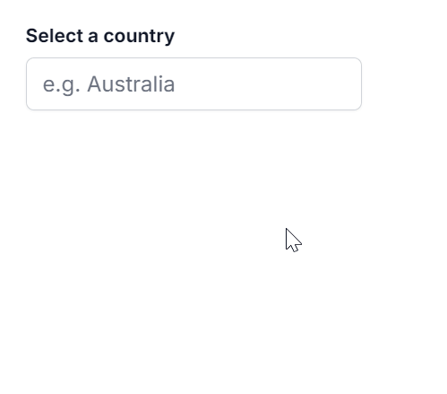

# Resizing in Vue AutoComplete

You can dynamically adjust the size of the popup in the AutoComplete component by using the [allowResize](https://ej2.syncfusion.com/vue/documentation/api/auto-complete/index-default#allowresize) property. When enabled, users can resize the popup, improving visibility and control. The resized dimensions are retained for a consistent user experience.

The following sample illustrates the implementation of the Popup Resize feature.










