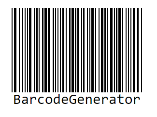
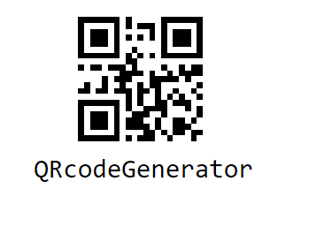
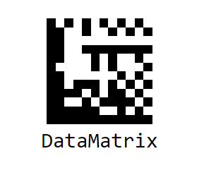

# Getting Started with Syncfusion® Barcode Component in Vue 3

This section explains how to use Barcode component in Vue 3 application.

## Prerequisites

[System requirements for Syncfusion® Vue UI components](https://ej2.syncfusion.com/vue/documentation/system-requirements/)

## Creating Vue application using Vue CLI

The easiest way to create a Vue application is to use the [`Vue CLI`](https://github.com/vuejs/vue-cli). Vue CLI versions higher than [`4.5.0`](https://v3.vuejs.org/guide/migration/introduction.html#vue-cli) are mandatory for creating applications using Vue 3. Use the following command to uninstall older versions of the Vue CLI.

```bash
npm uninstall vue-cli -g
```

Use the following commands to install the latest version of Vue CLI.

```bash
npm install -g @vue/cli
npm install -g @vue/cli-init
```

Create a new project using the following command.

```bash
vue create quickstart

```

Initiating a new project prompts us to select the type of project to be used for the current application. Select the option `Default (Vue 3)` from the menu.


## Adding Syncfusion® Barcode package in the application

Syncfusion® Vue packages are maintained in the [`npmjs.com`](https://www.npmjs.com/~syncfusionorg) registry.
In this example, the Barcode component will be used. Use the following command to install it.

```bash
npm install @syncfusion/ej2-vue-barcode-generator
```

## Adding CSS reference for Syncfusion® Vue Barcode component

Import the necessary css styles for the Barcode component along with dependency styles in the `<style>` section of the `src/App.vue` file as follows.

```
<style>
  @import "../node_modules/@syncfusion/ej2-base/styles/material.css";
  @import "../node_modules/@syncfusion/ej2-icons/styles/material.css";
  @import "../node_modules/@syncfusion/ej2-vue-barcode-generator/styles/material.css";
</style>
```

## Adding Syncfusion® Vue Barcode component in the application

You have completed all of the necessary configurations required to render the Syncfusion® Vue component. Now, you are going to add the Barcode component using the following steps:

1. Import the Barcode component in the `<script>` section of the `src/App.vue` file.

    ```
      <script setup>
        import { BarcodeGeneratorComponent as EjsBarcodegenerator, QRCodeGeneratorComponent as EjsQrcodegenerator, DataMatrixGeneratorComponent as EjsDatamatrixgenerator} from '@syncfusion/ej2-vue-barcode-generator';
      </script>
    ```

2. Register the Barcode component, which is used in this example. The following table contains a list of directives and the tag names that can be used in the Barcode component.

    | Directive Name   | Tag Name    |
    |------------------|-------------|
    | `BarcodeGeneratorComponent` | `ejs-barcodegenerator` |
    | `QRCodeGeneratorComponent` | `ejs-qrcodegenerator` |
    | `DataMatrixGeneratorComponent` | `ejs-datamatrixgenerator` |

3. By using the following code sample, you can add the component definition in template section.

    ```

    <template>
      <div id="app" class="barcodeStyle">
        <ejs-barcodegenerator
          id="barcode"
          ref="barcodeControl"
          :width="width"
          :height="height"
          :type="type"
          :value="value"
          :mode="mode"
          :displayText="displaytext"
        >
        </ejs-barcodegenerator>
      </div>
    </template>
    ```

4. Declare the barcode generator properties in the `script` section. Here, declare the width, Height, type, value, and mode values for the `ejs-barcodegenerator` property.

    ```js
    const width = "200px";
    const height = "150px";
    const displaytext = { text: 'BarcodeGenerator' };
    const mode = "SVG";
    const type = "Codabar";
    const value = "123456789";
      ```

5. Summarizing the above steps, update the `src/App.vue` file with following code.

    ```

    <template>
      <div id="app" class="barcodeStyle">
        <ejs-barcodegenerator
          id="barcode"
          ref="barcodeControl"
          :width="width"
          :height="height"
          :type="type"
          :displayText="displaytext"
          :value="value"
          :mode="mode"
        >
        </ejs-barcodegenerator>
      </div>
    </template>

    <script setup>
    import {
      BarcodeGeneratorComponent as EjsBarcodegenerator
    } from "@syncfusion/ej2-vue-barcode-generator";

    const width = "200px";
    const height = "150px";
    const displaytext = { text: 'BarcodeGenerator' };
    const mode = "SVG";
    const type = "Codabar";
    const value = "123456789";
    </script>

    <style>
      @import "../node_modules/@syncfusion/ej2-base/styles/material.css";
      @import "../node_modules/@syncfusion/ej2-icons/styles/material.css";
      @import "../node_modules/@syncfusion/ej2-vue-barcode-generator/styles/material.css";
    </style>
    ```

## Running the application

Run the application using the following command.

```bash
npm run serve
```

Web server will be initiated, open the quick start app in the browser at port `localhost:8080`.



## Adding Syncfusion® Vue QR Generator control in the application

You can add the QR code generator component by using the following code sample.

```
<template>
  <div id="app" class="barcodeStyle">
    <ejs-qrcodegenerator
      id="qrcode"
      ref="qrcodeControl"
      :width="width"
      :height="height"
      :type="type"
      :displayText="displaytext"
      :value="value"
      :mode="mode"
    >
    </ejs-qrcodegenerator>
  </div>
</template>

<script setup>

import {
  QRCodeGeneratorComponent as EjsQrcodegenerator
} from "@syncfusion/ej2-vue-barcode-generator";

  const width = "200px";
  const height = "150px";
  const displaytext = { text: 'QRcodeGenerator' };
  const mode = "SVG";
  const type = "Codabar";
  const value = "123456789";

</script>

<style>
  @import "../node_modules/@syncfusion/ej2-base/styles/material.css";
  @import "../node_modules/@syncfusion/ej2-icons/styles/material.css";
  @import "../node_modules/@syncfusion/ej2-vue-barcode-generator/styles/material.css";
</style>

```



## Adding Syncfusion® Vue Datamatrix Generator control in the application

You can add the datamatrix code generator component by using the following code sample.

```
<template>
  <div id="app" class="barcodeStyle">
    <ejs-datamatrixgenerator
      id="qrcode"
      ref="qrcodeControl"
      :width="width"
      :height="height"
      :type="type"
      :displayText="displaytext"
      :value="value"
      :mode="mode"
    >
    </ejs-datamatrixgenerator>
  </div>
</template>

<script setup>

import {
  DataMatrixGeneratorComponent as EjsDatamatrixgenerator
} from "@syncfusion/ej2-vue-barcode-generator";

  const width = "200px";
  const height = "150px";
  const displaytext = { text: 'DataMatrix' };
  const mode = "SVG";
  const type = "Codabar";
  const value = "123456789";

</script>

<style>
  @import "../node_modules/@syncfusion/ej2-base/styles/material.css";
  @import "../node_modules/@syncfusion/ej2-icons/styles/material.css";
  @import "../node_modules/@syncfusion/ej2-vue-barcode-generator/styles/material.css";
</style>

```



Refer the following sample, [vue3-barcode-generator-getting-started](https://github.com/SyncfusionExamples/vue3-barcode-getting-started).