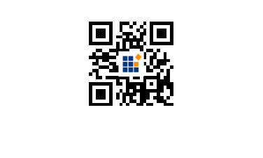

# QrCodeGenerator in Vue Barcode component

## QR Code

A QR Code is a two-dimensional barcode that consists of a grid of dark and light dots or blocks that form a square. The data encoded in the barcode can be numeric, alphanumeric, or Shift Japanese Industrial Standards (JIS8) characters. The QR Code uses version from 1 to 40. Version 1 measures 21 modules x 21 modules, Version 2 measures 25 modules x 25 modules, and so on. The number of modules increases in steps of 4 modules per side up to Version 40 that measures 177 modules x 177 modules. Each version has its own capacity. By default, the barcode control automatically set the version according to the length of the input text. The QR Barcodes are designed for industrial uses and also commonly used in consumer advertising.









        


## Customizing the Barcode color

A page or printed media with barcode often appears colorful in the background and surrounding region with other contents. In such cases the barcode can also be customized to suit the needs. You can achieve this by using for fore color property .









        


## Customizing the Barcode dimension

The dimension of the barcode can be changed using the height and width properties of the barcodeGenerator.









        


## Customizing the text

In barcode generators You can customize the barcode text by using display text property .









        


## Enhancing QR Codes with Icons

The EJ2 Barcode Generator now lets you add a [`logo`](https://ej2.syncfusion.com/vue/documentation/api/barcode/qRCodeLogo/) or icon to your QR codes, boosting their visual appeal, clarity, and even security. Adding a recognizable icon can make it easier for users to identify the source and can help prevent tampering .

### Supported Image Sources
 
The [`imageSource`](https://ej2.syncfusion.com/vue/documentation/api/barcode/qRCodeLogo/#imagesource) property of the `QRCodeLogo` class supports the following image sources:
 
- **Local image path**: Specify the path to the image file relative to your project's root directory (e.g., `images/syncfusion.png`) or as an absolute path (e.g., `/assets/icons/logo.svg`).
- **Remote image URL**: Provide the web address of the image file (e.g., `https://example.com/image.jpg`).
- **Base64 encoded image data**: Embed the image data directly in the code using a Base64-encoded string (e.g., `data:image/png;base64,iVBORw0KGgoAAAANSUhEUg...`).

### Logo Dimensions
 
The [`width`](https://ej2.syncfusion.com/vue/documentation/api/barcode/qRCodeLogo/#width) and [`height`](https://ej2.syncfusion.com/vue/documentation/api/barcode/qRCodeLogo/#height) properties of the `QRCodeLogo` class define the dimensions of the logo in pixels. If not specified, both default to 30% of the QR code’s size. The maximum allowed size is 30% of the QR code’s dimensions to ensure optimal readability.

**Note:** Always test the readability of your QR code after adding a logo. Depending on the logo size and QR code content, you might need to adjust the [`errorCorrectionLevel`](https://ej2.syncfusion.com/vue/documentation/api/barcode/errorCorrectionLevel/) property of the `QRCodeGenerator` to `"Medium"` or `"High"` for better reliability.

The following image illustrates QR code with logo:









        
