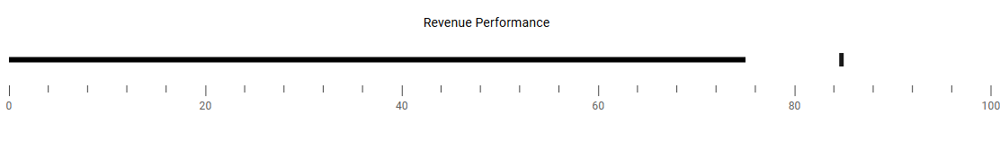

# Getting Started with Vue Bullet Chart

This article provides a step-by-step guide to setting up a [Vite](https://vite.dev) JavaScript project and integrating the Syncfusion<sup style="font-size:70%">&reg;</sup> Vue Bullet Chart component using either the [Composition API](https://vuejs.org/guide/introduction.html#composition-api) or the [Options API](https://vuejs.org/guide/introduction.html#options-api).

The **Composition API** groups related logic into reusable functions. The **Options API** organizes component logic with options such as `data`, `methods`, and life cycle hooks. Choose the API that best fits the application's structure.

## Prerequisites

Ensure that the development environment meets the [system requirements for Syncfusion Vue UI components](https://ej2.syncfusion.com/vue/documentation/system-requirements).

## Set Up the Vite Project

Create a Vite project using either npm or yarn.

**npm**

```bash
npm create vite@latest my-app -- --template vue
```

**yarn**

```bash
yarn create vite my-app --template vue
```

If Vite prompts you to install dependencies and start the project immediately, select **No**. The Syncfusion package is installed in a later step.

Navigate to the project directory:

```bash
cd my-app
```

Install the project dependencies using either npm or yarn.

**npm**

```bash
npm install
```

**yarn**

```bash
yarn install
```

> **Note:** To create a TypeScript project, use `npm create vite@latest my-app -- --template vue-ts` or `yarn create vite my-app --template vue-ts`.

## Add the Syncfusion<sup style="font-size:70%">&reg;</sup> Vue Package

Syncfusion Vue packages are available on [npm](https://www.npmjs.com/search?q=ej2-vue).

Install the `@syncfusion/ej2-vue-charts` package. Use a package release compatible with Vue 3 and the Node.js version used by the project.

**npm**

```bash
npm install @syncfusion/ej2-vue-charts
```

**yarn**

```bash
yarn add @syncfusion/ej2-vue-charts
```

> **Note:** For TypeScript projects, refer to [Vue 3 with the Composition API and TypeScript](https://ej2.syncfusion.com/vue/documentation/getting-started/vue-3-ts-composition) or [Vue 3 with the Options API and TypeScript](https://ej2.syncfusion.com/vue/documentation/getting-started/vue-3-ts-options).

## Add the Syncfusion<sup style="font-size:70%">&reg;</sup> Vue Bullet Chart Component

Follow these steps to add the Vue Bullet Chart component using the Composition API or Options API.

**Step 1:** Import and Register the Component

Import the Bullet Chart component used by the example in **src/App.vue**.

In the Composition API example, alias the imports to names that match the custom elements used in the template. Components imported in `<script setup>` are available directly in the template.




<script setup>
import {
  BulletChartComponent as EjsBulletchart
} from '@syncfusion/ej2-vue-charts';

</script>




<script>
import {
  BulletChartComponent
} from '@syncfusion/ej2-vue-charts';

export default {
  name: 'App',
  components: {
    'ejs-bulletchart': BulletChartComponent
  }
};
</script>




**Step 2:** Declare the Data and Configuration

Define the chart data, scale, title and dimensions configuration in the `script` section.




<script setup>
const data = [
  { value: 75, target: 85 }
];

const valueField = 'value';
const targetField = 'target';
const minimum = 0;
const maximum = 100;
const interval = 20;
const title = 'Revenue Performance';
</script>




<script>
export default {
  data() {
    return {
      data: [
        { value: 75, target: 85 }
      ],
      valueField: 'value',
      targetField: 'target',
      minimum: 0,
      maximum: 100,
      interval: 20,
      title: 'Revenue Performance'
    };
  }
};
</script>




**Step 3:** Define the Bullet Chart in the Template

Add the Bullet Chart to the `template` section of **src/App.vue**.

The example uses the following properties:

- [`dataSource`](https://ej2.syncfusion.com/vue/documentation/api/bullet-chart#datasource) specifies the array of data objects.
- [`valueField`](https://ej2.syncfusion.com/vue/documentation/api/bullet-chart#valuefield) maps the feature-measure field.
- [`targetField`](https://ej2.syncfusion.com/vue/documentation/api/bullet-chart#targetfield) maps the comparative-target field.
- [`minimum`](https://ej2.syncfusion.com/vue/documentation/api/bullet-chart#minimum) specifies the minimum value of the quantitative scale.
- [`maximum`](https://ej2.syncfusion.com/vue/documentation/api/bullet-chart#maximum) specifies the maximum value of the quantitative scale.
- [`interval`](https://ej2.syncfusion.com/vue/documentation/api/bullet-chart#interval) specifies the interval between scale labels.
- [`title`](https://ej2.syncfusion.com/vue/documentation/api/bullet-chart#title) specifies the chart title.




<template>
  <div id="app">
    <ejs-bulletchart
      id="bulletChart"
      :dataSource="data"
      :valueField="valueField"
      :targetField="targetField"
      :minimum="minimum"
      :maximum="maximum"
      :interval="interval"
      :title="title"
    >
    </ejs-bulletchart>
  </div>
</template>




Each data object must contain the fields assigned to `valueField` and `targetField`. Both mapped fields must contain numeric values within the configured scale.

Here is the summarized code for the above steps in the **src/App.vue** file.

Replace the contents of **src/App.vue** with either the Composition API or Options API example.




<template>
  <div id="app">
    <ejs-bulletchart
      id="bulletChart"
      :dataSource="data"
      :valueField="valueField"
      :targetField="targetField"
      :minimum="minimum"
      :maximum="maximum"
      :interval="interval"
      :title="title"
      :height="height"
    >
    </ejs-bulletchart>
  </div>
</template>

<script setup>
import {
  BulletChartComponent as EjsBulletchart
} from '@syncfusion/ej2-vue-charts';

const data = [
  { value: 75, target: 85 }
];

const valueField = 'value';
const targetField = 'target';
const minimum = 0;
const maximum = 100;
const interval = 20;
const title = 'Revenue Performance';
const height = '300px';

</script>




<template>
  <div id="app">
    <ejs-bulletchart
      id="bulletChart"
      :dataSource="data"
      :valueField="valueField"
      :targetField="targetField"
      :minimum="minimum"
      :maximum="maximum"
      :interval="interval"
      :title="title"
      :height="height"
    >
    </ejs-bulletchart>
  </div>
</template>

<script>
import {
  BulletChartComponent
} from '@syncfusion/ej2-vue-charts';

export default {
  name: 'App',
  components: {
    'ejs-bulletchart': BulletChartComponent
  },
  data() {
    return {
      data: [
        { value: 75, target: 85 }
      ],
      valueField: 'value',
      targetField: 'target',
      minimum: 0,
      maximum: 100,
      interval: 20,
      title: 'Revenue Performance',
      height: '300px'
    };
  }
};
</script>




## Run the Project

Save **src/App.vue**, and then start the development server using either npm or yarn.

**npm**

```bash
npm run dev
```

**yarn**

```bash
yarn dev
```

Open the local URL displayed in the terminal, commonly `http://localhost:5173`, and verify that the Bullet Chart displays.



> **Sample:** Explore the [Vue 3 Bullet Chart getting-started sample](https://github.com/SyncfusionExamples/vue3-bullet-chart-getting-started).

## Troubleshooting

- **The Bullet Chart is not rendered.** Verify that the component import is aliased correctly in the Composition API or registered in `components` in the Options API. Check the browser console for component, data, module, or licensing errors.
- **No feature measure or target is displayed.** Verify that `dataSource` contains records, `valueField` and `targetField` match fields in every data object, and the mapped fields contain numeric values.
- **The scale does not contain the measure or target.** Set `minimum` and `maximum` so that both mapped values fall within the quantitative scale.
- **An import or runtime error is displayed.** Verify that `@syncfusion/ej2-vue-charts` is installed and that its version supports the project's Vue and Node.js versions.

For additional assistance, refer to the [Vue Bullet Chart API documentation](https://ej2.syncfusion.com/vue/documentation/api/bullet-chart).

## See Also

- [Vue Bullet Chart overview](https://www.syncfusion.com/vue-components/vue-bullet-chart)
- [Vue Bullet Chart Demos](https://ej2.syncfusion.com/vue/demos/#/material3/bullet-chart/default.html)
- [Vue Bullet Chart customization](https://ej2.syncfusion.com/vue/documentation/bullet-chart/customization)
- [Vue 3 Migration Guide](https://v3-migration.vuejs.org)
- [Getting Started with Vue UI Components using the Composition API and TypeScript](https://ej2.syncfusion.com/vue/documentation/getting-started/vue-3-ts-composition)
- [Getting Started with Vue UI Components using the Options API and TypeScript](https://ej2.syncfusion.com/vue/documentation/getting-started/vue-3-ts-options)
