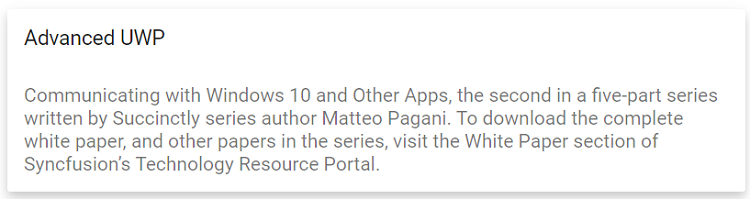

# Getting Started with the Vue Card Component in Vue 3

This article provides a step-by-step guide for setting up a [Vite](https://vitejs.dev) project with a JavaScript environment and integrating the Syncfusion<sup style="font-size:70%">&reg;</sup> Vue Card component using the [Composition API](https://vuejs.org/guide/introduction.html#composition-api) / [Options API](https://vuejs.org/guide/introduction.html#options-api).

The `Composition API` is a new feature introduced in Vue.js 3 that provides an alternative way to organize and reuse component logic. It allows developers to write components as functions that use smaller, reusable functions called composition functions to manage their properties and behavior.

The `Options API` is the traditional way of writing Vue.js components, where the component logic is organized into a series of options that define the component's properties and behavior. These options include data, methods, computed properties, watchers, life cycle hooks, and more.

## Prerequisites

[System requirements for Syncfusion<sup style="font-size:70%">&reg;</sup> Vue UI components](https://ej2.syncfusion.com/vue/documentation/system-requirements)

## Setup the Vite project

A recommended approach for beginning with Vue is to scaffold a project using [Vite](https://vitejs.dev). To create a new Vite project, use one of the commands that are specific to either NPM or Yarn.

```bash
npm create vite@latest
```

or

```bash
yarn create vite
```

Using one of the above commands will lead you to set up additional configurations for the project as below:

1.Define the project name: The name of the project can be specified directly. For this article, the project name is set as `my-project`.

```bash
? Project name: » my-project
```

2.Select `Vue` as the framework. It will create a Vue 3 project.

```bash
? Select a framework: » - Use arrow-keys. Return to submit.
Vanilla
> Vue
  React
  Preact
  Lit
  Svelte
  Others
```

3.Choose `JavaScript` as the framework variant to build this Vite project using JavaScript and Vue.

```bash
? Select a variant: » - Use arrow-keys. Return to submit.
> JavaScript
  TypeScript
  Customize with create-vue ↗
  Nuxt ↗
```

4.Roll down is Vite's new experimental faster bundler (rust-based, replacing roll up). Choose `No` uses the stable, proven roll up-based Vite (recommended for most users)

```bash
Use rolldown-vite (Experimental)? No
```

5.Install dependencies and start the Dev server.

```bash
Install with npm and start now?: Yes
```

Since you selected `Yes`, the development server should start automatically. If you selected `No`, please follow these steps to set up and start the project manually:

```bash
cd my-project
npm install
```

or

```bash
cd my-project
yarn install
```

Now that `my-project` is ready to run with default settings, let's add Syncfusion<sup style="font-size:70%">&reg;</sup> components to the project.

## Add Syncfusion<sup style="font-size:70%">&reg;</sup> Vue packages

Syncfusion<sup style="font-size:70%">&reg;</sup> Vue component packages are available at [npmjs.com](https://www.npmjs.com/search?q=ej2-vue). To use Syncfusion<sup style="font-size:70%">&reg;</sup> Vue components in the project, install the corresponding npm package.

This article uses the [Vue Card component](https://www.syncfusion.com/vue-components/vue-card) as an example. To use the Vue Card component in the project, the `@syncfusion/ej2-vue-layouts` package needs to be installed using the following command:

```bash
npm install @syncfusion/ej2-vue-layouts --save
```

or

```bash
yarn add @syncfusion/ej2-vue-layouts
```

## Import Syncfusion<sup style="font-size:70%">&reg;</sup> CSS styles

You can import themes for the Syncfusion<sup style="font-size:70%">&reg;</sup> Vue component in various ways, such as using CSS or SASS styles from npm packages, CDN, [CRG](https://ej2.syncfusion.com/javascript/documentation/common/custom-resource-generator) and [Theme Studio](https://ej2.syncfusion.com/vue/documentation/appearance/theme-studio). Refer to [themes topic](https://ej2.syncfusion.com/vue/documentation/appearance/theme) to know more about built-in themes and different ways to refer to themes in a Vue project.

In this article, `Material3` theme is applied using CSS styles, which are available in installed packages. The necessary `Material3` CSS styles for the Card component and its dependents were imported into the `<style>` section of **src/App.vue** file.




<style>
  @import '../node_modules/@syncfusion/ej2-base/styles/material3.css';
  @import '../node_modules/@syncfusion/ej2-vue-layouts/styles/material3.css';
</style>




> The order of importing CSS styles should be in line with its dependency graph.

## Adding a header and content

You can create Card with a header in a specific structure. For adding header you need to create a `div` element with `e-card-header` class added.

* You can include heading inside the Card header by adding a `div` element with `e-card-header-caption` class, and also content will be added
 by adding element with `e-card-content`. For detailed information, refer to the [Header and Content](./header-content).




<div class = "e-card">                    --> Root Element
    <div class="e-card-header">           --> Root Header Element
        <div class="e-card-header-caption">    --> Root Heading Element
            <div class="e-card-header-title"></div>   --> Heading Title Element
        </div>
        <div class="e-card-content"></div>         --> Card content Element
    </div>
</div>




## Adding Syncfusion<sup style="font-size:70%">&reg;</sup> Vue Card component in the application

You have completed all the necessary configurations needed for rendering the Syncfusion<sup style="font-size:70%">&reg;</sup> Vue component. Add the HTML div element with **e-card** class into the `<template>` section of the `App.vue` file in src directory.




<template>
    <div id='container' style="margin:50px auto 0; width:100%;">
        <br>
          <div tabindex="0" class="e-card" id="basic">
            <div class="e-card-header">
                <div class="e-card-header-caption">
                    <div class="e-card-title">Advanced UWP</div>
                </div>
            </div>
            <div class="e-card-content">
                Communicating with Windows 10 and Other Apps, the second in a five-part series written by Succinctly series
                author Matteo Pagani. To download the complete white paper, and other papers in the series, visit
                the White Paper section of Syncfusion’s Technology Resource Portal.
            </div>
        </div>
    </div>
</template>
<style>
  @import "../node_modules/@syncfusion/ej2-base/styles/material3.css";
  @import "../node_modules/@syncfusion/ej2-vue-layouts/styles/material3.css";
</style>




<template>
    <div id='container' style="margin:50px auto 0; width:100%;">
        <br>
          <div tabindex="0" class="e-card" id="basic">
            <div class="e-card-header">
                <div class="e-card-header-caption">
                    <div class="e-card-title">Advanced UWP</div>
                </div>
            </div>
            <div class="e-card-content">
                Communicating with Windows 10 and Other Apps, the second in a five-part series written by Succinctly series
                author Matteo Pagani. To download the complete white paper, and other papers in the series, visit
                the White Paper section of Syncfusion’s Technology Resource Portal.
            </div>
        </div>
    </div>
</template>
<script>
export default {
  name: 'App',
  components: {
  },
  data() {
    return {
    };
  }
}
</script>
<style>
  @import "../node_modules/@syncfusion/ej2-base/styles/material3.css";
  @import "../node_modules/@syncfusion/ej2-vue-layouts/styles/material3.css";
</style>




## Run the project

To run the project, use the following command:

```bash
npm run dev
```

or

```bash
yarn run dev
```

The output will appear as follows:

