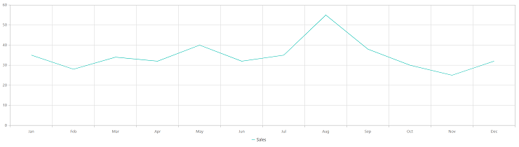

# Getting Started with the Vue Chart Component in the Quasar Framework

This section provides a step-by-step guide to creating a [`Quasar`](https://quasar.dev/) application and integrating the Syncfusion<sup style="font-size:70%">&reg;</sup> Vue Chart component using the [`Composition API`](https://vuejs.org/guide/introduction.html#composition-api). It helps developers quickly set up a responsive and high-performance charting solution within the Quasar ecosystem.

The Quasar Framework is a Vue.js-based open-source framework that enables developers to build modern, performant applications for web, mobile, and desktop platforms from a single codebase.

## Prerequisites

Ensure that the development environment meets the requirements listed in  
[System requirements for Syncfusion<sup style="font-size:70%">&reg;</sup> Vue Chart components](../system-requirements).

## Set up the Quasar project

To create a new https://quasar.dev/start/quick-start/ project, run the following command:

```bash
npm init quasar
```

This command prompts additional configurations. Follow the steps outlined in the images below:


This generates the necessary files and prompts for project dependency installation. Respond with 'yes' to proceed with npm install, as shown in the image below:


Navigate to your project directory:

```bash
cd quasar-project
```

Now that `quasar-project` is ready to run with default settings, let's add the Syncfusion<sup style="font-size:70%">&reg;</sup> Vue Chart component to the project.

## Add Syncfusion<sup style="font-size:70%">&reg;</sup> Vue packages

Syncfusion<sup style="font-size:70%">&reg;</sup> Vue Chart component packages are available at [`npmjs.com`](https://www.npmjs.com/search?q=ej2-vue). To use Syncfusion<sup style="font-size:70%">&reg;</sup> Vue components in the project, install the corresponding npm package.

This article uses the [`Vue Chart component`](https://www.syncfusion.com/vue-components/vue-charts) as an example. To use the Vue Chart component in the project, the `@syncfusion/ej2-vue-charts` package needs to be installed using the following command:

```bash
npm install @syncfusion/ej2-vue-charts --save
```

## Add the Syncfusion<sup style="font-size:70%">&reg;</sup> Vue component

Follow the below steps to add the Vue Chart component:

1\. First, add the `setup` attribute to the `script` tag to indicate that Vue will be using the `Composition API`. And import the Chart component in the `script` section of the **src/app.vue** file.




<script setup>
import { ChartComponent as EjsChart, SeriesCollectionDirective as ESeriesCollection, SeriesDirective as ESeries, LineSeries, Legend, Category } from "@syncfusion/ej2-vue-charts";
</script>



   
2\. In the `template` section, define the Chart component with the [`dataSource`](https://ej2.syncfusion.com/vue/documentation/api/chart#datasource) property.




<template>
    <ejs-chart id="container" :title='title' :primaryXAxis='primaryXAxis'>
        <e-series-collection>
            <e-series :dataSource='seriesData' type='Line' xName='month' yName='sales' name='Sales'> </e-series>
        </e-series-collection>
    </ejs-chart>
</template>




3\. Declare the values for the `dataSource` property in the `script` section.




<script setup>
const seriesData = [
    { month: 'Jan', sales: 35 }, { month: 'Feb', sales: 28 },
    { month: 'Mar', sales: 34 }, { month: 'Apr', sales: 32 },
    { month: 'May', sales: 40 }, { month: 'Jun', sales: 32 },
    { month: 'Jul', sales: 35 }, { month: 'Aug', sales: 55 },
    { month: 'Sep', sales: 38 }, { month: 'Oct', sales: 30 },
    { month: 'Nov', sales: 25 }, { month: 'Dec', sales: 32 }
];
</script>




Here is the summarized code for the above steps in the **src/app.vue** file:




<template>
    <ejs-chart id="container" :title='title' :primaryXAxis='primaryXAxis'>
        <e-series-collection>
            <e-series :dataSource='seriesData' type='Line' xName='month' yName='sales' name='Sales'> </e-series>
        </e-series-collection>
    </ejs-chart>
</template>

<script setup>
import { provide } from 'vue';
import { ChartComponent as EjsChart, SeriesCollectionDirective as ESeriesCollection, SeriesDirective as ESeries, LineSeries, Legend, Category } from "@syncfusion/ej2-vue-charts";

const seriesData = [
    { month: 'Jan', sales: 35 }, { month: 'Feb', sales: 28 },
    { month: 'Mar', sales: 34 }, { month: 'Apr', sales: 32 },
    { month: 'May', sales: 40 }, { month: 'Jun', sales: 32 },
    { month: 'Jul', sales: 35 }, { month: 'Aug', sales: 55 },
    { month: 'Sep', sales: 38 }, { month: 'Oct', sales: 30 },
    { month: 'Nov', sales: 25 }, { month: 'Dec', sales: 32 }
];
const title = 'Sales Analysis';
const primaryXAxis = {valueType: 'Category'};
const chart = [LineSeries, Legend, Category];
provide('chart', chart);
</script>




## Run the project

To run the project, use the following command:

```bash
npm run dev
```

The output will appear as follows:

