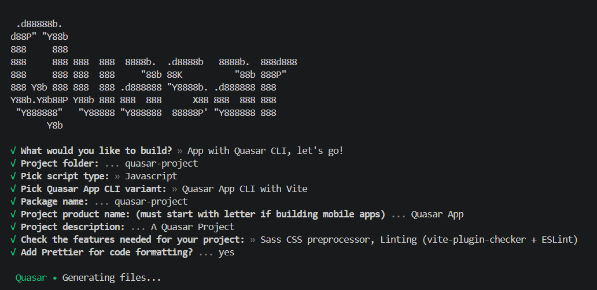
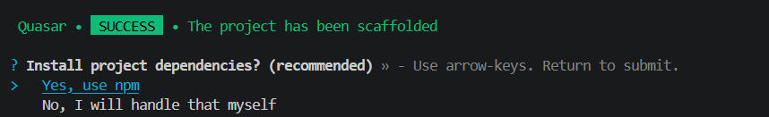
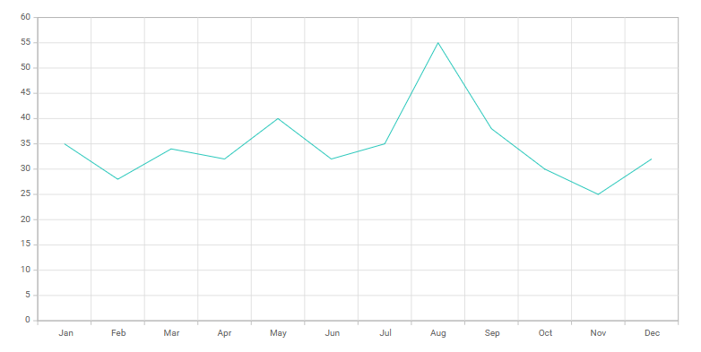

# Getting Started with the Vue Chart Component in the Quasar Framework

This section provides a step-by-step guide to creating a [`Quasar`](https://quasar.dev) application and integrating the Syncfusion<sup style="font-size:70%">&reg;</sup> Vue Chart component using the [`Composition API`](https://vuejs.org/guide/introduction.html#composition-api). It helps developers set up a responsive, high-performance charting solution within the Quasar ecosystem.

The Quasar Framework is a Vue.js–based open-source framework that enables developers to build modern, high-performance applications for web, mobile, and desktop from a single code base.

## Prerequisites

Ensure that the development environment meets the requirements listed in [System requirements for Syncfusion<sup style="font-size:70%">&reg;</sup> Vue Chart components](../system-requirements).

## Set Up the Quasar Project

To create a new Quasar project, run the following command:

```bash
npm init quasar
```

The command prompts for project options; example prompts appear below:



The generator installs dependencies when prompted. Confirm installation to proceed, as shown below:



Navigate to the project directory:

```bash
cd quasar-project
```

Now that `quasar-project` is ready, add the Syncfusion<sup style="font-size:70%">&reg;</sup> Vue Chart component to the project.

## Add Syncfusion<sup style="font-size:70%">&reg;</sup> Vue Packages

Syncfusion<sup style="font-size:70%">&reg;</sup> Vue Chart component packages are available at [`npmjs.com`](https://www.npmjs.com/search?q=ej2-vue). To use Syncfusion<sup style="font-size:70%">&reg;</sup> Vue components in the project, install the corresponding npm package.

This article uses the [`Vue Chart component`](https://www.syncfusion.com/vue-components/vue-charts) as an example. To use the Vue Chart component in the project, install the `@syncfusion/ej2-vue-charts` package using:

```bash
npm install @syncfusion/ej2-vue-charts
```

> Note: npm v5+ saves packages to `dependencies` by default; `--save` is not required.

## Add the Syncfusion<sup style="font-size:70%">&reg;</sup> Vue Component

Follow the steps below to add the Vue Chart component:

**Step 1:** First, add the `setup` attribute to the `script` tag to indicate that Vue will be using the `Composition API`, and import the Chart component in the `script` section of **src/app.vue**.




<script setup>
import { provide } from 'vue';
import { ChartComponent as EjsChart, SeriesCollectionDirective as ESeriesCollection, SeriesDirective as ESeries, LineSeries, Category } from "@syncfusion/ej2-vue-charts";
</script>




**Step 2:** Declare the values for the `dataSource` property in the `script` section.




<script setup>
const seriesData = [
    { month: 'Jan', sales: 35 }, { month: 'Feb', sales: 28 },
    { month: 'Mar', sales: 34 }, { month: 'Apr', sales: 32 },
    { month: 'May', sales: 40 }, { month: 'Jun', sales: 32 },
    { month: 'Jul', sales: 35 }, { month: 'Aug', sales: 55 },
    { month: 'Sep', sales: 38 }, { month: 'Oct', sales: 30 },
    { month: 'Nov', sales: 25 }, { month: 'Dec', sales: 32 }
];
const primaryXAxis = { valueType: 'Category' };
</script>




**Step 3:** Register the required chart modules using the `provide()` method.




<script setup>
// Module injection
provide('chart', [LineSeries, Category]);
</script>




**Step 4:** In the `template` section, define the Chart component with the [`dataSource`](https://ej2.syncfusion.com/vue/documentation/api/chart/series#datasource) property.




<template>
    <ejs-chart id="container" :primaryXAxis='primaryXAxis'>
        <e-series-collection>
            <e-series :dataSource='seriesData' type='Line' xName='month' yName='sales' name='Sales'></e-series>
        </e-series-collection>
    </ejs-chart>
</template>





Here is the summarized code for the above steps in the **src/app.vue** file:




<template>
    <ejs-chart id="container" :primaryXAxis='primaryXAxis'>
        <e-series-collection>
            <e-series :dataSource='seriesData' type='Line' xName='month' yName='sales' name='Sales'></e-series>
        </e-series-collection>
    </ejs-chart>
</template>

<script setup>
import { provide } from 'vue';
import { ChartComponent as EjsChart, SeriesCollectionDirective as ESeriesCollection, SeriesDirective as ESeries, LineSeries, Category } from "@syncfusion/ej2-vue-charts";

// Data source for the chart
const seriesData = [
    { month: 'Jan', sales: 35 }, { month: 'Feb', sales: 28 },
    { month: 'Mar', sales: 34 }, { month: 'Apr', sales: 32 },
    { month: 'May', sales: 40 }, { month: 'Jun', sales: 32 },
    { month: 'Jul', sales: 35 }, { month: 'Aug', sales: 55 },
    { month: 'Sep', sales: 38 }, { month: 'Oct', sales: 30 },
    { month: 'Nov', sales: 25 }, { month: 'Dec', sales: 32 }
];

// Primary X-axis configuration
const primaryXAxis = { valueType: 'Category' };

// Module injection
provide('chart', [LineSeries, Category]);
</script>




## Run the Project

To run the project, use the following command:

```bash
npm run dev
```

Open the generated local URL (for example, `http://localhost:9000`) from terminal in the browser. The application displays the chart as shown below:



**Chart not rendering:**
- Ensure that the required chart modules (`LineSeries`, `Category`) are registered using `provide()` in the script section
- Verify the `dataSource` is correctly assigned with proper field mappings
- Check the browser console (F12 → Console tab) for any error messages

**Module not found error:**
- Confirm that the module is imported from `@syncfusion/ej2-vue-charts`
- Verify the module name is spelled correctly in the import statement and `provide()` call

**Incorrect package version:**
- Verify that `@syncfusion/ej2-vue-charts` is compatible with your Quasar and Vue versions
- Run `npm list @syncfusion/ej2-vue-charts` to check the installed version

**Components not rendering in Quasar layout:**
- Ensure the component is placed in a Quasar page file (e.g., `src/pages/IndexPage.vue`)
- Check that the component has proper container sizing (add CSS for `#container` height)

For additional assistance, refer to the [`Vue Charts API Documentation`](https://ej2.syncfusion.com/vue/documentation/api/chart) and the [Feature Modules](./feature-modules) page.

N> Looking for the full Vue Charts component overview, features, pricing, and documentation? Visit the [Vue Charts](https://www.syncfusion.com/vue-components/vue-charts) page.
