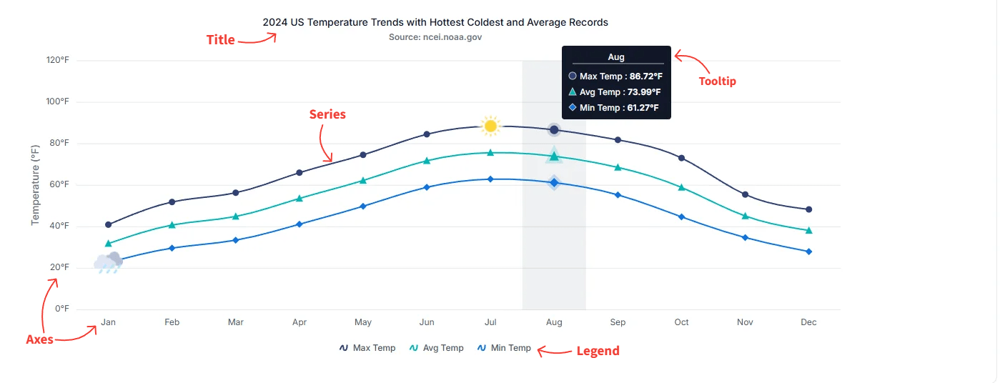

# Understanding of Vue Chart

The Vue Chart component is a versatile visualization tool that presents data using a wide range of graphical formats. Each chart is composed of essential elements—such as the title, series, tooltip, legend, and axes—that work together to provide clear, interactive, and meaningful insights. Understanding these elements helps in configuring and customizing charts for various analytical needs.

The following image highlights the primary elements of a chart:

## Title

The chart title conveys the overall purpose or subject of the visualization. It typically appears at the top of the chart and can be customized in terms of alignment, style, and formatting.  
For more details, see the [Title and Subtitle](./title-subtitle.md) section.

## Series

A series represents a group of data points plotted on the chart. Charts can include one or more series depending on the scenario, and each series can use different chart types such as line, column, area, or other supported visualizations.  
For more details, see the [Series](./chart-types/line.md) section.

## Tooltip

Tooltips display helpful information when users hover over a data point or series. They offer interactive and contextual insights, such as exact values or additional metadata, and can be customized to match the design or analytical needs of the application.  
For more details, see the [Tooltip](./tool-tip.md) section.

## Legend

The legend identifies each series in the chart, making it easier for users to understand dataset distinctions. It also supports toggling the visibility of individual series to facilitate interactive data exploration.  
For more details, see the [Legend](./legend.md) section.

## Axes

Axes structure and organize chart data. Standard Cartesian charts include an x-axis for independent variables and a y-axis for dependent variables. Three-dimensional charts add a z-axis to represent depth. Polar and radar charts instead use radial axes to measure distance from the center and angular axes to define direction. These axes help translate complex datasets into a readable graphical format.