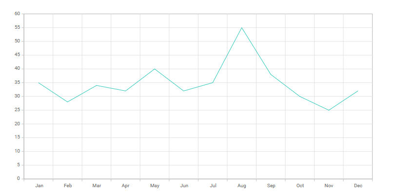

# Getting Started with the Vue Chart Component in Vue 3

This article provides a step-by-step guide to setting up a [`Vite`](https://vitejs.dev) project using JavaScript and integrating the Syncfusion<sup style="font-size:70%">&reg;</sup> Vue Chart component with either the [`Composition API`](https://vuejs.org/guide/introduction.html#composition-api) or the [`Options API`](https://vuejs.org/guide/introduction.html#options-api).

The **Composition API** groups related logic into reusable functions and is recommended for larger, composition-friendly code bases. The **Options API** uses `data`, `methods`, and life cycle options and may be preferable for smaller components or teams familiar with Vue 2 patterns. Choose the API that best fits your project’s structure and long-term maintainability.

## Prerequisites

Ensure your development environment meets the following requirements as listed in [System requirements for Syncfusion<sup style="font-size:70%">&reg;</sup> Vue UI components](https://ej2.syncfusion.com/vue/documentation/system-requirements).

## Set Up the Vite Project

Create a Vite project using either npm or Yarn.

**npm**

```bash
npm create vite@latest my-app -- --template vue
```

**yarn**

```bash
yarn create vite my-app --template vue
```

If Vite prompts you to install dependencies and start the project immediately, select **No**. The Syncfusion package is installed in a later step.

Navigate to the project directory:

```bash
cd my-app
```

Install the project dependencies using either npm or Yarn.

**npm**

```bash
npm install
```

**yarn**

```bash
yarn install
```

Now that `my-app` is ready, add Syncfusion<sup style="font-size:70%">&reg;</sup> Vue components to the project.

> **Note:** To create a TypeScript project, use `npm create vite@latest my-app -- --template vue-ts` or `yarn create vite my-app --template vue-ts`.

## Add Syncfusion<sup style="font-size:70%">&reg;</sup> Vue Packages

Syncfusion<sup style="font-size:70%">&reg;</sup> Vue component packages are available at [npmjs.com](https://www.npmjs.com/search?q=ej2-vue). To use Syncfusion<sup style="font-size:70%">&reg;</sup> Vue components in the project, install the corresponding npm package.

This article uses the [`Vue Chart component`](https://www.syncfusion.com/vue-components/vue-charts) as an example. To use the Vue Chart component in the project, install the `@syncfusion/ej2-vue-charts` package using either npm or Yarn. The package is compatible with Vue 3.0 and later versions.

**npm**

```bash
npm install @syncfusion/ej2-vue-charts
```

**yarn**

```bash
yarn add @syncfusion/ej2-vue-charts
```

> **Note:** For TypeScript support, refer to [Getting Started with Vue UI Components using Composition API and TypeScript](https://ej2.syncfusion.com/vue/documentation/getting-started/vue-3-ts-composition) or [Getting Started with Vue UI Components using Options API and TypeScript](https://ej2.syncfusion.com/vue/documentation/getting-started/vue-3-ts-options).

## Add Syncfusion<sup style="font-size:70%">&reg;</sup> Vue Chart Component

Follow the steps below to add the Vue Chart component using the `Composition API` or `Options API`:

**Step 1:** First, import and register the Chart component and its child directives in the `script` section of **src/App.vue**. If using the `Composition API`, add the `setup` attribute to the `script` tag.




<script setup>
import { ChartComponent as EjsChart, SeriesCollectionDirective as ESeriesCollection, SeriesDirective as ESeries, LineSeries, Category } from "@syncfusion/ej2-vue-charts";
</script>




<script>
import { ChartComponent, SeriesCollectionDirective, SeriesDirective, LineSeries, Category } from '@syncfusion/ej2-vue-charts';
// Register Chart component and its child directives
export default {
  name: "App",
  components: {
    'ejs-chart' : ChartComponent,
    'e-series-collection' : SeriesCollectionDirective,
    'e-series' : SeriesDirective
  }
}
</script>




**Step 2:** Declare the values for the `dataSource` property in the `script` section.




<script setup>
let seriesData = [
    { month: 'Jan', sales: 35 }, { month: 'Feb', sales: 28 },
    { month: 'Mar', sales: 34 }, { month: 'Apr', sales: 32 },
    { month: 'May', sales: 40 }, { month: 'Jun', sales: 32 },
    { month: 'Jul', sales: 35 }, { month: 'Aug', sales: 55 },
    { month: 'Sep', sales: 38 }, { month: 'Oct', sales: 30 },
    { month: 'Nov', sales: 25 }, { month: 'Dec', sales: 32 }
];
let primaryXAxis = { valueType: 'Category' };
</script>




<script>
export default {
  data() {
    return {
      seriesData: [
          { month: 'Jan', sales: 35 }, { month: 'Feb', sales: 28 },
          { month: 'Mar', sales: 34 }, { month: 'Apr', sales: 32 },
          { month: 'May', sales: 40 }, { month: 'Jun', sales: 32 },
          { month: 'Jul', sales: 35 }, { month: 'Aug', sales: 55 },
          { month: 'Sep', sales: 38 }, { month: 'Oct', sales: 30 },
          { month: 'Nov', sales: 25 }, { month: 'Dec', sales: 32 }
      ],
      primaryXAxis : { valueType: 'Category' }
    };
  }
}
</script>




**Step 3:** In the `template` section, define the Chart component with the [`dataSource`](https://ej2.syncfusion.com/vue/documentation/api/chart/series#datasource) property.




<template>
<ejs-chart id="container" :primaryXAxis='primaryXAxis'>
    <e-series-collection>
        <e-series :dataSource='seriesData' type='Line' xName='month' yName='sales' name='Sales'></e-series>
    </e-series-collection>
</ejs-chart>
</template>



Here is the summarized code for the above steps in the **src/App.vue** file. 

**Note**: The Composition API example uses an import alias for `ChartComponent`, while the Options API example uses `ChartComponent` directly. The names shown in each example match the corresponding imports.



<template>
  <ejs-chart id="container" :primaryXAxis='primaryXAxis'>
      <e-series-collection>
          <e-series :dataSource='seriesData' type='Line' xName='month' yName='sales' name='Sales'></e-series>
      </e-series-collection>
  </ejs-chart>
</template>
<script setup>
import { provide } from 'vue';
import { ChartComponent as EjsChart, SeriesCollectionDirective as ESeriesCollection, SeriesDirective as ESeries, LineSeries, Category } from "@syncfusion/ej2-vue-charts";

let seriesData = [
  { month: "Jan", sales: 35 }, { month: "Feb", sales: 28 },
  { month: "Mar", sales: 34 }, { month: "Apr", sales: 32 },
  { month: "May", sales: 40 }, { month: "Jun", sales: 32 },
  { month: "Jul", sales: 35 }, { month: "Aug", sales: 55 },
  { month: "Sep", sales: 38 }, { month: "Oct", sales: 30 },
  { month: "Nov", sales: 25 }, { month: "Dec", sales: 32 }
];
const primaryXAxis = {valueType: 'Category'};
const chart = [LineSeries, Category];
provide('chart', chart);
</script>




<template>
  <ejs-chart id="container" :primaryXAxis="primaryXAxis">
    <e-series-collection>
      <e-series :dataSource="seriesData" type="Line" xName="month" yName="sales" name="Sales"></e-series>
    </e-series-collection>
  </ejs-chart>
</template>

<script>
import { ChartComponent, SeriesCollectionDirective, SeriesDirective, LineSeries, Category } from "@syncfusion/ej2-vue-charts";

export default {
    name: "App",
    components: {
        'ejs-chart': ChartComponent,
        'e-series-collection': SeriesCollectionDirective,
        'e-series': SeriesDirective
    },
    data() {
        return {
          primaryXAxis: {
            valueType: "Category"
          },
          seriesData: [
            { month: "Jan", sales: 35 }, { month: "Feb", sales: 28 },
            { month: "Mar", sales: 34 }, { month: "Apr", sales: 32 },
            { month: "May", sales: 40 }, { month: "Jun", sales: 32 },
            { month: "Jul", sales: 35 }, { month: "Aug", sales: 55 },
            { month: "Sep", sales: 38 }, { month: "Oct", sales: 30 },
            { month: "Nov", sales: 25 }, { month: "Dec", sales: 32 }
          ]
        };
    },
    provide: {
      chart: [LineSeries, Category]
    }
};
</script>




## Run the Project

To run the project, use either npm or Yarn:

**npm**

```bash
npm run dev
```

**yarn**

```bash
yarn run dev
```

- Open the project URL shown in the terminal (usually `http://localhost:5173`) and verify that the chart is displayed.

The output will appear as follows:



> **Sample**: You can explore the complete sample project in the [`vue-3-chart-getting-started`](https://github.com/SyncfusionExamples/vue3-chart-getting-started) repository.

For migration information from Vue 2 to Vue 3, refer to the [Vue 3 Migration Guide](https://v3-migration.vuejs.org/).

## Troubleshooting

* **Chart is not rendering** — Ensure the required chart modules, such as `LineSeries` and `Category`, are provided using `provide()` in the Composition API or the `provide` option in the Options API.
* **Module not found error** — Confirm that the module is imported from `@syncfusion/ej2-vue-charts` and that the package is installed.
* **No data is displayed** — Verify that `xName` and `yName` match the field names in the data source and that `primaryXAxis.valueType` is set to `Category`.

For additional assistance, refer to the [`Vue Charts API Documentation`](https://ej2.syncfusion.com/vue/documentation/api/chart) and the [Feature Modules](./feature-modules) page.

## See Also

* [Getting Started with Vue UI Components using Composition API and TypeScript](https://ej2.syncfusion.com/vue/documentation/getting-started/vue-3-ts-composition)
* [Getting Started with Vue UI Components using Options API and TypeScript](https://ej2.syncfusion.com/vue/documentation/getting-started/vue-3-ts-options)