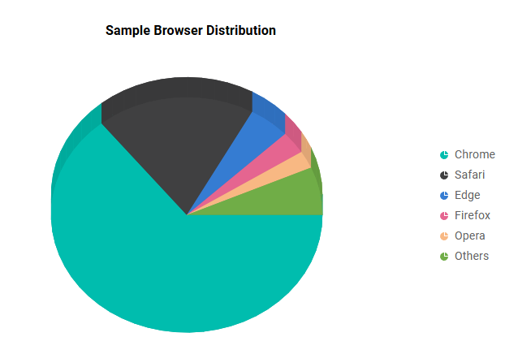

# Getting Started with the Vue 3D Circular Chart in Vue 3

This article provides a step-by-step guide to setting up a [Vite](https://vite.dev/) JavaScript project and integrating the Syncfusion<sup style="font-size:70%">&reg;</sup> Vue 3D Circular Chart component using either the [Composition API](https://vuejs.org/guide/introduction.html#composition-api) or the [Options API](https://vuejs.org/guide/introduction.html#options-api).

The **Composition API** groups related logic into reusable functions. The **Options API** organizes component logic with options such as `data`, `methods`, and life cycle hooks. Choose the API that best fits the application's structure.

## Prerequisites

Ensure that the development environment meets the [system requirements for Syncfusion Vue UI components](https://ej2.syncfusion.com/vue/documentation/system-requirements).

## Set Up the Vite Project

Create a Vite project using either npm or yarn.

**npm**

```bash
npm create vite@latest my-app -- --template vue
```

**yarn**

```bash
yarn create vite my-app --template vue
```

If Vite prompts you to install dependencies and start the project immediately, select **No**. The Syncfusion package is installed in a later step.

Navigate to the project folder:

```bash
cd my-app
```

Install the application dependencies using npm or yarn:

**npm**

```bash
npm install
```

**yarn**

```bash
yarn install
```
> **Note** If you prefer TypeScript instead of JavaScript, create the application using npm create vite@latest my-app -- --template vue-ts.

## Add the Syncfusion<sup style="font-size:70%">&reg;</sup> Vue Package

Syncfusion Vue packages are available on [npm](https://www.npmjs.com/search?q=ej2-vue).

Install the `@syncfusion/ej2-vue-charts` package. Use a package release compatible with Vue 3 and the Node.js version used by the project.

**npm**

```bash
npm install @syncfusion/ej2-vue-charts
```

**yarn**

```bash
yarn add @syncfusion/ej2-vue-charts
```

> **Note:** For TypeScript projects, refer to [Vue 3 with the Composition API and TypeScript](https://ej2.syncfusion.com/vue/documentation/getting-started/vue-3-ts-composition) or [Vue 3 with the Options API and TypeScript](https://ej2.syncfusion.com/vue/documentation/getting-started/vue-3-ts-options).

## Add the Syncfusion<sup style="font-size:70%">&reg;</sup> Vue 3D Circular Chart Component

Follow these steps to add the Vue 3D Circular Chart component using the Composition API or Options API.

**Step 1:** Import and Register the Component

Import the 3D Circular Chart component, its child directives, and the feature modules used by the example in **src/App.vue**.

The example uses the following modules:

- `PieSeries3D` renders the 3D pie series.

In the Composition API example, alias the component and directive imports to names that match the custom elements in the template. Components imported in `<script setup>` are available directly in the template.




<script setup>
import { provide } from 'vue';
import {
  CircularChart3DComponent as EjsCircularchart3d,
  CircularChart3DSeriesCollectionDirective as ECircularchart3dSeriesCollection,
  CircularChart3DSeriesDirective as ECircularchart3dSeries,
  PieSeries3D
} from '@syncfusion/ej2-vue-charts';

provide('circularchart3d', [
  PieSeries3D
]);
</script>




<script>
import {
  CircularChart3DComponent,
  CircularChart3DSeriesCollectionDirective,
  CircularChart3DSeriesDirective,
  PieSeries3D
} from '@syncfusion/ej2-vue-charts';

export default {
  name: 'App',
  components: {
    'ejs-circularchart3d': CircularChart3DComponent,
    'e-circularchart3d-series-collection': CircularChart3DSeriesCollectionDirective,
    'e-circularchart3d-series': CircularChart3DSeriesDirective
  },
  provide: {
    circularchart3d: [
      PieSeries3D
    ]
  }
};
</script>




> **Note:** The module injection key must be `circularchart3d`. Register only the modules required by the features used in the application.

**Step 2:** Declare the Data and Configuration

Define the series data and the chart configuration values in the `script` section.




<script setup>
const seriesData = [
  { browser: 'Chrome', share: 64.2 },
  { browser: 'Safari', share: 18.8 },
  { browser: 'Edge', share: 4.9 },
  { browser: 'Firefox', share: 3.1 },
  { browser: 'Opera', share: 2.4 },
  { browser: 'Others', share: 6.6 }
];

const title = 'Sample Browser Distribution';
const tilt = 30;
</script>




<script>
export default {
  data() {
    return {
      seriesData: [
        { browser: 'Chrome', share: 64.2 },
        { browser: 'Safari', share: 18.8 },
        { browser: 'Edge', share: 4.9 },
        { browser: 'Firefox', share: 3.1 },
        { browser: 'Opera', share: 2.4 },
        { browser: 'Others', share: 6.6 }
      ],
      title: 'Sample Browser Distribution',
      tilt: 30
    };
  }
};
</script>




**Step 3:** Define the 3D Circular Chart in the Template

Add the 3D Circular Chart and its series directives to the `template` section of **src/App.vue**.

The series uses the following properties:

- [`dataSource`](https://ej2.syncfusion.com/vue/documentation/api/circularchart3d/pieseries3d#datasource) specifies the array of data objects.
- [`xName`](https://ej2.syncfusion.com/vue/documentation/api/circularchart3d/pieseries3d#xname) maps the category field.
- [`yName`](https://ej2.syncfusion.com/vue/documentation/api/circularchart3d/pieseries3d#yname) maps the numeric value field.
- [`title`](https://ej2.syncfusion.com/vue/documentation/api/circularchart3d/circularChart3DModel#title) specifies the chart title.
- [`tilt`](https://ej2.syncfusion.com/vue/documentation/api/circularchart3d/circularChart3DModel#tilt) specifies the vertical rotation of the 3D chart.




<template>
  <div id="app">
    <ejs-circularchart3d
      id="container"
      :title="title"
      :tilt="tilt"
    >
      <e-circularchart3d-series-collection>
        <e-circularchart3d-series
          :dataSource="seriesData"
          xName="browser"
          yName="share"
        ></e-circularchart3d-series>
      </e-circularchart3d-series-collection>
    </ejs-circularchart3d>
  </div>
</template>




Each data object must contain the fields assigned to `xName` and `yName`. The field assigned to `yName` must contain a numeric value.

Here is the summarized code for the above steps in the **src/App.vue** file.

Replace the contents of **src/App.vue** with either the Composition API or Options API example.




<template>
  <div id="app">
    <ejs-circularchart3d
      id="container"
      :title="title"
      :tilt="tilt"
    >
      <e-circularchart3d-series-collection>
        <e-circularchart3d-series
          :dataSource="seriesData"
          xName="browser"
          yName="share"
        ></e-circularchart3d-series>
      </e-circularchart3d-series-collection>
    </ejs-circularchart3d>
  </div>
</template>

<script setup>
import { provide } from 'vue';
import {
  CircularChart3DComponent as EjsCircularchart3d,
  CircularChart3DSeriesCollectionDirective as ECircularchart3dSeriesCollection,
  CircularChart3DSeriesDirective as ECircularchart3dSeries,
  PieSeries3D
} from '@syncfusion/ej2-vue-charts';

const seriesData = [
  { browser: 'Chrome', share: 64.2 },
  { browser: 'Safari', share: 18.8 },
  { browser: 'Edge', share: 4.9 },
  { browser: 'Firefox', share: 3.1 },
  { browser: 'Opera', share: 2.4 },
  { browser: 'Others', share: 6.6 }
];

const title = 'Sample Browser Distribution';
const tilt = 30;
provide('circularchart3d', [
  PieSeries3D
]);
</script>




<template>
  <div id="app">
    <ejs-circularchart3d
      id="container"
      :title="title"
      :tilt="tilt"
    >
      <e-circularchart3d-series-collection>
        <e-circularchart3d-series
          :dataSource="seriesData"
          xName="browser"
          yName="share"
        ></e-circularchart3d-series>
      </e-circularchart3d-series-collection>
    </ejs-circularchart3d>
  </div>
</template>

<script>
import {
  CircularChart3DComponent,
  CircularChart3DSeriesCollectionDirective,
  CircularChart3DSeriesDirective,
  PieSeries3D
} from '@syncfusion/ej2-vue-charts';

export default {
  name: 'App',
  components: {
    'ejs-circularchart3d': CircularChart3DComponent,
    'e-circularchart3d-series-collection': CircularChart3DSeriesCollectionDirective,
    'e-circularchart3d-series': CircularChart3DSeriesDirective
  },
  provide: {
    circularchart3d: [
      PieSeries3D
    ]
  },
  data() {
    return {
      seriesData: [
        { browser: 'Chrome', share: 64.2 },
        { browser: 'Safari', share: 18.8 },
        { browser: 'Edge', share: 4.9 },
        { browser: 'Firefox', share: 3.1 },
        { browser: 'Opera', share: 2.4 },
        { browser: 'Others', share: 6.6 }
      ],
      title: 'Sample Browser Distribution',
      tilt: 30
    };
  }
};
</script>




## Run the Project

Save **src/App.vue**, and then start the development server using either npm or yarn.

**npm**

```bash
npm run dev
```

**yarn**

```bash
yarn run dev
```

Open the local URL displayed in the terminal, commonly `http://localhost:5173`, and verify that a 3D pie chart titled **Sample Browser Distribution** displays six categories.



## Troubleshooting

- **The 3D Circular Chart is not rendered.** Verify that the component and both child directives are imported. In the Options API, also verify that they are registered in `components`. Check the browser console for component, module, data, or licensing errors.
- **The pie series is not displayed.** Import `PieSeries3D` and include it in the array provided with the exact `circularchart3d` key.
- **No data is displayed.** Verify that `dataSource` contains records, `xName` and `yName` match fields in every data object, and the field mapped by `yName` contains numeric values.
- **The Composition API template does not recognize the component.** Verify that the imported component and directives use aliases matching the template element names.
- **An import or runtime error is displayed.** Verify that `@syncfusion/ej2-vue-charts` is installed and that its version supports the project's Vue and Node.js versions.

For additional assistance, refer to the [Vue 3D Circular Chart API documentation](https://ej2.syncfusion.com/vue/documentation/api/circularchart3d).

## See Also

- [Vue 3D Circular Chart data labels](https://ej2.syncfusion.com/vue/documentation/circular-chart-3d/data-label)
- [Vue 3D Circular Chart legend](https://ej2.syncfusion.com/vue/documentation/circular-chart-3d/legend)
- [Vue 3D Circular Chart Demos](https://ej2.syncfusion.com/vue/demos/#/material3/three-dimension-circular-chart/pie)
- [Vue 3D Circular Chart getting-started sample](https://github.com/SyncfusionExamples/getting-started-with-the-vue-3d-circular-charts-component)
- [Vue 3 Migration Guide](https://v3-migration.vuejs.org/)
- [Getting Started with Vue UI Components using the Composition API and TypeScript](https://ej2.syncfusion.com/vue/documentation/getting-started/vue-3-ts-composition)
- [Getting Started with Vue UI Components using the Options API and TypeScript](https://ej2.syncfusion.com/vue/documentation/getting-started/vue-3-ts-options)
