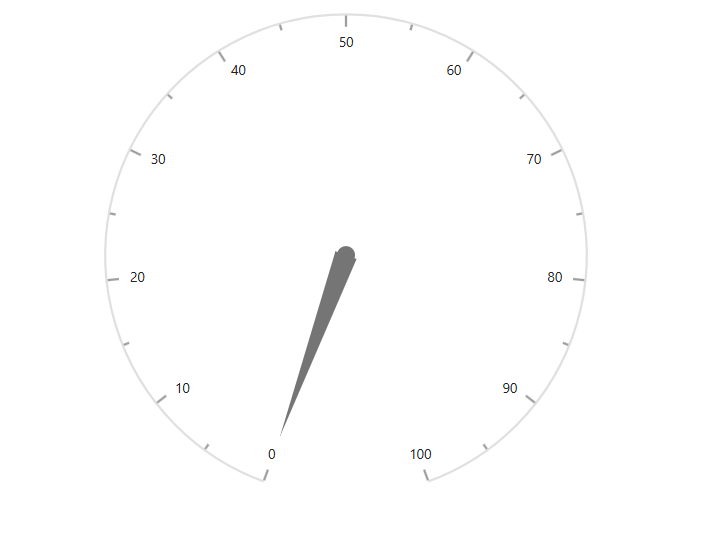

# Getting Started with the Vue Circular Gauge Component in Vue 3

This article provides a step-by-step guide to creating a [Vite](https://vite.dev/) JavaScript project and integrating the Syncfusion<sup style="font-size:70%">&reg;</sup> Vue Circular Gauge component using either the [Composition API](https://vuejs.org/guide/introduction.html#composition-api) or the [Options API](https://vuejs.org/guide/introduction.html#options-api).

The **Composition API** groups related logic into reusable functions. The **Options API** organizes component logic with options such as `data`, `methods`, and life cycle hooks. Choose the API that best fits the application's structure.

The Circular Gauge visualizes numeric values on a circular scale. It can be configured as a speedometer, meter gauge, analog clock, or other radial indicator by customizing its axes, pointers, ranges, ticks, and labels.

## Prerequisites

Ensure that the development environment meets the [system requirements for Syncfusion<sup style="font-size:70%">&reg;</sup> Vue UI components](https://ej2.syncfusion.com/vue/documentation/system-requirements).

## Set Up the Vite Project

Create a Vite project using either npm or yarn.

**npm**

```bash
npm create vite@latest my-app -- --template vue
```

**yarn**

```bash
yarn create vite my-app --template vue
```

If Vite prompts you to install dependencies and start the project immediately, select **No**. The project dependencies and Syncfusion package are installed in the following steps.

Navigate to the project directory:

```bash
cd my-app
```

Install the project dependencies.

**npm**

```bash
npm install
```

**yarn**

```bash
yarn install
```

> **Note:** To create a TypeScript project, use `npm create vite@latest my-app -- --template vue-ts` or `yarn create vite my-app --template vue-ts`.

## Add the Syncfusion<sup style="font-size:70%">&reg;</sup> Vue Circular Gauge Package

Syncfusion<sup style="font-size:70%">&reg;</sup> Vue packages are available on [npm](https://www.npmjs.com/search?q=ej2-vue). Refer to the product documentation or npm search when identifying the package used by another Syncfusion component.

**npm**

```bash
npm install @syncfusion/ej2-vue-circulargauge
```

**yarn**

```bash
yarn add @syncfusion/ej2-vue-circulargauge
```

> **Note:** For TypeScript projects, refer to [Vue 3 with the Composition API and TypeScript](https://ej2.syncfusion.com/vue/documentation/getting-started/vue-3-ts-composition) or [Vue 3 with the Options API and TypeScript](https://ej2.syncfusion.com/vue/documentation/getting-started/vue-3-ts-options).

## Add the Syncfusion<sup style="font-size:70%">&reg;</sup> Vue Circular Gauge Component

Follow these steps to add the Vue Circular Gauge component using the Composition API or Options API.

**Step 1:** Import and Register the Component

Import the Circular Gauge component in **src/App.vue**.

In the Composition API example, the aliases correspond to the custom-element names used in the template. Components imported in `<script setup>` are available to the template without a `components` option.




<script setup>
import {
  CircularGaugeComponent as EjsCirculargauge
} from '@syncfusion/ej2-vue-circulargauge';
</script>




<script>
import {
  CircularGaugeComponent
} from '@syncfusion/ej2-vue-circulargauge';

export default {
  name: 'App',
  components: {
    'ejs-circulargauge': CircularGaugeComponent
  }
};
</script>




**Step 2:** Define the Circular Gauge in the Template

Add the Circular Gauge to the `template` section of **src/App.vue**.




<template>
  <div id="app">
    <ejs-circulargauge id="circulargauge" :title="title">
    </ejs-circulargauge>
  </div>
</template>




Here is the summarized code for the above steps. Replace the contents of **src/App.vue** with either the Composition API or Options API example.




<template>
  <div id="app">
    <ejs-circulargauge id="circulargauge" :title="title">
    </ejs-circulargauge>
  </div>
</template>

<script setup>
import {
  CircularGaugeComponent as EjsCirculargauge
} from '@syncfusion/ej2-vue-circulargauge';
</script>




<template>
  <div id="app">
    <ejs-circulargauge id="circulargauge" :title="title">
    </ejs-circulargauge>
  </div>
</template>

<script>
import {
  CircularGaugeComponent
} from '@syncfusion/ej2-vue-circulargauge';

export default {
  name: 'App',
  components: {
    'ejs-circulargauge': CircularGaugeComponent
  }
};
</script>




## Run the Project

Save **src/App.vue**, and then start the development server.

**npm**

```bash
npm run dev
```

**yarn**

```bash
yarn run dev
```

Open the URL displayed in the terminal, commonly `http://localhost:5173`, and verify that the Circular Gauge is displayed correctly.



> **Sample:** Explore the [Vue Circular Gauge getting-started sample](https://github.com/SyncfusionExamples/getting-started-with-the-vue-circular-gauge-component).

## Troubleshooting

- **The Circular Gauge is not rendered.** Verify that the component and all child directives are imported or registered correctly and check the browser console for component, package, or licensing errors.
- **The gauge is blank.** Ensure that at least one `e-axis` is declared inside `e-axes` and that the axis contains a pointer or other visible elements.
- **A module-not-found error occurs.** Ensure that the required Circular Gauge package is installed, and then restart the development server.
- **A package or Vue version error occurs.** Confirm that the installed package release supports Vue 3 and the project's Node.js version.

For additional assistance, refer to the [Vue Circular Gauge API documentation](https://ej2.syncfusion.com/vue/documentation/api/circular-gauge).

## See Also

- [Vue Circular Gauge axes](https://ej2.syncfusion.com/vue/documentation/circular-gauge/gauge-axes)
- [Vue Circular Gauge ranges](https://ej2.syncfusion.com/vue/documentation/circular-gauge/gauge-ranges)
- [Vue Circular Gauge user interaction](https://ej2.syncfusion.com/vue/documentation/circular-gauge/gauge-user-interaction)
- [Vue Circular Gauge examples](https://ej2.syncfusion.com/vue/demos/#/material3/circular-gauge/default-functionalities.html)
- [Getting Started with Vue UI Components using the Composition API and TypeScript](https://ej2.syncfusion.com/vue/documentation/getting-started/vue-3-ts-composition)
- [Getting Started with Vue UI Components using the Options API and TypeScript](https://ej2.syncfusion.com/vue/documentation/getting-started/vue-3-ts-options)
