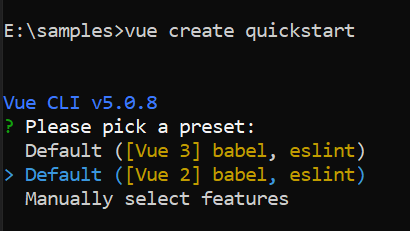

# Getting Started with the Vue Circular Gauge Component in Vue 2

This article provides a step-by-step guide to creating a Vue 2 application using [Vue CLI](https://cli.vuejs.org/) and integrating the Syncfusion<sup>®</sup> Vue Circular Gauge component.

The Circular Gauge visualizes numeric values on a circular scale. It can be used to create speedometers, meter gauges, clocks, and other radial indicators by configuring axes, ranges, ticks, labels, and pointers.

## Prerequisites

Ensure that the development environment meets the [system requirements for Syncfusion Vue UI components](https://ej2.syncfusion.com/vue/documentation/system-requirements).

## Dependencies

The following packages are used by the Vue Circular Gauge package:

```
|-- @syncfusion/ej2-vue-circulargauge
    |-- @syncfusion/ej2-base
    |-- @syncfusion/ej2-buttons
    |-- @syncfusion/ej2-popups
       |-- @syncfusion/ej2-splitbuttons
       |-- @syncfusion/ej2-vue-base
    |-- @syncfusion/ej2-svg-base
    |-- @syncfusion/ej2-circulargauge
```

Use a package release that supports Vue 2. Before upgrading, check the [Vue system requirements](https://ej2.syncfusion.com/vue/documentation/system-requirements) and package release notes.

## Set Up the Vue 2 Project

Install Vue CLI globally using either npm or yarn, and create a project with the [`vue create`](https://cli.vuejs.org/#getting-started) command.

**npm**

```bash
npm install -g @vue/cli
vue create quickstart
```

**yarn**

```bash
yarn global add @vue/cli
vue create quickstart
```

When creating the project, select `Default ([Vue 2] babel, eslint)` from the menu. If this preset is unavailable, select the manual configuration option and choose Vue 2 when prompted for the Vue version.



After the project is created, navigate to its directory:

```bash
cd quickstart
```

## Add the Syncfusion<sup style="font-size:70%">&reg;</sup> Vue Package

Syncfusion<sup style="font-size:70%">&reg;</sup> Vue packages are available on [npm](https://www.npmjs.com/search?q=ej2-vue).

Install the package using either npm or yarn.

**npm**

```bash
npm install @syncfusion/ej2-vue-circulargauge
```

**yarn**

```bash
yarn add @syncfusion/ej2-vue-circulargauge
```

> **Note:** npm v5 and later save installed packages to `dependencies` by default, so the `--save` option is not required.

## Add the Syncfusion<sup style="font-size:70%">&reg;</sup> Vue Circular Gauge Component

Follow these steps to add the Vue Circular Gauge component.

**Step 1:** Import and locally register the Circular Gauge component and its axis and pointer directives in the `script` section of **src/App.vue**.




<script>
import {
  CircularGaugeComponent
} from '@syncfusion/ej2-vue-circulargauge';

export default {
  components: {
    'ejs-circulargauge': CircularGaugeComponent
  }
};
</script>




**Step 2:** Define the Circular Gauge with one axis and one pointer in the `template` section.




<template>
  <div id="app">
      <ejs-circulargauge id="circulargauge">
      </ejs-circulargauge>
  </div>
</template>




Here is the summarized code for the above steps in the **src/App.vue** file:







## Run the Project

Save **src/main.js** and **src/App.vue**, and then start the development server using either npm or yarn.

**npm**

```bash
npm run serve
```

**yarn**

```bash
yarn run serve
```

Open the local URL displayed in the terminal, commonly `http://localhost:8080`, and verify that the Circular Gauge is displayed correctly.



## Troubleshooting

- **The Circular Gauge is not rendered.** Verify that `CircularGaugeComponent` is registered, and the browser console contains no component errors.
- **A module-not-found error occurs.** Ensure that the required Circular Gauge package is installed, and then restart the development server.
- **A package or Vue version error occurs.** Confirm that the installed package release supports Vue 2 and that all Syncfusion packages use compatible versions.

For additional assistance, refer to the [Vue Circular Gauge API documentation](https://ej2.syncfusion.com/vue/documentation/api/circular-gauge).

## See Also

- [Vue Circular Gauge pointers](https://ej2.syncfusion.com/vue/documentation/circular-gauge/gauge-pointers)
- [Vue Circular Gauge examples](https://ej2.syncfusion.com/vue/demos/#/material3/circular-gauge/default-functionalities.html)
- [Getting Started with Vue 3 using the Composition API and TypeScript](https://ej2.syncfusion.com/vue/documentation/getting-started/vue-3-ts-composition)
- [Getting Started with Vue 3 using the Options API and TypeScript](https://ej2.syncfusion.com/vue/documentation/getting-started/vue-3-ts-options)
