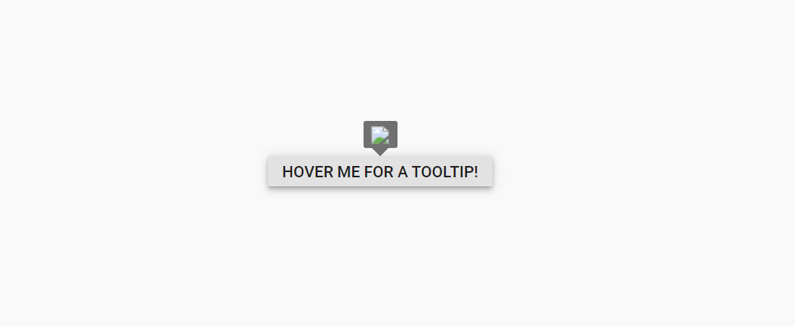
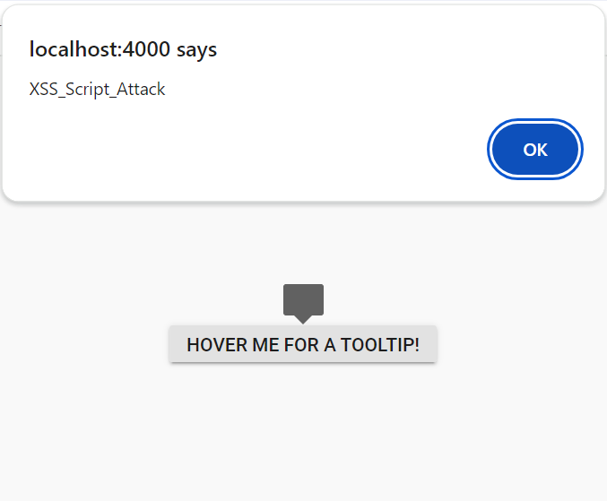

#  Syncfusion<sup style="font-size:70%">&reg;</sup> Vue Components - Security

Security is a critical aspect of web applications. Using HTTPS for data encryption, validating and sanitizing user inputs, and implementing strong authentication measures (such as multi-factor authentication) are essential practices in web application development.

Syncfusion<sup style="font-size:70%">&reg;</sup> Vue components are implemented with these security considerations.

Vue also provides built-in security guidance:

* [Security in Vue](https://vuejs.org/guide/best-practices/security)

## Security Vulnerabilities

Security vulnerabilities are weaknesses in the design, implementation, or configuration of a web application that can be exploited by attackers. Common vulnerabilities include:

* [Cross-Site Scripting](https://developer.mozilla.org/en-US/docs/Glossary/Cross-site_scripting) - XSS is a security vulnerability that can occur in web applications. These scripts can steal session cookies, redirect users to malicious websites, or deface the website. XSS vulnerabilities typically arise when the application fails to properly validate or encode user-supplied input before rendering it in the browser.

* [Cross-Site Request Forgery](https://developer.mozilla.org/en-US/docs/Glossary/CSRF) - CSRF is a type of web security vulnerability that allows an attacker to force a logged-in user to perform actions on a web application without their consent or knowledge. CSRF attacks exploit the trust that a web application has in the user's browser by tricking it into sending unauthorized requests to the vulnerable application.

* Injection Attacks - These occur when an attacker injects malicious code (such as SQL injection, XML injection, or command injection) into input fields or parameters of a web application. If the application does not properly sanitize or validate user inputs, it can execute unintended commands or gain unauthorized access to sensitive data.

Syncfusion<sup style="font-size:70%">&reg;</sup> Vue components provide support for implementing web applications with enhanced security features.

## Security Considerations

Incorporating security from the start of development is vital. Syncfusion<sup style="font-size:70%">&reg;</sup> considers several security aspects in Vue components. Key topics covered here:

* [Content Security Policy](#content-security-policy)
* [HTML Sanitizer](#html-sanitizer)
* [Browser Storage](#browser-storage)

### Content Security Policy

[Content Security Policy (CSP)](https://developer.mozilla.org/en-US/docs/Web/HTTP/CSP) is a browser security feature that helps mitigate XSS and code injection by restricting the sources of content such as scripts, styles, fonts, and images. CSP can block inline styles, inline scripts, eval, and new Function, unless explicitly allowed.

To implement CSP, include a `<meta>` tag or HTTP header with the required directives. Syncfusion<sup style="font-size:70%">&reg;</sup> Vue components are designed to work with appropriate CSP directives. Some commonly required directives are shown below.

#### CSP Directives

The following directives are essential for utilizing Syncfusion<sup style="font-size:70%">&reg;</sup> Vue components.

|    Directives    |    Description    |    Examples    |
|------------------|-------------------|----------------|
|  `style-src`  | Defines the allowed sources for loading stylesheets. This helps mitigate style-based attacks by restricting the locations from which styles can be applied. | `style-src 'self' https://cdn.syncfusion.com/ https://fonts.googleapis.com/ 'unsafe-inline';`|
|  `font-src`  | Defines the allowed sources for loading fonts. It helps prevent font-related security issues by restricting the locations from which fonts can be loaded. | `font-src 'self' https://fonts.googleapis.com/ https://fonts.gstatic.com/ data: cdn.syncfusion.com 'unsafe-inline';` |
|  `img-src`  | Specifies the allowed sources for loading images. It helps control from where images can be displayed on the web page. | `img-src 'self' data:"` |

> Utilizing a web worker within the Spreadsheet Control for exporting necessitates the addition of a specific directive to ensure proper functionality during the export process.
`worker-src 'self' 'unsafe-inline' * blob:;`

#### CSP Sources

The following sources refer to the origins from which resources such as styles, images, fonts are allowed to be loaded and executed on a web page.

|  Source  |  Description  | Examples  |
|----------|---------------|-----------|
|  `self`  |  Refers to the origin from which the protected document is being served, including the same URL scheme and port number  |  `style-src 'self'`  |
|  `data`  | Enables a website to fetch resources using the data scheme, such as loading Base64-encoded images.  |  `img-src 'self' data:`  |
|  `unsafe-inline`  | Allows the use of inline resources, such as inline `style` elements.  |  `style-src 'self' https://fonts.googleapis.com/ 'unsafe-inline'`  |

For more information about the CSP, refer this [documentation](https://ej2.syncfusion.com/documentation/common/troubleshoot/content-security-policy).

### HTML Sanitizer

An HTML sanitizer removes potentially dangerous content from HTML, helping prevent XSS. Syncfusion provides an HTML sanitizer utility and component-level support to sanitize user-provided HTML.

Syncfusion components expose `enableHtmlSanitizer` (component API) to sanitize HTML strings before rendering. When enabled, input HTML is cleaned to remove scripts and dangerous attributes.
To sanitize input values in a web application using Syncfusion<sup style="font-size:70%">&reg;</sup> sanitizer, you can use the following code.

```ts
import { SanitizeHtmlHelper } from '@syncfusion/ej2-base';

let html: string = '<script>alert("XSS");</script>';

let sanitizedHtml: string = SanitizeHtmlHelper.sanitize(html);
```

For sanitizing the template content using Syncfusion<sup style="font-size:70%">&reg;</sup> JavaScript controls, please see the provided code below.

```ts
import { DialogPlugin } from '@syncfusion/ej2-vue-popups';
import { SanitizeHtmlHelper } from '@syncfusion/ej2-base';

export default {
  name: 'App',
  components: {
    'ejs-dialog': DialogPlugin
  },
  data() {
    return {
      sanitizeHeader: ''
    };
  },
  mounted() {
    this.sanitizeHeader = SanitizeHtmlHelper.sanitize('<div id="dlg-template"  title="Nancy" class="e-icon-settings"> Nancy <div><div onmousemove=function(){alert("XSS")}>XSS</div>');
  }
};
```

When `enableHtmlSanitizer` is `true`, the content will be sanitized and displays the code.



When `enableHtmlSanitizer` is `false` or not included this property, the malicious code will be interpreted as script, and the alert pop-up window will be open.











        


### Browser Storage

Browser storage refers to the mechanisms provided by web browsers to store data locally on a user's device. Syncfusion<sup style="font-size:70%">&reg;</sup> Vue components utilize the following storage options only.

* Local Storage

#### Local Storage

[Local Storage](https://developer.mozilla.org/en-US/docs/Web/API/Web_Storage_API) is a type of web storage mechanism provided by web browsers that allows web applications to store data locally on a user's device. It provides a simple key-value pair storage interface and is accessible via Vue.

Syncfusion<sup style="font-size:70%">&reg;</sup> Vue components utilize local storage only when persistence is enabled.