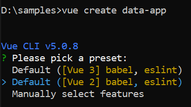

# Getting started with Vue DataManager in Vue 2

The Syncfusion Vue DataManager enables efficient data management in Vue applications. It seamlessly interacts with various data sources (remote or local) and provides functionalities like sorting, filtering, paging, and CRUD (Create, Read, Update, Delete) operations, enhancing the data presentation capabilities of your Vue application. 

This guide details the steps involved in setting up a Vue 2 project using Vue CLI and seamlessly integrating the Syncfusion Vue DataManager.

## Prerequisites for Syncfusion Vue UI Components

Before you start using Syncfusion Vue UI components, ensure that your system meets the following prerequisites by referring to the system requirements documentation. This documentation provides information about supported browsers, Vue.js versions, and other dependencies required for using Syncfusion Vue UI components effectively.

[System requirements for Syncfusion Vue UI components](https://ej2.syncfusion.com/vue/documentation/system-requirements)

## Dependencies

This section provides information about the essential dependencies required for integrating the Syncfusion Vue DataManager into your Vue projects. These dependencies are necessary for managing and manipulating data effectively within your applications.

1.  `@syncfusion/ej2-data`: The `@syncfusion/ej2-data` package serves as the core component for Syncfusion data management functionalities. It includes critical features such as DataManager, which enables various data operations like sorting, filtering, and paging. By integrating this package into your Vue project, you gain access to powerful tools for handling data efficiently.

2. `@syncfusion/ej2-base`: The `@syncfusion/ej2-base` package serves as the foundational layer for other Syncfusion packages. It provides essential utilities and helpers required for seamless integration and functionality of Syncfusion components within your Vue applications.

```javascript
|-- @syncfusion/ej2-data
    |-- @syncfusion/ej2-base
    |-- es6-promise (Required when window.Promise is not available)
```

> **@syncfusion/ej2-data** requires the presence of a Promise feature in global environment. In the browser, window.Promise must be available.

## Installation and configuration

To set up a Vue 2 application, you can utilize the [Vue CLI](https://cli.vuejs.org/#getting-started), which provides various commands to initialize projects, manage dependencies, and build production-ready applications. Follow the steps below:

**Step 1: Install Vue CLI globally**

Open your terminal or command prompt and run the following command to install Vue CLI globally using npm:

```bash
npm install -g @vue/cli
```

Alternatively, if you prefer using yarn, you can use the following command:

```bash
yarn global add @vue/cli
```

**Step 2: Create a New Vue Project**

Once Vue CLI is installed, navigate to your desired project directory using the terminal. Execute the following command to create a new Vue project

```bash
vue create data-app
```

This command initiates the project creation process, where you can choose features and configurations. Select the option `Default ([Vue 2] babel, eslint)` from the menu.

 

**Step 3: Navigate to the project directory**

After creating the project, navigate into the project directory using the **cd** command:

```bash
cd data-app
```

**Step 4: Install Syncfusion package**

Install the Syncfusion package required for data management using the following command:

```bash
npm install @syncfusion/ej2-data --save
```

**Step 5: Run the application** 

To launch the development server, use one of the following commands 

Using npm
```bash
npm run serve
```

or

Using yarn
```bash
yarn run serve
```

## Connection to a data source

Data sources are fundamental for applications that depend on information, serving as repositories that store and manage various types of data. It enables applications to retrieve, manipulate, and present data effectively. Establishing a connection between your application and a data source is essential for making the most of the data's potential

The Syncfusion [DataManager](https://ej2.syncfusion.com/documentation/api/data/datamanager) serves as a gateway for both local and remote data sources, utilizing query to interact with the data.

### Binding to JSON data

Binding to a local data source involves connecting your application directly to a dataset stored within the application itself. This method is useful for small-scale applications where data does not need to be fetched from external sources.

To bind [DataManager](https://ej2.syncfusion.com/documentation/api/data/datamanager) to a local data source, you can assign an array of JavaScript objects to the **json** property or pass them to the constructor during instantiation.

1. Create a [src/datasource.js] file and use the following dataset to provide JSON data: 

    ```typescript
    exports.data = [
        {
            OrderID: 10248, CustomerID: 'VINET', EmployeeID: 5, OrderDate: new Date(8364186e5),
            ShipName: 'Vins et alcools Chevalier', ShipCity: 'Reims', ShipAddress: '59 rue de l Abbaye',
            ShipRegion: 'CJ', ShipPostalCode: '51100', ShipCountry: 'France', Freight: 32.38, Verified: !0
        },
        {
            OrderID: 10249, CustomerID: 'TOMSP', EmployeeID: 6, OrderDate: new Date(836505e6),
            ShipName: 'Toms Spezialitäten', ShipCity: 'Münster', ShipAddress: 'Luisenstr. 48',
            ShipRegion: 'CJ', ShipPostalCode: '44087', ShipCountry: 'Germany', Freight: 11.61, Verified: !1
        },
        {
            OrderID: 10250, CustomerID: 'HANAR', EmployeeID: 4, OrderDate: new Date(8367642e5),
            ShipName: 'Hanari Carnes', ShipCity: 'Rio de Janeiro', ShipAddress: 'Rua do Paço, 67',
            ShipRegion: 'RJ', ShipPostalCode: '05454-876', ShipCountry: 'Brazil', Freight: 65.83, Verified: !0
        },
        {
            OrderID: 10251, CustomerID: 'VICTE', EmployeeID: 3, OrderDate: new Date(8367642e5),
            ShipName: 'Victuailles en stock', ShipCity: 'Lyon', ShipAddress: '2, rue du Commerce',
            ShipRegion: 'CJ', ShipPostalCode: '69004', ShipCountry: 'France', Freight: 41.34, Verified: !0
        },
        {
            OrderID: 10252, CustomerID: 'SUPRD', EmployeeID: 4, OrderDate: new Date(8368506e5),
            ShipName: 'Suprêmes délices', ShipCity: 'Charleroi', ShipAddress: 'Boulevard Tirou, 255',
            ShipRegion: 'CJ', ShipPostalCode: 'B-6000', ShipCountry: 'Belgium', Freight: 51.3, Verified: !0
        },
        {
            OrderID: 10253, CustomerID: 'HANAR', EmployeeID: 3, OrderDate: new Date(836937e6),
            ShipName: 'Hanari Carnes', ShipCity: 'Rio de Janeiro', ShipAddress: 'Rua do Paço, 67',
            ShipRegion: 'RJ', ShipPostalCode: '05454-876', ShipCountry: 'Brazil', Freight: 58.17, Verified: !0
        },
        {
            OrderID: 10254, CustomerID: 'CHOPS', EmployeeID: 5, OrderDate: new Date(8370234e5),
            ShipName: 'Chop-suey Chinese', ShipCity: 'Bern', ShipAddress: 'Hauptstr. 31',
            ShipRegion: 'CJ', ShipPostalCode: '3012', ShipCountry: 'Switzerland', Freight: 22.98, Verified: !1
        },
        {
            OrderID: 10255, CustomerID: 'RICSU', EmployeeID: 9, OrderDate: new Date(8371098e5),
            ShipName: 'Richter Supermarkt', ShipCity: 'Genève', ShipAddress: 'Starenweg 5',
            ShipRegion: 'CJ', ShipPostalCode: '1204', ShipCountry: 'Switzerland', Freight: 148.33, Verified: !0
        },
        {
            OrderID: 10256, CustomerID: 'WELLI', EmployeeID: 3, OrderDate: new Date(837369e6),
            ShipName: 'Wellington Importadora', ShipCity: 'Resende', ShipAddress: 'Rua do Mercado, 12',
            ShipRegion: 'SP', ShipPostalCode: '08737-363', ShipCountry: 'Brazil', Freight: 13.97, Verified: !1
        },
        {
            OrderID: 10257, CustomerID: 'HILAA', EmployeeID: 4, OrderDate: new Date(8374554e5),
            ShipName: 'HILARION-Abastos', ShipCity: 'San Cristóbal', ShipAddress: 'Carrera 22 con Ave. Carlos Soublette #8-35',
            ShipRegion: 'Táchira', ShipPostalCode: '5022', ShipCountry: 'Venezuela', Freight: 81.91, Verified: !0
        },
        {
            OrderID: 10258, CustomerID: 'ERNSH', EmployeeID: 1, OrderDate: new Date(8375418e5),
            ShipName: 'Ernst Handel', ShipCity: 'Graz', ShipAddress: 'Kirchgasse 6',
            ShipRegion: 'CJ', ShipPostalCode: '8010', ShipCountry: 'Austria', Freight: 140.51, Verified: !0
        },
        {
            OrderID: 10259, CustomerID: 'CENTC', EmployeeID: 4, OrderDate: new Date(8376282e5),
            ShipName: 'Centro comercial Moctezuma', ShipCity: 'México D.F.', ShipAddress: 'Sierras de Granada 9993',
            ShipRegion: 'CJ', ShipPostalCode: '05022', ShipCountry: 'Mexico', Freight: 3.25, Verified: !1
        },
        {
            OrderID: 10260, CustomerID: 'OTTIK', EmployeeID: 4, OrderDate: new Date(8377146e5),
            ShipName: 'Ottilies Käseladen', ShipCity: 'Köln', ShipAddress: 'Mehrheimerstr. 369',
            ShipRegion: 'CJ', ShipPostalCode: '50739', ShipCountry: 'Germany', Freight: 55.09, Verified: !0
        },
        {
            OrderID: 10261, CustomerID: 'QUEDE', EmployeeID: 4, OrderDate: new Date(8377146e5),
            ShipName: 'Que Delícia', ShipCity: 'Rio de Janeiro', ShipAddress: 'Rua da Panificadora, 12',
            ShipRegion: 'RJ', ShipPostalCode: '02389-673', ShipCountry: 'Brazil', Freight: 3.05, Verified: !1
        },
        {
            OrderID: 10262, CustomerID: 'RATTC', EmployeeID: 8, OrderDate: new Date(8379738e5),
            ShipName: 'Rattlesnake Canyon Grocery', ShipCity: 'Albuquerque', ShipAddress: '2817 Milton Dr.',
            ShipRegion: 'NM', ShipPostalCode: '87110', ShipCountry: 'USA', Freight: 48.29, Verified: !0
        }
    ]

    ```

2. Import dataset in the **src/App.vue** file.

3. Add the following CSS to the `<style>` section of the **src/App.vue** file to style the table:

    ```css
    <style>
        .e-table {
            border: solid 1px #e0e0e0;
            border-collapse: collapse;
            font-family: Roboto;
        }

        .e-table td,
        .e-table th {
            border-style: solid;
            border-width: 1px 0 0;
            border-color: #e0e0e0;
            display: table-cell;
            font-size: 14px;
            line-height: 20px;
            overflow: hidden;
            padding: 8px 21px;
            vertical-align: middle;
            white-space: nowrap;
            width: auto;
        }
    </style>
    ```

The following example demonstrates how to bind JSON data using the [executeLocal](https://ej2.syncfusion.com/documentation/api/data/dataManager/#executelocal) method of `DataManager`.




<template>
  <div id="app">
    <table class='e-table'>
      <tr><th>Order ID</th><th>Customer ID</th><th>Employee ID</th><th>Ship Country</th></tr>
      <tr v-for="(item, index) in items" :key="index">
        <td>{{ item.OrderID }}</td>
        <td>{{ item.CustomerID }}</td>
        <td>{{ item.EmployeeID }}</td>
        <td>{{ item.ShipCountry }}</td>
      </tr>
    </table>  
  </div>
</template>

<script>
import { data } from './datasource.js';
import { DataManager, Query } from '@syncfusion/ej2-data';

export default {
  data() {
    return {
      items: new DataManager(data).executeLocal(new Query())
    };
  },  
}
</script>

<style>
  .e-table {
    border: solid 1px #e0e0e0;
    border-collapse: collapse;
    font-family: Roboto;
  }

  .e-table td, .e-table th {
    border-style: solid;
    border-width: 1px 0 0;
    border-color: #e0e0e0;
    display: table-cell;
    font-size: 14px;
    line-height: 20px;
    overflow: hidden;
    padding: 8px 21px;
    vertical-align: middle;
    white-space: nowrap;
    width: auto;
  }
</style>



        


### Binding to ODataV4

OData (Open Data Protocol) is a standardized protocol for creating and consuming data APIs over the internet, allowing you to access and manipulate data from various sources. Syncfusion's DataManager provides seamless integration with OData services, enabling you to bind data from remote sources to your application.

[DataManager](https://ej2.syncfusion.com/documentation/api/data/datamanager) can also be bound to remote data source by assigning service endpoint URL to the `url` property. All `DataManager` operations will address the provided service endpoint.

The following example demonstrates how to bind data to an OData service using the [executeQuery](https://ej2.syncfusion.com/documentation/api/data/dataManager/#executequery) method of `DataManager`.




<template>
  <div id="app">
    <table class='e-table'>
      <tr><th>Order ID</th><th>Customer ID</th><th>Employee ID</th><th>Ship Country</th></tr>
      <tr v-for="(item, index) in items" :key="index">
        <td>{{ item.OrderID }}</td>
        <td>{{ item.CustomerID }}</td>
        <td>{{ item.EmployeeID }}</td>
        <td>{{ item.ShipCountry }}</td>
      </tr>
    </table>  
  </div>
</template>

<script>
import { DataManager, Query, ODataV4Adaptor } from '@syncfusion/ej2-data';

export default {
  data() {
    return {
      items: [] 
    };
  },
  mounted() {
    let SERVICE_URI = "https://services.odata.org/V4/Northwind/Northwind.svc/Orders";
    let dataManager = new DataManager({
      url: SERVICE_URI,
      adaptor: new ODataV4Adaptor()
    });
    dataManager.executeQuery(new Query().take(12)).then((e) => {
      this.items = e.result;
    });
  }  
}
</script>

<style>
  .e-table {
    border: solid 1px #e0e0e0;
    border-collapse: collapse;
    font-family: Roboto;
  }

  .e-table td, .e-table th {
    border-style: solid;
    border-width: 1px 0 0;
    border-color: #e0e0e0;
    display: table-cell;
    font-size: 14px;
    line-height: 20px;
    overflow: hidden;
    padding: 8px 21px;
    vertical-align: middle;
    white-space: nowrap;
    width: auto;
  }
</style>



        


## Filter

Data filtering is a fundamental operation that allows to obtain a reduced view of data based on specified filter criteria. This feature is essential for efficiently managing and displaying large datasets.

The filter expression can be easily constructed using the [where](https://ej2.syncfusion.com/documentation/api/data/query/#where) method of the [query](https://ej2.syncfusion.com/documentation/api/data/query) class. This method allows you to specify filter criteria based on various conditions. 

The following example demonstrates how to filter data based on the **EmployeeID** field equal to **4** using the `where` method of `query` class and [executeLocal](https://ej2.syncfusion.com/documentation/api/data/dataManager/#executelocal) method of [DataManager](https://ej2.syncfusion.com/documentation/api/data/datamanager). 




<template>
  <div id="app">
    <table class='e-table'>
      <tr><th>Order ID</th><th>Customer ID</th><th>Employee ID</th><th>Ship Country</th></tr>
      <tr v-for="(item, index) in items" :key="index">
        <td>{{ item.OrderID }}</td>
        <td>{{ item.CustomerID }}</td>
        <td>{{ item.EmployeeID }}</td>
        <td>{{ item.ShipCountry }}</td>
      </tr>
    </table>  
  </div>
</template>

<script>
import { data } from './datasource.js';
import { DataManager, Query } from '@syncfusion/ej2-data';

export default {
  data() {
    return {
      items: new DataManager(data).executeLocal(new Query().where('EmployeeID', 'equal', 4))
    };
  },
}
</script>

<style>
  .e-table {
    border: solid 1px #e0e0e0;
    border-collapse: collapse;
    font-family: Roboto;
  }

  .e-table td, .e-table th {
    border-style: solid;
    border-width: 1px 0 0;
    border-color: #e0e0e0;
    display: table-cell;
    font-size: 14px;
    line-height: 20px;
    overflow: hidden;
    padding: 8px 21px;
    vertical-align: middle;
    white-space: nowrap;
    width: auto;
  }
</style>



        


## Sort

Sorting data allows you to arrange it either in ascending or descending order based on specified criteria. 

This can be achieved using the [sortBy](https://ej2.syncfusion.com/documentation/api/data/query/#sortby) method of the [query](https://ej2.syncfusion.com/documentation/api/data/query) class. This method facilitates the sorting of data based on specified fields and order.

The following example demonstrates how to sort data based on the **EmployeeID** field in **ascending** order using the `sortBy` method of `query` class and [executeLocal](https://ej2.syncfusion.com/documentation/api/data/dataManager/#executelocal) method of [DataManager](https://ej2.syncfusion.com/documentation/api/data/datamanager). 




<template>
  <div id="app">
    <table class='e-table'>
      <tr><th>Order ID</th><th>Customer ID</th><th>Employee ID</th><th>Ship Country</th></tr>
      <tr v-for="(item, index) in items" :key="index">
        <td>{{ item.OrderID }}</td>
        <td>{{ item.CustomerID }}</td>
        <td>{{ item.EmployeeID }}</td>
        <td>{{ item.ShipCountry }}</td>
      </tr>
    </table>  
  </div>
</template>

<script>
import { data } from './datasource.js';
import { DataManager, Query } from '@syncfusion/ej2-data';

export default {
  data() {
    return {
      items: new DataManager(data).executeLocal(new Query().sortBy('EmployeeID').take(8))
    };
  }, 
}
</script>

<style>
  .e-table {
    border: solid 1px #e0e0e0;
    border-collapse: collapse;
    font-family: Roboto;
  }

  .e-table td, .e-table th {
    border-style: solid;
    border-width: 1px 0 0;
    border-color: #e0e0e0;
    display: table-cell;
    font-size: 14px;
    line-height: 20px;
    overflow: hidden;
    padding: 8px 21px;
    vertical-align: middle;
    white-space: nowrap;
    width: auto;
  }
</style>



        


## Page

Paging provides an option to display data in segmented pages, making it easier to navigate through large datasets. This feature is particularly useful when dealing with extensive datasets.

The [page](https://ej2.syncfusion.com/documentation/api/data/query/#page) method of the [query](https://ej2.syncfusion.com/documentation/api/data/query) class enables pagination of data by retrieving a specific range of data based on the page index and the page size.

The following example demonstrates how to apply paging to the data using the `page` method of `query` class and [executeLocal](https://ej2.syncfusion.com/documentation/api/data/dataManager/#executelocal) method of [DataManager](https://ej2.syncfusion.com/documentation/api/data/datamanager). 




<template>
  <div id="app">
    <table class='e-table'>
      <tr><th>Order ID</th><th>Customer ID</th><th>Employee ID</th><th>Ship Country</th></tr>
      <tr v-for="(item, index) in items" :key="index">
        <td>{{ item.OrderID }}</td>
        <td>{{ item.CustomerID }}</td>
        <td>{{ item.EmployeeID }}</td>
        <td>{{ item.ShipCountry }}</td>
      </tr>
    </table> 
  </div>
</template>

<script>
import { data } from './datasource.js';
import { DataManager, Query } from '@syncfusion/ej2-data';

export default {
  data() {
    return {
      items: new DataManager(data).executeLocal(new Query().page(1, 8))
    };
  },
}
</script>

<style>
  .e-table {
    border: solid 1px #e0e0e0;
    border-collapse: collapse;
    font-family: Roboto;
  }

  .e-table td, .e-table th {
    border-style: solid;
    border-width: 1px 0 0;
    border-color: #e0e0e0;
    display: table-cell;
    font-size: 14px;
    line-height: 20px;
    overflow: hidden;
    padding: 8px 21px;
    vertical-align: middle;
    white-space: nowrap;
    width: auto;
  }
</style>



        


## Component binding

The DataManager can be seamlessly integrated with Syncfusion components that support data binding. However, before utilizing DataManager, you need to register the Syncfusion Vue component.

In the following samples, the grid component is bound. To render the Grid with the necessary configurations, please refer to the [Grid Getting Started](https://ej2.syncfusion.com/vue/documentation/grid/getting-started) documentation.

### Local data binding

Local data binding allows you to directly bind data to Syncfusion components from within your Vue application. This method is useful when you have the data available locally and want to integrate it seamlessly with Syncfusion components.

To bind local data to a Syncfusion component, follow these steps:

1. Define your data directly in your Vue component or import it from an external source.

2. Use the [DataManager](https://ej2.syncfusion.com/documentation/api/data/datamanager) class to create a data source and bind it to your data.

3. Integrate the data source with the Syncfusion grid component by setting the [dataSource](https://ej2.syncfusion.com/javascript/documentation/api/grid/#datasource) property.

The following example shows how to bind local data to the grid component using `DataManager`.






        


### Remote data binding

Remote data binding involves binding external data sources, such as API endpoints, to Syncfusion components. This allows you to fetch and display data dynamically from a server.

To bind remote data to a Syncfusion component, follow these steps:

1. Initialize a [DataManager](https://ej2.syncfusion.com/documentation/api/data/datamanager) object and configure it with the URL of the remote service from which you want to fetch data.

2.  Assign the `DataManager` instance to the [dataSource](https://ej2.syncfusion.com/javascript/documentation/api/grid/#datasource) property of the Syncfusion grid component.

The following example demonstrates how to bind remote data to the grid component using `DataManager`.






        

