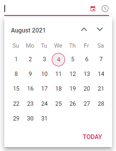
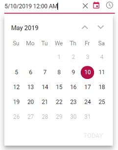

# Getting Started with the Vue DateTimePicker Component in Vue 3

This article provides a step-by-step guide for setting up a [Vite](https://vitejs.dev/) project with a JavaScript environment and integrating the Syncfusion<sup style="font-size:70%">&reg;</sup> Vue DateTimePicker component using the [Composition API](https://vuejs.org/guide/introduction.html#composition-api) / [Options API](https://vuejs.org/guide/introduction.html#options-api).

The `Composition API` is a new feature introduced in Vue.js 3 that provides an alternative way to organize and reuse component logic. It allows developers to write components as functions that use smaller, reusable functions called composition functions to manage their properties and behavior.

The `Options API` is the traditional way of writing Vue.js components, where the component logic is organized into a series of options that define the component's properties and behavior. These options include data, methods, computed properties, watchers, lifecycle hooks, and more.

## Prerequisites

[System requirements for Syncfusion<sup style="font-size:70%">&reg;</sup> Vue UI components](https://ej2.syncfusion.com/vue/documentation/system-requirements)

## Setup for local development

Easily set up a Vue 3 application using [Vite](https://vitejs.dev), which provides a faster development environment, smaller bundle sizes, and optimized builds compared to traditional tools. For detailed steps, refer to the Vite [installation instructions](https://vitejs.dev/guide). Vite sets up your environment using JavaScript and optimizes your application for production.

> **Note:** To create a Vue application using `create-vue`, refer to this [documentation](https://ej2.syncfusion.com/vue/documentation/getting-started) for more details.

To create a new Vue 3 application, run one of the following commands based on your preferred language:

***Vue with JavaScript***

```bash
npm create vite@latest my-app -- --template vue
```

***Vue with TypeScript***

```bash
npm create vite@latest my-app -- --template vue-ts
```

During the setup process, the CLI will prompt you for a few configuration options. Select the following:

- **Which linter to use?** → **Default ([Vue 3] babel, eslint)**
- **Install with npm and start now?** → **Yes**

Selecting **Yes** automatically installs the project dependencies and starts the development server.

After verifying that the application starts successfully, terminate the development server in the terminal and proceed to the next step.

Then, navigate to the project directory:

```bash
cd my-app
```

## Add Vue DateTimePicker packages

To install the DateTimePicker packages, use the following command:

```bash
npm install @syncfusion/ej2-vue-calendars
```

or

```bash
yarn add @syncfusion/ej2-vue-calendars
```

## Adding CSS reference

Themes for Syncfusion<sup style="font-size:70%">&reg;</sup> components can be applied using CSS files provided through [npm theme packages](https://www.npmjs.com/package/@syncfusion/ej2-material3-theme). For available themes, refer to the [Themes](https://ej2.syncfusion.com/vue/documentation/appearance/theme) documentation.
 
Install the **Material 3** theme package using the following command:



 
npm install @syncfusion/ej2-material3-theme --save
 


 
Then add the following CSS reference to the **src/App.vue** file:




<style>
    @import "../node_modules/@syncfusion/ej2-material3-theme/styles/datetimepicker/index.css";
</style>




## Adding Vue DateTimePicker component

The DateTimePicker code should be added in the **src/App.vue** file.




<template>
    <div class="control_wrapper">
        <ejs-datetimepicker></ejs-datetimepicker>
    </div>
</template>

<script setup>
  import { DateTimePickerComponent as EjsDateTimePicker } from '@syncfusion/ej2-vue-calendars';
</script>

<style>
    @import "../node_modules/@syncfusion/ej2-material3-theme/styles/datetimepicker/index.css";
</style>




<template>
    <div class="control_wrapper">
        <ejs-datetimepicker></ejs-datetimepicker>
    </div>
</template>

<script>
import { DateTimePickerComponent } from "@syncfusion/ej2-vue-calendars";
//Component registeration
export default {
    name: 'App',
    components: {
        "ejs-datetimepicker": DateTimePickerComponent
    }
}
</script>

<style>
    @import "../node_modules/@syncfusion/ej2-material3-theme/styles/datetimepicker/index.css";
</style>




## Run the project

To run the project, use the following command:

```bash
npm run dev
```

or

```bash
yarn run dev
```



## Setting the value, min and max dates

The following example demonstrates how to set the value, min and max dates on initializing the DateTimePicker. Here the DateTimePicker allows you to select a date within the range from 9th to 15th in the month of May 2017. To know more about range restriction in DateTimePicker, please refer this [page](./date-range).




<template>
    <div id="app">
        <div class='wrapper'>
            <ejs-datetimepicker :min="data[0].minDate" :max="data[0].maxDate" :value="data[0].dateVal" ></ejs-datetimepicker>
        </div>
  </div>
</template>

<script setup>
import { DateTimePickerComponent as EjsDateTimePicker } from "@syncfusion/ej2-vue-calendars";
    const data = [{minDate: new Date("05/04/2017"), 
                  maxDate: new Date("05/16/2017"), 
                  dateVal: new Date("05/10/2017")}];
</script>

<style>
    @import "../node_modules/@syncfusion/ej2-material3-theme/styles/DateTimePicker/index.css";
</style>




<template>
    <div id="app">
        <div class='wrapper'>
            <ejs-datetimepicker :min="minDate" :max="maxDate" :value="dateVal" ></ejs-datetimepicker>
        </div>
  </div>
</template>

<script>
import { DateTimePickerComponent } from "@syncfusion/ej2-vue-calendars";
//Component registeration
export default {
    name: 'App',
    components: {
        "ejs-datetimepicker": DateTimePickerComponent
    },
    data () {
        return {
            minDate : new Date("05/09/2017"),
            maxDate : new Date("05/15/2017"),
            dateVal : new Date("05/11/2017")
        }
    }
}
</script>
<style>
    @import "../node_modules/@syncfusion/ej2-material3-theme/styles/DateTimePicker/index.css";
</style>






> If the value of `min` or `max` properties changed through code behind, then you have to update the `value` property to set within the range.

## See Also

* [Render DateTimePicker with specific culture](./globalization)