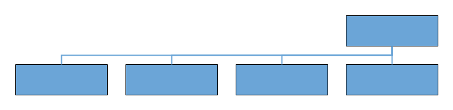
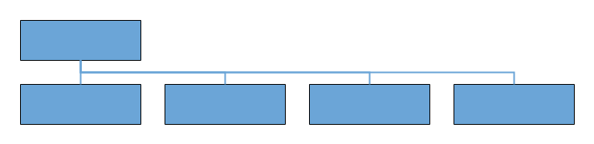
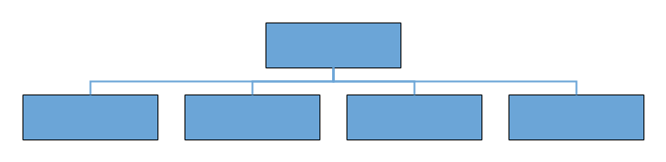
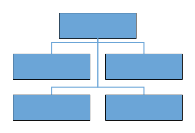
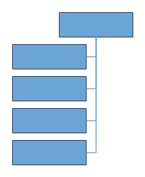

# Automatic layout in Vue Diagram component

Diagram provides support to auto-arrange the nodes in the diagram area that is referred as `Layout`. It includes the following layout modes:

## Layout modes

* Hierarchical layout
* Organization chart
* Radial tree
* Symmetric layout
* Mind Map layout
* Complex hierarchical tree layout

## Hierarchical layout

The hierarchical tree layout arranges nodes in a tree-like structure, where the nodes in the hierarchical layout may have multiple parents. There is no need to specify the layout root. To arrange the nodes in a hierarchical structure, specify the layout [`type`](https://ej2.syncfusion.com/vue/documentation/api/diagram/layout/#type) as hierarchical tree. The following example shows how to arrange the nodes in a hierarchical structure.

>Note: If you want to use hierarchical tree layout in diagram, you need to inject HierarchicalTree in the diagram.









        


## Radial tree layout

The radial tree layout arranges nodes on a virtual concentric circle around a root node. Sub-trees formed by the branching of child nodes are located radially around the child nodes. This arrangement result in an ever-expanding concentric arrangement with radial proximity to the root node indicating the node level in the hierarchy. The layout [`root`](https://ej2.syncfusion.com/vue/documentation/api/diagram/layout/#root) property can be used to define the root node of the layout. When no root node is set, the algorithm automatically considers one of the diagram nodes as the root node.

To arrange nodes in a radial tree structure, set the [`type`](https://ej2.syncfusion.com/vue/documentation/api/diagram/layout/#type) of the layout as `RadialTree`. The following code illustrates how to arrange the nodes in a radial tree structure.

>Note: If you want to use radial tree layout in diagram, you need to inject DataBinding and RadialTree in the diagram.









        


## Organizational Chart

An organizational chart is a diagram that displays the structure of an organization and relationships. To create an organizational chart, the [`type`](https://ej2.syncfusion.com/vue/documentation/api/diagram/layout/#type) of layout should be set as an `OrganizationalChart`.

To create and position an organization chart using the Syncfusion Vue Diagram component, refer to the below video link.



The following code example illustrates how to create an organizational chart.









        


Organizational chart layout starts parsing from root and iterate through all its child elements. The `getLayoutInfo` method provides necessary information of a node’s children and the way to arrange (direction, orientation, offsets, etc.) them. The arrangements can be customized by overriding this function as explained.

**GetLayoutInfo**
Set chart orientations, chart types, and offset to be left between parent and child nodes by overriding the method, `diagram.layout.getLayoutInfo`. The [`getLayoutInfo`](https://ej2.syncfusion.com/vue/documentation/api/diagram/layout/#getlayoutinfo) method is called to configure every subtree of the organizational chart. It takes the following arguments.

    * node: Parent node to that options are to be customized.
    * options: Object to set the customizable properties.









        


The following table illustrates the properties that “options” argument takes.

| Property              | Description                                                                                                                                                                             | Default Value                                                                                                            |
| --------------------- | --------------------------------------------------------------------------------------------------------------------------------------------------------------------------------------- | ------------------------------------------------------------------------------------------------------------------------ |
| options.assistants    | By default, the collection is empty. When any of the child nodes have to be set as**Assistant**, you can remove from children collection and have to insert into assistants collection. | Empty array                                                                                                              |
| options.orientation   | Gets or sets the organizational chart orientation.                                                                                                                                      | SubTreeOrientation.Vertical                                                                                              |
| options.type          | Gets or sets the chart organizational chart type.                                                                                                                                       | For horizontal chart orientation:SubTreeAlignments.Center and for vertical chart orientation:SubTreeAlignments.Alternate |
| options.offset        | Offset is the horizontal space to be left between parent and child nodes.                                                                                                               | 20 pixels applicable only for vertical chart orientations.                                                               |
| options.hasSubTree    | Gets whether the node contains subtrees.                                                                                                                                                | Boolean                                                                                                                  |
| options.level         | Gets the depth of the node from layout root.                                                                                                                                            | Number                                                                                                                   |
| options.enableRouting | By default, connections are routed based on the chart type and orientations. This property gets or sets whether default routing is to be enabled or disabled.                           | true                                                                                                                     |
| options.rows          | Sets the number of rows on which the child nodes will be arranged. Applicable only for balanced type horizontal tree.                                                                   | Number                                                                                                                   |

The following table illustrates the different chart orientations and chart types.

| Orientation | Type                                                                         | Description                                                           | Example               |
| ----------- | ---------------------------------------------------------------------------- | --------------------------------------------------------------------- | --------------------- |
| Horizontal  | Left                                                                         | Arranges the child nodes horizontally at the left side of the parent. |  |
| Right       | Arranges the child nodes horizontally at the right side of the parent.       |                                                 |
| Center      | Arranges the children like standard tree layout orientation.                 |                                                |
| Balanced    | Arranges the leaf level child nodes in multiple rows.                        |                                             |
| Vertical    | Left                                                                         | Arranges the children vertically at the left side of the parent.      |  |
| Right       | Arranges the children vertically at the right side of the parent.            |                                               |
| Alternate   | Arranges the children vertically at both left and right sides of the parent. |                                             |

The following code example illustrates how to set the vertical right arrangement to the leaf level trees.









        


### Assistant

Assistants are child item that have a different relationship with the parent node. They are laid out in a dedicated part of the tree. A node can be specified as an assistant of its parent by adding it to the `assistants` property of the argument “options”.

The following code example illustrates how to add assistants to layout.









        


## Symmetric layout

The symmetric layout has been formed using nodes position by closer together or pushing them further apart. This is repeated iteratively until the system comes to an equilibrium state.

The layout’s [`springLength`](https://ej2.syncfusion.com/vue/documentation/api/diagram/layout/#springlength) defined as how long edges should be, ideally. This will be the resting length for the springs. Edge attraction and vertex repulsion forces to be defined by using layout’s [`springFactor`](https://ej2.syncfusion.com/vue/documentation/api/diagram/layout/#springfactor), the more sibling nodes repel each other. The relative positions do not change any more from one iteration to the next. The number of iterations can be specified by using layout’s [`maxIteration`](https://ej2.syncfusion.com/vue/documentation/api/diagram/layout/#maxiteration).

The following code illustrates how to arrange the nodes in a radial tree structure.

>Note: If you want to use symmetric layout in diagram, you need to inject SymmetricLayout in the diagram.

## Mind Map layout

A mind map is a diagram that displays the nodes as a spider diagram organizes information around a central concept. To create mind map, the [`type`](https://ej2.syncfusion.com/vue/documentation/api/diagram/layout/#type) of layout should be set as `MindMap`.

To create a Mind map Layout using the EJ2 Vue Diagram, refer to the below video link,



## Tree Orientation in layout

An [`Orientation`](https://ej2.syncfusion.com/vue/documentation/api/diagram/orientation/) of a `MindMapTreeLayout` is used to arrange the tree layout according to a specific direction. By default, the orientation is set to Horizontal. The following table outlines the various orientation types available:

<table>
<tr>
<td><b>Orientation Type</b></td>
<td><b>Description</b></td>
</tr>
<tr>
<td>Horizontal</td>
<td>Aligns the tree layout from left to right</td>
</tr>
<tr>
<td>Vertical</td>
<td>Aligns the tree layout from top to bottom</td>
</tr>
</table>

N> If you want to use mind map layout in diagram, you need to inject MindMap in the diagram.

The following code example illustrates how to create an mind map layout.









        


## Complex hierarchical tree

Complex hierarchical tree layout is the extended version of the hierarchical tree layout. The child had been two or more parents. To create a complex hierarchical tree, the [`type`](https://ej2.syncfusion.com/vue/documentation/api/diagram/layout/#type) of layout should be set as `ComplexHierarchicalTree`.

>Note: If you want to use Complex hierarchical layout in diagram, you need to inject ComplexHierarchicalTree in the diagram.

The following code example illustrates how to create a complex hierarchical tree.









        


### Line Distribution

Line distribution is used to arrange the connectors without overlapping in automatic layout. In some cases, the automatic layout connectors connecting to the nodes will be overlapped with one another. So user can decide whether the segment of each connector from a single parent node should be same point or different point. The [`connectionPointOrigin`](https://ej2.syncfusion.com/vue/documentation/api/diagram/connectionPointOrigin/#connectionpointorigin) property of layout is used to enable or disable the line distribution in layout. By default connectionPointOrigin will be `SamePoint`.

The following code example illustrates how to create a complex hierarchical tree with line distribution.

>Note: If you want to use line distribution in diagram layout, you need to inject  LineDistribution module in the diagram.









        


### Linear Arrangement

Linear arrangement is used to linearly arrange the child nodes in layout, which means the parent node is placed in the center corresponding to its children. When line distribution is enabled, linear arrangement is also activated by default. The [`arrangement`](https://ej2.syncfusion.com/vue/documentation/api/diagram/childArrangement/#childarrangement) property of layout is used to enable or disable the linear arrangement in layout. By default arrangement will be `Nonlinear`.

>Note: If you want to use linear arrangement in diagram layout, you need to inject  LineDistribution module in the diagram. Linear arrangement is applicable only for complex hierarchical tree layout.

The following code illustrates how to allow a linear arrangement in diagram layout.

```

export default {
    name: 'app',
    data() {
        return {
            width: "100%",
            height: "590px",
            layout: {
                type: 'ComplexHierarchicalTree',
                //To arrange a child nodes in a linear manner
                arrangement: ChildArrangement.Linear,
                horizontalSpacing: 40, verticalSpacing: 40,
                orientation: 'TopToBottom'
            },
        }
    },
    provide: {
        diagram: [DataBinding, ComplexHierarchicalTree, LineDistribution]
    },
}

```

### Prevent connectors overlay

The below constraints prevents the connector segments overlapping nodes with a complex hierarchical layout.

```

export default {
    name: 'app',
    data() {
        return {
            width: "100%",
            height: "590px",
            layout: {
                //this prevents connector segments overlapping
                enableRouting: true
            },
        }
    },
    provide: {
        diagram: [DataBinding, ComplexHierarchicalTree, LineDistribution]
    },
}

```

## Customize layout

Orientation, spacings, and position of the layout can be customized with a set of properties.

To explore layout properties, refer to [`Layout Properties`](https://ej2.syncfusion.com/vue/documentation/api/diagram/layout/).

### Layout bounds

Diagram provides support to align the layout within any custom rectangular area. For more information about bounds, refer to [`bounds`](https://ej2.syncfusion.com/vue/documentation/api/diagram/layout/#bounds).

### Layout alignment

The layout can be aligned anywhere over the layout bounds/viewport using the [`horizontalAlignment`](https://ej2.syncfusion.com/vue/documentation/api/diagram/layout/#horizontalalignment) and[`verticalAlignment`](https://ej2.syncfusion.com/vue/documentation/api/diagram/layout/#verticalalignment) properties of the layout.

The following code illustrates how to align the layout at the top-left of the layout bounds.









        


### Layout spacing

Layout provides support to add space horizontally and vertically between the nodes. The [`horizontalSpacing`](https://ej2.syncfusion.com/vue/documentation/api/diagram/layout/#horizontalspacing) and [`verticalSpacing`](https://ej2.syncfusion.com/vue/documentation/api/diagram/layout/#verticalspacing) properties of the layout allows you to set the space between the nodes in horizontally and vertically.

### Layout margin

Layout provides support to add some blank space between the layout bounds/viewport and the layout. The [`margin`](https://ej2.syncfusion.com/vue/documentation/api/diagram/layout/#margin) property of the layout allows you to set the blank space.

The following code illustrates how to set the layout margin.









        


### Layout orientation

The layout orientation can used to arrange the layout based on the direction. there are different orientation types that are defined in the following table.

|Orientation|Description|
| -------- | ----------- |
|TopToBottom|Aligns the layout from top to bottom. All the roots are placed at top of diagram.|
|LeftToRight|Aligns the layout from left to right. All the roots are placed at left of diagram.|
|BottomToTop|Aligns the layout from bottom to top. All the roots are placed at bottom of the diagram.|
|RightToLeft|Aligns the layout from right to left. All the roots are placed at right of the diagram.|

Diagram provides support to customize the  [`orientation`](https://ej2.syncfusion.com/vue/documentation/api/diagram/layout/#orientation) of layout. You can set the desired orientation using layout.orientation.

>Note: In the diagram the default orientation is TopToBottom.

The following code illustrates how to arrange the nodes in a BottomToTop orientation.









        


### Fixed node

Layout provides support to arrange the nodes with reference to the position of a fixed node and set it to the [`fixedNode`](https://ej2.syncfusion.com/vue/documentation/api/diagram/layout/#fixednode) of the layout property. This is helpful when you try to expand/collapse a node. It might be expected that the position of the double-clicked node should not be changed.









        


### Expand and collapse

Diagram allows to expand/collapse the subtrees of a layout. The node’s isExpanded property allows you to expand/collapse its children. The following code example shows how to expand/collapse the children of a node.









        


In the previous example, while expanding/collapsing a node, it is set as fixed node in order to prevent it from repositioning.

### Refresh layout

Diagram allows to refresh the layout at runtime. To refresh the layout, refer to Refresh layout.

### setNodeTemplate

 The setNodeTemplate function is provided for the purpose of customizing nodes. It will be called for each node on node initialization. In this function, the node style and its properties can be customized and can bind the custom JSON with node.

 







        
