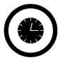
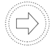
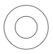
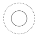
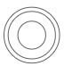
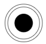

# BPMN Event in Vue Diagram component

## Event

An [`event`](https://ej2.syncfusion.com/vue/documentation/api/diagram/bpmnEvent) is notated with a circle and it represents an event in a business process. The type of events are as follows:

    * Start
    * Intermediate
    * NonInterruptingStart
    * NonInterruptingIntermediate
    * ThrowingIntermediate
    * End
        
The [`event`](https://ej2.syncfusion.com/vue/documentation/api/diagram/bpmnEvent#event-bpmnevents) property of the node allows you to define the type of the event. The default value of the event is **start**. The following code example illustrates how to create a BPMN event.









        


## BPMN event trigger

Event triggers are notated as icons inside the circle and they represent the specific details of the process. The [`trigger`](https://ej2.syncfusion.com/vue/documentation/api/diagram/bpmnEvent#trigger-bpmntriggers) property of the node allows you to set the type of trigger and by default, it is set as **none**. The following table illustrates the type of event triggers.

| Triggers | Start | Non-Interrupting Start | Intermediate | Non-Interrupting Intermediate | Throwing Intermediate | End |
| -------- | -------- | -------- | -------- | -------- | -------- | -------- |
| None |   |  |  |  | |  |
| Message |  |  |  | | |  |
| Timer |  |  | | | |  |
| Conditional |  |  | | |  |  |
| Link |  |  | |  |  | | 
| Signal |  |  |  | |  |  |
| Error |  |  |   |  |  | |
| Escalation |  |  | | |  |  |
| Termination |  |  |  |  |  | |
| Compensation |  |  | |  | | |
| Cancel |  |  |  |  |  |  |
| Multiple |  |   | |  |   |  |
| Parallel |  |  | |  |  |  |