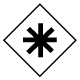
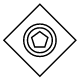
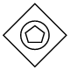
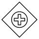

# BPMN Gateway in Vue Diagram

## Gateway

Gateway is used to control the flow of a process and it is represented as a diamond shape. To create a gateway, the shape property of the node should be set as [`gateway`](https://ej2.syncfusion.com/vue/documentation/api/diagram/bpmnGateways) and the gateway property can be set with any of the appropriate gateways. The following code example illustrates how to create a BPMN Gateway.









        


N> By default, the `gateway` will be set as **none**.

There are several types of gateways as tabulated:

| Shape | Image |
| -------- | -------- |
| Exclusive |  |
| Parallel |  |
| Inclusive |  |
| Complex |  |
| EventBased |  |
| ExclusiveEventBased |  |
| ParallelEventBased |  |