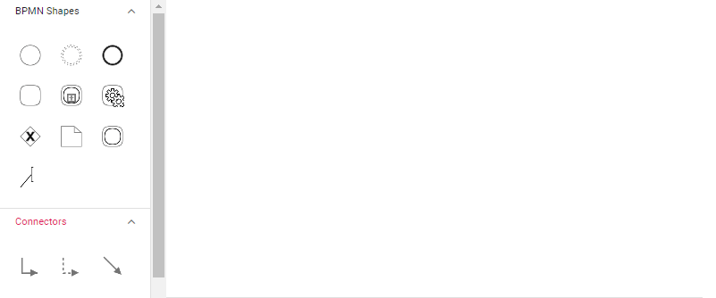

# BPMN text annotation in Vue Diagram component

## Text Annotation

* A BPMN object can be associated with a text annotation which does not affect the flow but gives details about objects within a flow.

* A TextAnnotation points to or references another BPMN shape, which we call the `textAnnotationTarget` of the textAnnotation. When a target shape is moved or deleted, any TextAnnotations attached to the shape will be moved or deleted too. Thus, the TextAnnotations remain with their target shapes though you can reposition the TextAnnotation to any offset from its target. The `textAnnotationTarget` property of the BpmnTextAnnotation is used to connect an annotation element to the BPMN Node.

* The annotation element can be switched from a BPMN node to another BPMN node simply by dragging the source end of the annotation connector into the other BPMN node.

* By default, the TextAnnotation shape has a connection.

* The `textAnnotationDirection` property is used to set the shape direction of the text annotation.

* By default, the `textAnnotationDirection` is set to a Auto.

* To set the size for text annotation, use the `width` and `height` properties of the node.

* The `offsetX` and `offsetY` properties are used to set the distance between the BPMN node and the TextAnnotation.









        


### Text annotation in palette.

Text annotation node can be rendered in symbol palette like other bpmn shapes. The following example shows how to render Bpmn text annotation node in symbol palette.









        


### Connect the TextAnnotation to BPMN node

Drag and drop any bpmn shapes from the palette to diagram and connect the BPMN Node and textAnnotation.

The following image shows how to drag a symbol from the palette and connect the textAnnotation to the BPMNNode with interaction.

### Text annotation direction

There are several types of Text annotation directions as follows:

| Text annotation direction | Image |
| -------- | -------- |
| Auto |  |
| Left |  |
| Right |  |
| Top |  |
| Bottom |  |

### Add text annotation at runtime

Text annotations can be added dynamically using either the [`addTextAnnotation`](https://ej2.syncfusion.com/vue/documentation/api/diagram/#addtextannotation) method or the [`add`](https://ej2.syncfusion.com/vue/documentation/api/diagram/#add) method of the diagram. The following example shows how to use these methods to add a text annotation node.









        
