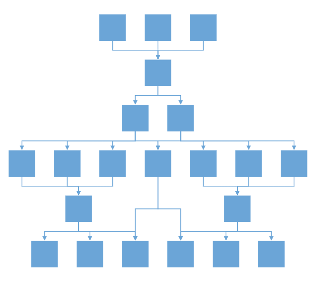
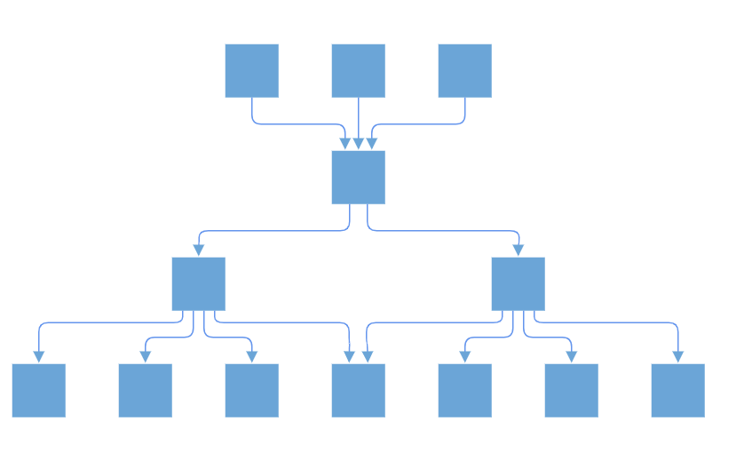

# Complex hierarchical tree layout in Vue Diagram control

Complex hierarchical tree layout arranges nodes in a tree-like structure, where the child node can have more than one parent. This layout is an extended version of the hierarchical tree layout. To create a complex hierarchical tree, the [`type`](https://ej2.syncfusion.com/vue/documentation/api/diagram/layout/#type) property of layout should be set as `ComplexHierarchicalTree`.

## Complex hierarchical tree layout with nodes and connectors

The following example demonstrates how to render a complex hierarchical tree layout using nodes and connectors. To achieve this, you need to define the nodes and connectors collections and assign them to the diagram. Additionally, you need to set the layout type to `ComplexHierarchicalTree`.









        


## Complex hierarchical tree layout with DataSource

The following code example illustrates how to create a complex hierarchical tree with DataSource.









        


N> In Diagram Layouts, all root nodes will always render at the same level. This default behavior cannot be changed to render different trees at distinct levels.

## Line Distribution

Line distribution is used to arrange the connectors without overlapping in automatic layout. In some cases, the automatic layout connectors connecting to the nodes will be overlapped with one another. So user can decide whether the segment of each connector from a single parent node should be same point or different point. The [`connectionPointOrigin`](https://ej2.syncfusion.com/vue/documentation/api/diagram/layout/#connectionpointorigin) property of layout is used to enable or disable the line distribution in layout. By default ConnectionPointOrigin will be `SamePoint`.

The following code example illustrates how to create a complex hierarchical tree with line distribution.









        


N> If you want to use line distribution in diagram layout, you need to inject  LineDistribution module in the diagram.

## Linear Arrangement

Linear arrangement is used to linearly arrange the child nodes in layout, which means the parent node is placed in the center corresponding to its children. When line distribution is enabled, linear arrangement is also activated by default. The [`arrangement`](https://ej2.syncfusion.com/vue/documentation/api/diagram/layout/#arrangement) property of layout is used to enable or disable the linear arrangement in layout. By default arrangement will be `Nonlinear`.

N> If you want to use linear arrangement in diagram layout, you need to inject  LineDistribution module in the diagram. Linear arrangement is applicable only for complex hierarchical tree layout.

The following code illustrates how to allow a linear arrangement in diagram layout.









        


## Enable routing for layout

In some complex parent-child relationships, connectors may overlap nodes in the layout. To address this issue, you can utilize the enableRouting functionality. This feature finds a connector path that avoids any obstacles.

To enable routing in the layout, set the [`enableRouting`](https://ej2.syncfusion.com/vue/documentation/api/diagram/layout/#enablerouting) property to true.

The following example shows how to activate enableRouting in the layout:









        

