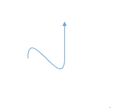
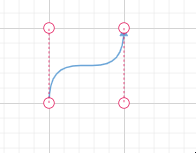
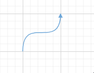
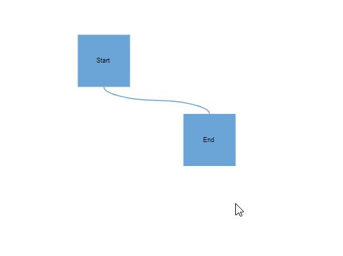
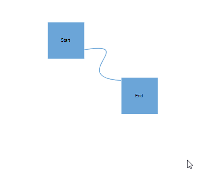

# Bezier Connectors in ej2-vue Diagram control

Bezier segments are used to create curve segments and the curves are configurable either with the control points or with vectors.

To create a bezier segment, the [`segment.type`](https://ej2.syncfusion.com/vue/documentation/api/diagram/segments/) is set as `bezier` and need to specify [`type`](https://ej2.syncfusion.com/vue/documentation/api/diagram/connector/#type) for the connector. The following code example illustrates how to create a default bezier segment.









        


### Bezier segment editing

* A segment control point of the Bezier connector is used to change the bezier vectors and points of the connector.

### Control Points

* Bezier control points can be positioned in two ways.

* When setting control point positions using the The [`point1`](https://ej2.syncfusion.com/vue/documentation/api/diagram/bezierSegment/#point1) and [`point2`](https://ej2.syncfusion.com/vue/documentation/api/diagram/bezierSegment/#point2)  properties, the control point remains fixed in its set position while dragging connector end points.
* When setting control point positions using the [`vector1`](https://ej2.syncfusion.com/vue/documentation/api/diagram/bezierSegment/#vector1) and [`vector2`](https://ej2.syncfusion.com/vue/documentation/api/diagram/bezierSegment/#vector2) properties, the control point dynamically adjusts to maintain the angle and distance originally set while moving the connector end points.

#### Point

The [`point1`](https://ej2.syncfusion.com/vue/documentation/api/diagram/bezierSegment/#point1) and [`point2`](https://ej2.syncfusion.com/vue/documentation/api/diagram/bezierSegment/#point2) enable you to set the control points. The following code example illustrates how to configure the bezier segments with control points.









        


#### Vector

The [`vector1`](https://ej2.syncfusion.com/vue/documentation/api/diagram/bezierSegment/#vector1) and [`vector2`](https://ej2.syncfusion.com/vue/documentation/api/diagram/bezierSegment/#vector2) properties of bezier segment enable you to define the vectors. The following code illustrates how to configure a bezier curve with vectors.









        


### Avoid overlapping with bezier

By default, when there are no segments defined for a bezier connector, the bezier segments will be created automatically and routed in such a way that avoids overlapping with the source and target nodes.

By default, when there are no segments defined for a bezier connector, the bezier segments will be created automatically and routed in such a way that avoids overlapping with the source and target nodes.









        


### Allow segment reset.

This feature allows users to choose whether to reset the control points of bezier segments when moving the source or target node. This decision empowers users to maintain control over the positioning of bezier curves, enhancing flexibility and precision in diagram editing.

#### With allow segment reset as true.

##### With allow segment reset as false.









        


### How to customize Bezier Segment Thumb Size

Bezier segment thumbs default to size 10. This can be adjusted globally or for individual connectors using the [`segmentThumbSize`](https://ej2.syncfusion.com/vue/documentation/api/diagram/#segmentthumbsize) property.
To change the thumb size for all Bezier connectors, set the [`segmentThumbSize`](https://ej2.syncfusion.com/vue/documentation/api/diagram/#segmentthumbsize) property in the diagram’s model.
To customize the thumb size for a specific connector, disable the [`InheritSegmentThumbSize`](https://ej2.syncfusion.com/vue/documentation/api/diagram/connectorConstraints/) constraint, then set the desired [`segmentThumbSize`](https://ej2.syncfusion.com/vue/documentation/api/diagram/#segmentthumbsize).









        
