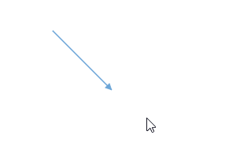
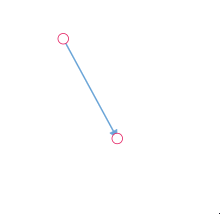
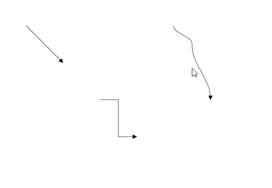

# Connector interaction in ##Platform_Name## Diagram

Connectors can be selected, dragged, and routed over the diagram page.

## Select and unSelect connector.

A connector can be selected, simply just by clicking on it.

A connector can be selected at runtime by using the Select method and clear the selection in the diagram using the ClearSelection. The following code explains how to select and clear selection in the diagram.









        


## Drag Connector

Connector can be dragged by just clicking on the connector and dragging.



A connector can be dragged at runtime by using the Drag method. The following code explains how to drag the connector by using the drag method.









        


## End point dragging

The connector can be selected by clicking it. When the connector is selected, circles will be added on the starting and ending of the connector that is represented by Thumbs. Clicking and dragging those handles helps you to adjust the source and target points.



You can also update the endPoints of diagram by using [`dragSourceEnd`](https://ej2.syncfusion.com/vue/documentation/api/diagram/#dragsourceend) and [`dragTargetEnd`](https://ej2.syncfusion.com/vue/documentation/api/diagram/#dragtargetend) methods of diagram. 

The following code example shows the ways to drag connector end point at runtime.









        


## Segment editing

Diagram allows you to edit connector segments at runtime. To enable this feature, you need to activate the [`DragSegmentThumb`](https://ej2.syncfusion.com/vue/documentation/api/diagram/connectorConstraints/) constraint for the connector.

```ts
{
connector.constraints =
      ConnectorConstraints.Default | ConnectorConstraints.DragSegmentThumb;
}

```

N> To edit a connector segment, you need to inject the `ConnectorEditing` module into the diagram.



## Flip

The diagram Provides support to flip the connector. The [`flip`](https://ej2.syncfusion.com/vue/documentation/api/diagram/connector/#flip) is performed to give the mirrored image of the original element.

The flip types are as follows:

* HorizontalFlip
 [`Horizontal`](https://ej2.syncfusion.com/vue/documentation/api/diagram/flipDirection/) is used to interchange the connector source and target x points.

* VerticalFlip
[`Vertical`](https://ej2.syncfusion.com/vue/documentation/api/diagram/flipDirection/) is used to interchange the connector source and target y points.

* Both
[`Both`](https://ej2.syncfusion.com/vue/documentation/api/diagram/flipDirection/) is used to interchange the source point as target point and target point as source point









        


 N> The flip is not applicable when the connectors connect in nodes