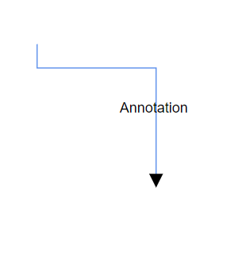

# Connector annotations in Vue Diagram component

Annotations of a connector can be positioned using the following properties of Annotation class.

* Offset
* Alignment
* Displacement
* SegmentAngle
* HorizontalAlignment
* VerticalAlignment
* Margin

## Annotation offset

The [`offset`](https://helpej2.syncfusion.com/vue/documentation/api/diagram/pathAnnotationModel/#offset) for [`pathAnnotation`](https://helpej2.syncfusion.com/vue/documentation/api/diagram/pathAnnotationModel/) is of type number and ranges from 0 to 1, from the source to the target point of the connector. By default, the offset value for a connector annotation is 0.5.

The following code illustrates, how to set offset for the connector.









        


The following image shows the position of the annotation with respect to different offsets.

## Annotation alignment

The connector’s annotation can be aligned over its segment path using the [`alignment`](https://helpej2.syncfusion.com/vue/documentation/api/diagram/annotationAlignment/) property of annotation.

The following code example illustrates how to align connector annotations.









        


## Displacement of annotation

[`Displacement`](https://helpej2.syncfusion.com/vue/documentation/api/diagram/pointModel/) refers displacement of an annotation from its actual position. A connector annotation can be displaced to a particular distance by using a displacement property of the pathAnnotation. The following example shows how to set displacement for the connector annotation.









        


N> Displacement is only applicable when we use alignment as `After` or `Before`.

## Segment angle for annotation

The [`segmentAngle`](https://helpej2.syncfusion.com/vue/documentation/api/diagram/pathAnnotationModel/#segmentangle) property is used to rotate the annotation based on the connectors segment direction. By default, annotation will be rotated in the connector path. When you set `segmentAngle` as true, annotation will be rotated from its position based on the connector segment direction. The following code illustrates, how to set segment angle.









        


|Segment angle|Output|
|-----|-----|
|True||
|False||