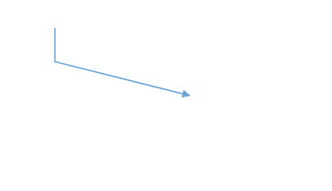

## Straight

To create a straight line, specify the [`type`](https://ej2.syncfusion.com/vue/documentation/api/diagram/segments/) of the segment as **straight** and add a straight segment to [`segments`](https://ej2.syncfusion.com/vue/documentation/api/diagram/connector/#segments) collection and need to specify [`type`](https://ej2.syncfusion.com/vue/documentation/api/diagram/connector/#segments) for the connector. 

The following code example illustrates how to create a default straight segment.









        


The [`point`](https://ej2.syncfusion.com/vue/documentation/api/diagram/straightSegment/#point) property of straight segment allows you to define the end point of it. 

The following code example illustrates how to define the end point of a straight segment.









        


### Straight segment editing

End point of each straight segment is represented by a thumb that enables to edit the segment.
Any number of new segments can be inserted into a straight line by clicking when Shift and Ctrl keys are pressed (Ctrl+Shift+Click).
Straight segments can be removed by clicking the segment end point when Ctrl and Shift keys are pressed (Ctrl+Shift+Click). You can also add/remove segments by using the [`editSegment`](https://ej2.syncfusion.com/vue/documentation/api/diagram/#editsegment) method of diagram.

The following example shows how to add segments at runtime for the straight connector.









        


