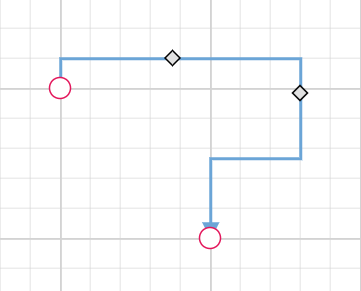

# Connector customization

Diagram allows you to customize the connector appearances. The following topics shows how to customize several properties of the connectors.

## Decorator

* Starting and ending points of a connector can be decorated with some customizable shapes like arrows, circles, diamond, or path. The connection end points can be decorated with the [`sourceDecorator`](https://ej2.syncfusion.com/vue/documentation/api/diagram/connector/#sourcedecorator) and [`targetDecorator`](https://ej2.syncfusion.com/vue/documentation/api/diagram/connector/#targetdecorator) properties of the connector.

* The [`shape`](https://ej2.syncfusion.com/vue/documentation/api/diagram/decoratorShapes/) property of `sourceDecorator` allows to define the shape of the decorators. Similarly, the [shape](https://ej2.syncfusion.com/vue/documentation/api/diagram/decoratorShapes/) property of `targetDecorator` allows to define the shape of the decorators.

* To create custom shape for source decorator, use [`pathData`](https://ej2.syncfusion.com/vue/documentation/api/diagram/decorator/#pathdata) property. Similarly, to create custom shape for target decorator, use [`pathData`](https://ej2.syncfusion.com/vue/documentation/api/diagram/decorator/#pathdata) property.

* The following code example illustrates how to create decorators of various shapes.









        


### Customize the decorator appearance

* The source decorator’s [`strokeColor`](https://ej2.syncfusion.com/vue/documentation/api/diagram/strokeStyle/#strokecolor), [`strokeWidth`](https://ej2.syncfusion.com/vue/documentation/api/diagram/strokeStyle/#strokewidth), and [`strokeDashArray`](https://ej2.syncfusion.com/vue/documentation/api/diagram/strokeStyle/#strokedasharray) properties are used to customize the color, width, and appearance of the decorator.

* To set the border stroke color, stroke width, and stroke dash array for the target decorator, use [`strokeColor`](https://ej2.syncfusion.com/vue/documentation/api/diagram/strokeStyle/#strokecolor), [`strokeWidth`](https://ej2.syncfusion.com/vue/documentation/api/diagram/strokeStyle/#strokewidth), and [`strokeDashArray`](https://ej2.syncfusion.com/vue/documentation/api/diagram/strokeStyle/#strokedasharray).

* To set the size for source and target decorator, use width and height property.

The following code example illustrates how to customize the appearance of the decorator.









        


### Gradient style for decorator.

The gradient property is used to set the gradient color for the decorator. There are two types of gradient.
 * Linear
 * Radial
 
The following code example illustrates how to apply gradient for the decorator.









        


## Padding

Padding is used to leave the space between the Connector's end point and the object to where it is connected.

* The [`sourcePadding`](https://ej2.syncfusion.com/vue/documentation/api/diagram/connector/#sourcepadding) property of connector defines space between the source point and the source node of the connector.

* The [`targetPadding`](https://ej2.syncfusion.com/vue/documentation/api/diagram/connector/#targetpadding) property of connector defines space between the end point and the target node of the connector.

* The following code example illustrates how to leave space between the connection end points and source and target nodes.









        


## Bridging

Line bridging creates a bridge for lines to smartly cross over the other lines, at points of intersection. By default, [`bridgeDirection`](https://ej2.syncfusion.com/vue/documentation/api/diagram/bridgeDirection/) is set to top. Depending upon the direction given bridging direction appears.
Bridging can be enabled/disabled either with the `connector.constraints` or `diagram.constraints`. The following code example illustrates how to enable line bridging.









        


N> You need to inject connector bridging module into the diagram.

The [`bridgeSpace`](https://ej2.syncfusion.com/vue/documentation/api/diagram/connector/#bridgespace) property of connectors can be used to define the width for line bridging.

Limitation: Bezier segments do not support bridging.

## Hit padding

* The [`hitPadding`](https://ej2.syncfusion.com/vue/documentation/api/diagram/connector/#hitpadding) property enables you to define the clickable area around the connector path.The default value for hitPadding is 10.

* The following code example illustrates how to specify hit padding for connector.









        


## Corner radius

Corner radius allows to create connectors with rounded corners. The radius of the rounded corner is set with the [`cornerRadius`](https://ej2.syncfusion.com/vue/documentation/api/diagram/connector/#cornerradius) property.









        


## Connector Appearance

* The connector’s [`strokeWidth`](https://ej2.syncfusion.com/vue/documentation/api/diagram/strokeStyle/#strokewidth), [`strokeColor`](https://ej2.syncfusion.com/vue/documentation/api/diagram/strokeStyle/#strokecolor), [`strokeDashArray`](https://ej2.syncfusion.com/vue/documentation/api/diagram/strokeStyle/#strokedasharray), and [`opacity`](https://ej2.syncfusion.com/vue/documentation/api/diagram/strokeStyle/#opacity) properties are used to customize the appearance of the connector segments.

* The [`visible`](https://ej2.syncfusion.com/vue/documentation/api/diagram/connector/#visible) property of the connector enables or disables the visibility of connector.

* Default values for all the `connectors` can be set using the `getConnectorDefaults` properties. For example, if all connectors have the same type or having the same property then such properties can be moved into `getConnectorDefaults`.

### Segment appearance

The following code example illustrates how to customize the segment appearance.










        


## Connector constraints

* The [`constraints`](https://ej2.syncfusion.com/vue/documentation/api/diagram/connector/#constraints) property of connector allows to enable/disable certain features of connectors.

* To enable or disable the constraints, refer [`constraints`](https://ej2.syncfusion.com/vue/documentation/api/diagram/connectorConstraints/).

The following code illustrates how to disable selection.









        


## Add info for connector

The [`addInfo`](https://ej2.syncfusion.com/vue/documentation/api/diagram/connector/#addinfo) property of connectors allow you to maintain additional information to the connectors.

```ts
var connectors = {
        id: 'connector1',
        //AddInfo for connector
        addInfo: {type:'connector',id:'connector1'},
        type: 'Straight',
        sourcePoint: {x: 300,y: 100},
        targetPoint: {x: 300,y: 200}
    }

```

## ZIndex for connector

The connectors [`zIndex`](https://ej2.syncfusion.com/vue/documentation/api/diagram/connector/#zindex) property specifies the stack order of the connector. A connector with greater stack order is always in front of a connector with a lower stack order.

The following code illustrates how to render connector based on the stack order.









        


## Connector spacing

* The [`connectorSpacing`](https://ej2.syncfusion.com/vue/documentation/api/diagram/connector/#connectorspacing) property allows you to define the distance between the source node and the connector. It is the minimum distance the connector will re-rout or the new segment will create.









        


## MaxSegment thumb

The property [`maxSegmentThumb`](https://ej2.syncfusion.com/vue/documentation/api/diagram/connector/#maxsegmentthumb) is used to limit the  number of segment thumb in the connector.









        





## Reset segments

The [`resetSegments`](https://ej2.syncfusion.com/vue/documentation/api/diagram/#resetsegments) method resets the segments of connectors to their default state based on their connection points. This operation removes any custom segments and restores the connectors to their original configuration. The following example demonstrates how to reset connector segments at runtime.









        


## Enable Connector Splitting

The connectors are used to create a link between two points, ports, or nodes to represent the relationship between them. Split the connector between two nodes when dropping a new node onto an existing connector and create a connection between the new node and existing nodes by setting the [`enableConnectorSplit`](https://ej2.syncfusion.com/vue/documentation/api/diagram/#enableconnectorsplit) as true. The default value of the [`enableConnectorSplit`](https://ej2.syncfusion.com/vue/documentation/api/diagram/#enableconnectorsplit) is false

The following code illustrates how to split the connector and create a connection with new node.









        



### Preserve connector style while connector splitting

When splitting a connector using [`enableConnectorSplit`](https://ej2.syncfusion.com/vue/documentation/api/diagram/#enableconnectorsplit), the new connector created will be a normal connector without any specific styles. To ensure the new connector has the same style as the original connector, you can use the collectionChange event to apply the styles.

The following example demonstrates how to apply the same style of the original connector to the newly added connector:









        
