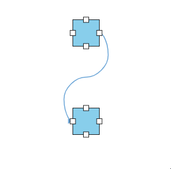
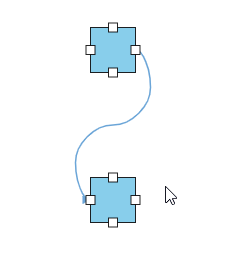
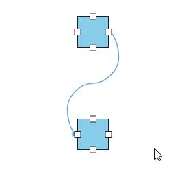
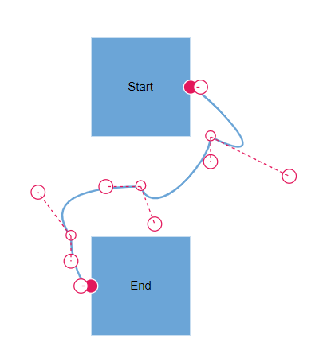
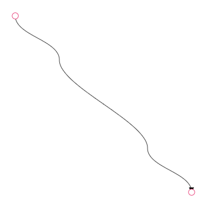
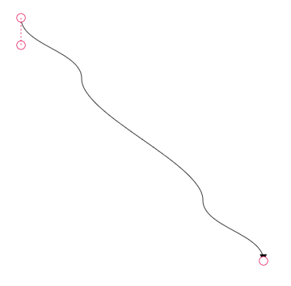
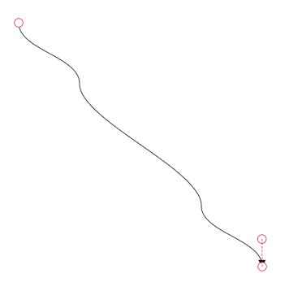
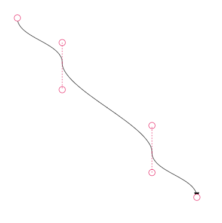
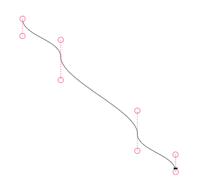

# Bezier Control points 

## How to interact with the bezier segments efficiently

While interacting with multiple bezier segments, maintain their control points at the same distance and angle by using the bezierSettings smoothness property of the connector class.

| BezierSmoothness value | Description | Output |
|-------- | -------- | -------- |
| SymmetricDistance| Both control points of adjacent segments will be at the same distance when any one of them is editing. |  |
| SymmetricAngle | Both control points of adjacent segments will be at the same angle when any one of them is editing. |  |
| Default | Both control points of adjacent segments will be at the same angle and same distance when any one of them is editing. |  |
| None | Segment’s control points are interacted independently from each other. |  |









        


## How to show or hide the bezier segment’s control points

By using the [`controlPointsVisibility`](https://ej2.syncfusion.com/vue/documentation/api/diagram/controlpointsvisibility) property of [`bezierSettings`](https://ej2.syncfusion.com/vue/documentation/api/diagram/beziersettingsmodel), you can enable or disable the visibility of the bezier segment’s control points.

| ControlPointsVisibility value | Description | Output |
|-------- | -------- | -------- |
| None |It allows you to hide all control points of the bezier connector. |  |
| Source | It allows you to show control points of the source segment and hides all other control points in a bezier connector. |  |
| Target | It allows you to show control points of the target segment and hides all other control points in a bezier connector. |  |
| Intermediate | It allows you to show control points of the intermediate segments and hides all other control points in a bezier connector.|  |
| All | It allows you to show all the control points of the bezier connector, including the source, target, and intermediate segments’ control points. |  |
