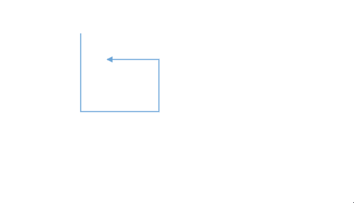
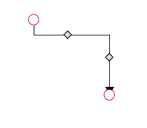
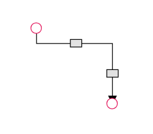
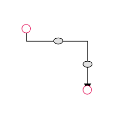
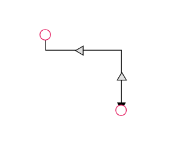
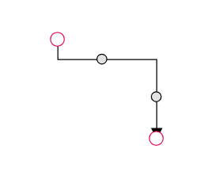
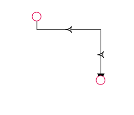
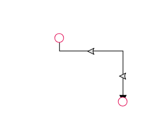
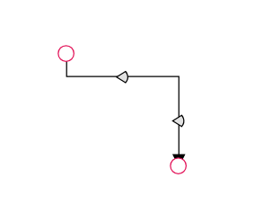
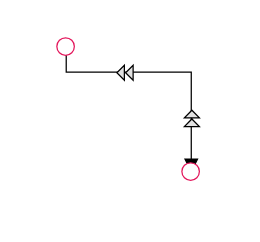

# Orthogonal Connectors in ej2-vue Diagram control

Orthogonal segments is used to create segments that are perpendicular to each other.

Set the segment [`type`](https://ej2.syncfusion.com/vue/documentation/api/diagram/segments/) as orthogonal to create a default orthogonal segment and need to specify [`type`](https://ej2.syncfusion.com/vue/documentation/api/diagram/connector/#type). The following code example illustrates how to create a default orthogonal segment.

Multiple segments can be defined one after another. To create a connector with multiple segments, define and add the segments to [`connector.segments`](https://ej2.syncfusion.com/vue/documentation/api/diagram/connector/#segments) collection. The following code example illustrates how to create a connector with multiple segments.

The [`length`](https://ej2.syncfusion.com/vue/documentation/api/diagram/orthogonalSegment/) and [`direction`](https://ej2.syncfusion.com/vue/documentation/api/diagram/orthogonalSegment/) properties allow to define the flow and length of segment. The following code example illustrates how to create customized orthogonal segments.









        


N> You need to mention the segment type as same as what you mentioned in connector type. There should be no contradiction between connector type and segment type.

## Orthogonal segment editing

* Orthogonal thumbs allow you to adjust the length of adjacent segments by clicking and dragging them.
* When necessary, some segments are added or removed automatically, while dragging the segment. 
* This is to maintain proper routing of orthogonality between segments.









        




## Avoid overlapping

Orthogonal segments are automatically re-routed, in order to avoid overlapping with the source and target nodes. The following preview illustrates how orthogonal segments are re-routed.









        



## How to customize Orthogonal Segment Thumb Shape

The orthogonal connector can have any number of segments in between the source and the target point. Segments are rendered with the circle shape by default. The [`segmentThumbShape`](https://ej2.syncfusion.com/vue/documentation/api/diagram/segmentThumbShapes/) property allows you to change the default shape of the segment thumb. The following predefined shapes are provided:

| Shape name | Shape |
|-------- | -------- |
|Rhombus|  |
| Square |  |
| Rectangle |  |
| Ellipse | |
|Arrow|  |
| OpenArrow |  |
| Circle | |
| Fletch| |
|OpenFetch|  |
| IndentedArrow |  |
| OutdentedArrow |  |
| DoubleArrow | |

 You can customize the style of the thumb shape by overriding the class e-orthogonal-thumb.









        


 

Use the following CSS to customize the segment thumb shape.

```scss

 .e-orthogonal-thumb {

            stroke:#24039e;

            fill:rgb(126, 190, 219);

            stroke-width: 3px;

            }

```

## How to customize Orthogonal Segment Thumb Size

Orthogonal segment thumbs default to size 10. This can be adjusted globally or for individual connectors using the [`segmentThumbSize`](https://ej2.syncfusion.com/vue/documentation/api/diagram/#segmentthumbsize) property.
To change the thumb size for all Orthogonal connectors, set the [`segmentThumbSize`](https://ej2.syncfusion.com/vue/documentation/api/diagram/#segmentthumbsize) property in the diagram’s model.
To customize the thumb size for a specific connector, disable the [`InheritSegmentThumbSize`](https://ej2.syncfusion.com/vue/documentation/api/diagram/connectorConstraints/) constraint, then set the desired [`segmentThumbSize`](https://ej2.syncfusion.com/vue/documentation/api/diagram/#segmentthumbsize). 









        
