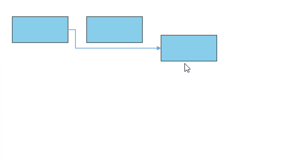
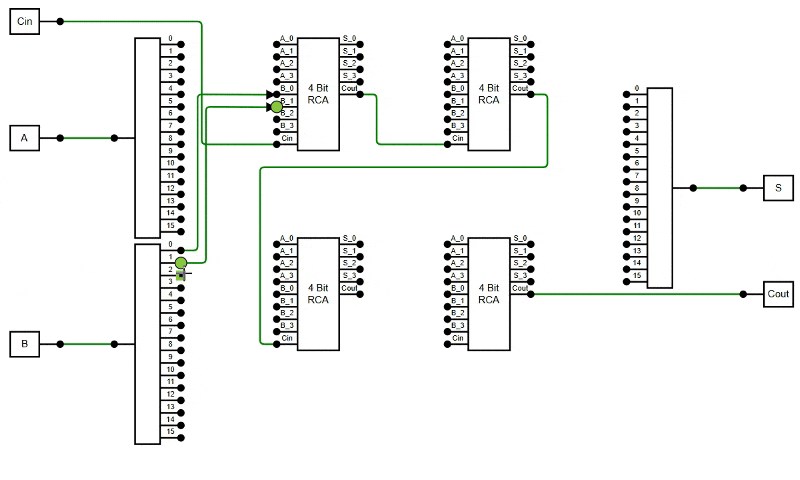

# Connectors in Vue Diagram component

Connectors are objects used to create link between two points, nodes or ports to represent the relationships between them.

## Create Connector

Connector can be created by defining the source and target point of the connector. The path to be drawn can be defined with a collection of segments. To explore the properties of a [`connector`](https://ej2.syncfusion.com/vue/documentation/api/diagram/connector), refer to [`Connector Properties`](https://ej2.syncfusion.com/vue/documentation/api/diagram/connector).
 The [`id`](https://ej2.syncfusion.com/vue/documentation/api/diagram/connector#id) property of a connector is used to define its unique identifier and can later be used to find the connector at runtime for customization. 

```ts
var connector = { 
                  id: "connector1",
                  type:'Straight',
                  sourcePoint: {x: 100,y: 100},
                  targetPoint: { x: 200,y: 200}
                }
```
N> When setting a Connector's ID, ensure that it does not contain white spaces, does not start with numbers or special characters, and does not include special characters like underscores (_) or spaces.

To create and customize the connectors easily in the EJ2 Vue Diagram component, refer to the below video link.



## Add connectors through connectors collection

* The [`sourcePoint`](https://ej2.syncfusion.com/vue/documentation/api/diagram/connector#sourcepoint) and [`targetPoint`](https://ej2.syncfusion.com/vue/documentation/api/diagram/connector#targetpoint) properties of connector allow you to define the end points of a connector.

The following code example illustrates how to add a connector through connector collection.









        


## Add/Remove connector at runtime

Connectors can be added at runtime by using public method,[`add`](https://ej2.syncfusion.com/vue/documentation/api/diagram/index-default#add) and can be removed at runtime by using public method, [`remove`](https://ej2.syncfusion.com/vue/documentation/api/diagram/index-default#remove).

The following code example illustrates how to add and remove connector at runtime.









        


## Add collection of connectors at runtime

The collection of connectors can be dynamically added using [`addElements`](https://ej2.syncfusion.com/vue/documentation/api/diagram/index-default#addelements) method. Each time an element is added to the diagram canvas, the 'collectionChange' event will be triggered.

The following code illustrates how to add a connectors collection at runtime.









        


## Add Connectors from palette

Connectors can be predefined and added to the symbol palette. You can drop those connectors into the diagram, when required.

The following code example illustrates how to add connectors in palette.









        


## Draw connectors

Connectors can be interactively drawn by clicking and dragging the diagram surface.

To draw a shape, you have to activate the drawing tool by setting `DrawOnce` or `ContinuousDraw` to the [`tool`](https://ej2.syncfusion.com/vue/documentation/api/diagram/index-default#tool) property and you need to set the `connector` object by using the [`drawingObject`](https://ej2.syncfusion.com/vue/documentation/api/diagram/index-default#drawingobject) property. 

The following code example illustrates how to draw a connector at runtime.









        


For more information about drawing connectors, refer to [`Draw Connectors`](https://ej2.syncfusion.com/vue/documentation/api/diagram/index-default#drawingobject).

## Update connector at runtime

Various connector properties such as `sourcePoint`, `targetPoint`, `style`, `sourcePortID`, `targetPortID`, etc., can be updated at the runtime.

The following code example illustrates how to update a connector's source point, target point, styles properties at runtime.









        


## Clone connector at runtime

Cloning a connector creates a new connector instance with identical properties and attributes.

The following code example illustrates how to clone a connector









        


## Get Connector defaults

Get Connector defaults helps to define default properties of the connector. It is triggered when the diagram is initialized. In this event, you can customize the connector properties.

The following code example explains how to customize the connector using [`getConnectorDefaults`](https://ej2.syncfusion.com/vue/documentation/api/diagram/index-default#getconnectordefaults).









        


## Connections

### Connection with nodes

* The [`sourceID`](https://ej2.syncfusion.com/vue/documentation/api/diagram/connector#sourceid) and [`targetID`](https://ej2.syncfusion.com/vue/documentation/api/diagram/connector#targetid) properties allow to define the nodes to be connected.

* The following code example illustrates how to connect two nodes.









        


* When you remove NodeConstraints [`InConnect`](https://ej2.syncfusion.com/vue/documentation/api/diagram/nodeconstraints) from Default, the node accepts only an outgoing connection to dock in it. Similarly, when you remove NodeConstraints [`OutConnect`](https://ej2.syncfusion.com/vue/documentation/api/diagram/nodeconstraints) from Default, the node accepts only an incoming connection to dock in it.

* When you remove both InConnect and OutConnect NodeConstraints from Default, the node restricts connector to establish connection in it.

* The following code illustrates how to disable InConnect constraints.

```ts

//Initialize diagram
 <ejs-diagram id="diagram" :width='width' :height='height' :nodes='nodes'></ejs-diagram>
    let nodes:[
         {
            id: 'node', width: 100, height: 100, offsetX: 100, offsetY: 150,
            shape: { type: 'Basic', shape: 'Rectangle' },
            //Disable InConnect constraints
            constraints: NodeConstraints.Default & ~NodeConstraints.InConnect,
         }
     ]

```

## Connections with ports

The [`sourcePortID`](https://ej2.syncfusion.com/vue/documentation/api/diagram/connector#sourceportid) and [`targetPortID`](https://ej2.syncfusion.com/vue/documentation/api/diagram/connector#targetportid) properties allow to create connections between some specific points of source/target nodes.

The following code example illustrates how to create port to port connections.









        


Similarly, the `sourcePortID` or `targetPortID` can be changed at the runtime by changing the port [`sourcePortID`](https://ej2.syncfusion.com/vue/documentation/api/diagram/connector#sourceportid) or [`targetPortID`](https://ej2.syncfusion.com/vue/documentation/api/diagram/connector#targetportid).









        


* When you set PortConstraints to [`InConnect`](https://ej2.syncfusion.com/vue/documentation/api/diagram/portconstraints), the port accepts only an incoming connection to dock in it. Similarly, when you set PortConstraints to [`OutConnect`](https://ej2.syncfusion.com/vue/documentation/api/diagram/portconstraints), the port accepts only an outgoing connection to dock in it.

* When you set PortConstraints to None, the port restricts connector to establish connection in it.

```ts

//Initialize diagram
 <ejs-diagram id="diagram" :width='width' :height='height' :nodes='nodes'></ejs-diagram>
    let nodes:[
         {
            id: 'node', width: 100, height: 100, offsetX: 100, offsetY: 150,
            shape: { type: 'Basic', shape: 'Rectangle' },
            ports: [
             //Enable portConstraints Inconnect
             { id: 'port', height: 10, width: 10, offset: { x: 1, y: 0.5 }, constraints: PortConstraints.InConnect },
           ]
         }
     ]
```

## Automatic line routing

Diagram provides additional flexibility to re-route the diagram connectors. A connector will frequently re-route itself when a shape moves next to it. Routing adjusts the geometry of connectors to prevent them from overlapping with any nearby nodes in their path. This feature can be activated by adding the LineRouting constraints property to the diagram.

* Dependency LineRouting module should be injected to the application as the following code snippet.

```ts
  /**
   * Inject the automatic line routing module.
   */
  import { DiagramComponent, LineRouting, DiagramConstraints } from '@syncfusion/ej2-vue-diagrams';
  provide('diagram', [LineRouting]);
```

* Now, the line routing constraints must be included to the default diagram constraints to enable automatic line routing support like below.

```ts
      <template>
        <div id="app">
        // Initialize the Diagram
                <ejs-diagram :constraints='constraints' ></ejs-diagram>
            </div>
        </template>

        <script setup>
        // Enable line routing constraints.
        let constraints = DiagramConstraints.Default | DiagramConstraints.LineRouting;
        </script>
```

* The following code block shows how to create the diagram with specifying nodes, connectors, constraints, and necessary modules for line routing.









        


The following image illustrates how the connector automatically re-routes the segments. 



* In some situations, automatic line routing enabled diagram needs to ignore a specific connector from automatic line routing. So, in this case, auto routing feature can be disabled to the specific connector using the [`constraints`](https://ej2.syncfusion.com/vue/documentation/api/diagram/connector#constraints) property of the connector like the following code snippet.









        


## Avoid line overlapping

The diagram provides flexibility to prevent connectors from overlapping, ensuring better clarity and readability. This feature intelligently adjusts connector paths to avoid stacking orthogonal connectors on top of each other, reducing visual clutter and enhancing diagram structure. It is especially useful in complex diagrams with multiple orthogonal connectors, where overlapping lines can make interpretation difficult.

To enable this feature, inject the `AvoidLineOverlapping` module and add its constraints to the diagram.
 
* Inject both the `LineRouting` and `AvoidLineOverlapping` modules into the application.

  ```ts
  /**
   * Inject the line routing and avoid line overlapping module
    */
  import { DiagramComponent, LineRouting, AvoidLineOverlapping, DiagramConstraints } from '@syncfusion/ej2-vue-diagrams';
  provide('diagram',  [LineRouting, AvoidLineOverlapping]);
  ```

* Add `LineRouting` and `AvoidLineOverlapping` constraints to the diagram constraints to enable line routing with avoid line overlapping support.

  ```ts

  <template>
    <div id="app">
      // Initialize the Diagram
      <ejs-diagram :constraints='constraints' ></ejs-diagram>
    </div>
  </template>

  <script setup>
  // Enable line routing and avoid line overlapping constraints.
  let constraints = DiagramConstraints.Default |
                    DiagramConstraints.LineRouting |
                    DiagramConstraints.AvoidLineOverlapping;
  </script>
  
  ```



The following example demonstrates how to enable the AvoidLineOverlapping feature in the diagram.









        


N> The `AvoidLineOverlapping` feature applies only to orthogonal connectors and requires the `LineRouting` module to be injected with its constraints enabled.


## See Also

* [How to add annotations to the connector](../labels/labels)
* [How to enable/disable the behavior of the node](../constraints)
* [How to add connectors to the symbol palette](../symbol-palette/symbol-palette)
* [How to perform the interaction on the connector](../interaction#connection-editing)
* [How to create diagram connectors using drawing tools](../tools)
