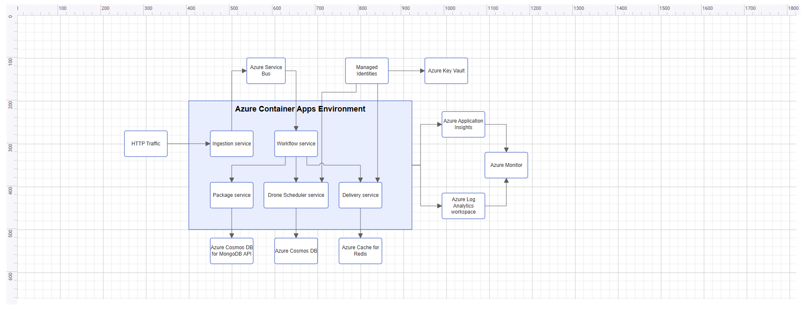

# Getting Started with Vue 3 Diagram Component

This section explains how to create a Vue 3 application from scratch and build a simple diagram using the [Vue Diagram](https://www.syncfusion.com/vue-components/vue-diagram) component.

In Vue 3, developers can choose between two APIs for building components:

- The `Composition API` is a modern approach that allows you to organize and reuse logic using functions. It enables better code organization and scalability, especially for complex applications.

- The `Options API` is the traditional approach where component logic is defined using options such as data, methods, computed properties, watchers, and life cycle hooks.

To create, edit, and view interactive diagrams using the Vue Diagram component, refer to the video below.






## Prerequisites

- [Node.js 24+](https://nodejs.org/en) (LTS recommended).
- Syncfusion CLI.

## Install the Syncfusion CLI 

Install the Syncfusion CLI globally using the following command:



npm install -g @syncfusion/cli



## Set up the Vite project using Syncfusion CLI

You can create a Vue application with [Vite](https://vite.dev/) using the Syncfusion CLI. The CLI provides two ways to create a project:

### Non-interactive mode

Non-interactive mode allows you to create a project directly using a single command with the required command-line arguments.



sf new my-project --framework vue --template diagram



In this mode, the project configuration is passed directly in the command. The above command creates a `Vue` application with Vite and configured it with the Syncfusion<sup style="font-size:70%">&reg;</sup> `Diagram` component. The generated project uses the TypeScript and the Composition API.

### Interactive mode

Interactive mode guides you through the project creation process with step-by-step prompts.



sf



When you run the `sf` command, the CLI prompts you to select the required project configuration options. To create a Vue application with Vite and the Syncfusion<sup style="font-size:70%">&reg;</sup> `Diagram` component, select the following options:




√ Project name? ... my-project
√ Choose Framework: » Vue
√ Choose Language: » JavaScript
√ Choose Template: » Diagram
√ Choose Theme: » Material3
√ Choose Style Format: » CSS
√ Would you like to integrate the Syncfusion MCP Server (AI Assistant) into this project? ... no
√ Would you like to install Syncfusion Component Skills for AI-powered development? ... no      
√ Install dependencies and start app now? ... no




The above selections generate a `Vue` application with Vite and configure it with the Syncfusion<sup style="font-size:70%">&reg;</sup> `Diagram` component. You can choose different values for language, theme, style format, MCP setup, and skills installation based on your project requirements.

The Syncfusion<sup style="font-size:70%">&reg;</sup> CLI creates the project with a predefined template. After the project is generated, you can customize or replace the component code based on your application requirements.

## Run the project

Once the project is created, navigate to the project directory and run the following commands in your terminal.



cd my-project
npm install
npm run dev



The output will appear as follows:







## Prerequisites

Before getting started, ensure that your development environment meets the [system requirements for Syncfusion® Vue UI components](https://ej2.syncfusion.com/vue/documentation/system-requirements). This guide requires Node.js 18.0 or later and Vite 5.0 or later.

## Before You Begin
This guide uses a Vue 3 project created with Vite using the JavaScript template, which provides fast builds and an optimized development experience.

The main files used in this guide are:
- `src/App.vue` — Defines the root Vue component and renders the Diagram component.
- `src/main.js` — Application entry point.
- `index.html` — Root HTML file.

N> In a Vite Vue application, the root element is defined in `index.html` as `<div id="app"></div>`, and the application is mounted from `src/main.js`. In a Vite Vue 3 application, the root component is commonly located at `src/App.vue`.

N> This guide uses the Composition API with `<script setup>`, which is the recommended approach for Vue 3 applications.


## Step 1: Set up the Vue 3 environment

Use [Vite](https://vitejs.dev/) to create and manage Vue 3 applications. 

Create a new Vue 3 application using the following command.

```bash
npm create vite@latest my-diagram-app -- --template vue
```

If Vite prompts you to install dependencies and start the project immediately, select **No**. Dependencies are installed in the next step instead, so that the Syncfusion package can be added together with the rest of the application dependencies.

Navigate to the project folder:

```bash
cd my-diagram-app
```

Install the application dependencies:

```bash
npm install
```
N> If you prefer TypeScript instead of JavaScript, create the application using `npm create vite@latest my-diagram-app -- --template vue-ts`. For TypeScript-specific guidance, refer to the [Vite Vue-TS template](https://vitejs.dev/guide/) documentation.

## Step 2: Install the Vue Diagram package

All Syncfusion Essential® JS 2 packages are available in the [npmjs.com](https://www.npmjs.com/~syncfusionorg) registry.

Install the Vue Diagram package using the following command:

```bash
npm install @syncfusion/ej2-vue-diagrams --save
```

N> Installing `@syncfusion/ej2-vue-diagrams` automatically installs the required dependency packages.

## Step 3: Add the required styles

The Diagram component needs Syncfusion® theme styles to display correctly. Syncfusion® theme packages include ready-to-use styles for supported controls.

To add the styles, install the Tailwind 3 theme package using the following command:

```bash
npm install @syncfusion/ej2-tailwind3-theme
```

Add the following import to the **src/App.vue** file:

```
<style>
  @import "../node_modules/@syncfusion/ej2-tailwind3-theme/styles/diagram/index.css";
</style>
```

For the list of available themes, refer to the [Themes](https://ej2.syncfusion.com/vue/documentation/appearance/theme) documentation.

N> Syncfusion® provides multiple built-in themes. If the application uses a different theme, replace **@syncfusion/ej2-tailwind3-theme/styles/diagram/index.css** with the corresponding stylesheet from the desired theme package. For example, to use the Material 3 theme, import **@syncfusion/ej2-material3-theme/styles/diagram/index.css**. Install the theme package at the same version as `@syncfusion/ej2-vue-diagrams` to avoid style mismatches.

## Step 4: Add the Diagram component

Import `DiagramComponent` from `@syncfusion/ej2-vue-diagrams` and use it in your component. Then add the `ejs-diagram` element to the template.

Replace the entire contents of **src/App.vue** with the following code:

```
<template>
  <ejs-diagram
    id="diagram"
    width="100%"
    height="580px"
  />
</template>

<script setup>
 import { DiagramComponent as EjsDiagram } from '@syncfusion/ej2-vue-diagrams';
</script>
 
<style>
 @import "../node_modules/@syncfusion/ej2-tailwind3-theme/styles/diagram/index.css";
</style>
```

At this stage, the Diagram component renders an empty canvas.

N> The `DiagramComponent as EjsDiagram` alias is required for `<script setup>`, because the `<ejs-diagram>` element name in the template must match the registered component alias. The Diagram component must also have a valid height; if the height is not set, the canvas may not be visible. If the canvas does not render, verify that the height is set, the theme CSS is imported, and the component alias matches the `EjsDiagram` import.

## Step 5: Create your first Diagram with nodes and connectors

This section explains how to create a simple flowchart by adding nodes, customizing their appearance, and connecting them using connectors.

The following example creates a flowchart with four nodes: **Start**, **Process**, **Decision**, and **End**. It also applies common node and connector settings through the `getNodeDefaults` and `getConnectorDefaults` callback bindings.

Replace the entire contents of **src/App.vue** with the following code:

```
<template>
  <ejs-diagram
    id="diagram"
    width="100%"
    height="580px"
    :nodes="nodes"
    :connectors="connectors"
    :getNodeDefaults="nodeDefaults"
    :getConnectorDefaults="connectorDefaults"
  />
</template>

<script setup>
import { DiagramComponent as EjsDiagram } from '@syncfusion/ej2-vue-diagrams';

const terminator = {
  type: 'Flow',
  shape: 'Terminator'
};

const process = {
  type: 'Flow',
  shape: 'Process'
};

const decision = {
  type: 'Flow',
  shape: 'Decision'
};

const nodes = [
  {
    id: 'node1',
    offsetX: 300,
    offsetY: 100,
    shape: terminator,
    annotations: [
      {
        content: 'Start'
      }
    ]
  },
  {
    id: 'node2',
    offsetX: 300,
    offsetY: 200,
    shape: process,
    annotations: [
      {
        content: 'Process'
      }
    ]
  },
  {
    id: 'node3',
    offsetX: 300,
    offsetY: 300,
    shape: decision,
    annotations: [
      {
        content: 'Decision?'
      }
    ]
  },
  {
    id: 'node4',
    offsetX: 300,
    offsetY: 400,
    shape: terminator,
    annotations: [
      {
        content: 'End'
      }
    ]
  }
];

const connectors = [
  {
    id: 'connector1',
    sourceID: 'node1',
    targetID: 'node2'
  },
  {
    id: 'connector2',
    sourceID: 'node2',
    targetID: 'node3'
  },
  {
    id: 'connector3',
    sourceID: 'node3',
    targetID: 'node4'
  }
];

function nodeDefaults(node) {
  node.width = 140;
  node.height = 50;
  node.style = {
    fill: '#E8F4FF',
    strokeColor: '#357BD2'
  };
  return node;
}

function connectorDefaults(connector) {
  connector.type = 'Orthogonal';
  connector.targetDecorator = {
    shape: 'Arrow',
    width: 10,
    height: 10
  };
  return connector;
}
</script>

 
<style>
 @import "../node_modules/@syncfusion/ej2-tailwind3-theme/styles/diagram/index.css";
</style>
```

In this example:

* [`offsetX`](https://ej2.syncfusion.com/vue/documentation/api/diagram/nodemodel#offsetx) and [`offsetY`](https://ej2.syncfusion.com/vue/documentation/api/diagram/nodemodel#offsety) define the position of each node.
* [`shape`](https://ej2.syncfusion.com/vue/documentation/api/diagram/nodemodel#shape) defines the node shape configuration, and [`FlowShapeModel.shape`](https://ej2.syncfusion.com/vue/documentation/api/diagram/flowshapemodel#shape) specifies flowchart shapes such as `Terminator`, `Process`, or `Decision`.
* The [`annotations`](https://ej2.syncfusion.com/vue/documentation/api/diagram/annotationmodel) property adds text inside each node using the [`content`](https://ej2.syncfusion.com/vue/documentation/api/diagram/annotationmodel#content) field.
* [`sourceID`](https://ej2.syncfusion.com/vue/documentation/api/diagram/connectormodel#sourceid) and [`targetID`](https://ej2.syncfusion.com/vue/documentation/api/diagram/connectormodel#targetid) define the connection between nodes.
* [`getNodeDefaults`](https://ej2.syncfusion.com/vue/documentation/api/diagram/index-default#getnodedefaults) applies common width, height, fill color, and stroke color to all nodes.
* [`getConnectorDefaults`](https://ej2.syncfusion.com/vue/documentation/api/diagram/index-default#getconnectordefaults) applies common connector settings, such as orthogonal routing and target arrows.

## Step 6: Run the application

Run the application using the following command:

```bash
npm run dev
```
Then open the generated local URL (`http://localhost:5173`) in the browser. The application displays the flowchart diagram as shown below:





N> Looking for the full Vue Diagram component overview, features, pricing, and documentation? Visit the [Vue Diagram](https://www.syncfusion.com/vue-components/vue-diagram) page.