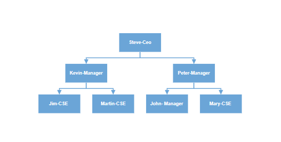

# Hierarchical tree layout in Vue Diagram control

The hierarchical tree layout arranges nodes in a tree-like structure, where the nodes in the hierarchical layout may have multiple parents. There is no need to specify the layout root.

## Hierarchical tree layout with nodes and connectors

To arrange the nodes in a hierarchical structure, specify the layout [`type`](https://ej2.syncfusion.com/vue/documentation/api/diagram/layout/#type) as **HierarchicalTree**. The following example shows how to arrange the nodes in a hierarchical structure.









        


>Note: If you want to use hierarchical tree layout in diagram, you need to inject HierarchicalTree in the diagram.

## Hierarchical layout with DataSource

You can create a hierarchical layout with data Source. The following code demonstrates how to render a Hierarchical layout using DataSource.









        


>Note: If you want to convert the data source into layout, you need to inject DataBinding along with HierarchicalTree module in the diagram.

