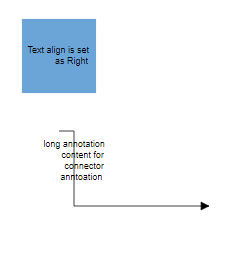
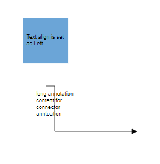
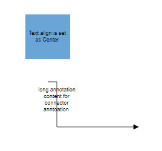
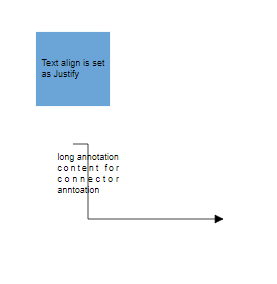
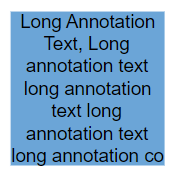
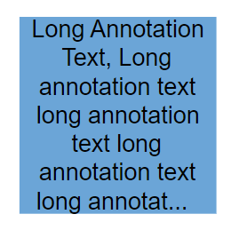
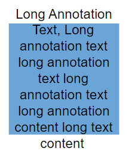

## Appearance

You can change the font style of the annotations with the font specific properties [`fontSize`](https://helpej2.syncfusion.com/vue/documentation/api/diagram/textStyleModel/#fontsize), [`fontFamily`](https://helpej2.syncfusion.com/vue/documentation/api/diagram/textStyleModel/#fontfamily), [`color`](https://helpej2.syncfusion.com/vue/documentation/api/diagram/textStyleModel/#color).
The label’s [`bold`](https://helpej2.syncfusion.com/vue/documentation/api/diagram/textStyleModel/#bold), [`italic`](https://helpej2.syncfusion.com/vue/documentation/api/diagram/textStyleModel/#italic), and [`textDecoration`](https://helpej2.syncfusion.com/vue/documentation/api/diagram/textStyleModel/#textdecoration) properties are used to style the label’s text.

The label’s [`fill`](https://helpej2.syncfusion.com/vue/documentation/api/diagram/textStyleModel/#fill), [`strokeColor`](https://helpej2.syncfusion.com/vue/documentation/api/diagram/textStyleModel/#strokecolor), and [`strokeWidth`](https://helpej2.syncfusion.com/vue/documentation/api/diagram/textStyleModel/#strokewidth) properties are used to define the background color and border color of the annotation and the [`opacity`](https://helpej2.syncfusion.com/vue/documentation/api/diagram/textStyleModel/#opacity) property is used to define the transparency of the annotations.

The [`visible`](https://helpej2.syncfusion.com/vue/documentation/api/diagram/annotationModel/#visibility) property of the annotation enables or disables the visibility of annotation.

 The following code illustrates how to customize the appearance of the annotation.









        


## Horizontal and vertical alignment

The following tables illustrates all the possible alignments visually with 'offset (0, 0)'.

| Horizontal Alignment | Vertical Alignment | Output with Offset(0,0) |
| -------- | -------- | -------- |
| Left | Top |  |
| Center | Top |  |
| Right | Top |   |
| Left | Center |  |
| Center | Center|  |
| Right | Center |  |
| Left | Bottom |  |
| Center | Bottom |  |
| Right |Bottom | |

The following codes illustrates how to align annotations.









        


## Annotation Margin

[`Margin`](https://helpej2.syncfusion.com/vue/documentation/api/diagram/annotationModel/#margin) is an absolute value used to add some blank space in any one of its four sides. The annotations can be displaced with the margin property. The following code example illustrates how to align a annotation based on its `offset`, `horizontalAlignment`, `verticalAlignment`, and [`margin`](https://helpej2.syncfusion.com/vue/documentation/api/diagram/marginModel/) values.









        


## Hyperlink

Diagram provides a support to add a [`hyperlink`](https://helpej2.syncfusion.com/vue/documentation/api/diagram/annotationModel/#hyperlink) for the nodes/connectors annotation. It can also be customized with the below properties.

A User can open the hyperlink in the new window, the same tab and the new tab by using the  [`hyperlinkOpenState`](https://helpej2.syncfusion.com/vue/documentation/api/diagram/hyperlinkModel/#hyperlinkopenstate) property.

The [`content`](https://helpej2.syncfusion.com/vue/documentation/api/diagram/hyperlinkModel/#content) property of `hyperlink` is used to display the content of the hyper link display text. The [`color`](https://helpej2.syncfusion.com/vue/documentation/api/diagram/hyperlinkModel/#color) property of the `hyperlink` is used to display the color of the hyper link.
The [`textDecoration`](https://helpej2.syncfusion.com/vue/documentation/api/diagram/textDecoration/) property is used to decorate the hyper link text with **Underline**, **LineThrough**, **Overline**. The following example illustrates how to define and customize hyper link in both node and connector.









        


## Rotate Annotation

Annotation can be rotated by setting the [`rotateAngle`](https://helpej2.syncfusion.com/vue/documentation/api/diagram/shapeAnnotationModel/#rotateangle) property of the annotation. The following example shows how to rotate annotation text.









        


## Template support for annotation

Diagram provides template support for annotation. You can either define a string template and assign it to [`template`](https://helpej2.syncfusion.com/vue/documentation/api/diagram/annotationModel/#template) property of annotation or define a annotation template in html file and assign it to the [`annotationTemplate`](https://helpej2.syncfusion.com/vue/documentation/api/diagram/#annotationtemplate) property of the diagram.

### String template

For string template you should define a SVG/HTML content as string in the annotation's [`template`](https://helpej2.syncfusion.com/vue/documentation/api/diagram/annotationModel/#template) property.

The following code illustrates how to define a template in annotation.









        


N> For the proper alignment of template, we need to mention width and height for the annotation while using template.

### Annotation template

For annotation template you should define a template in html file which you want to render in annotation and assign it to the [`annotationTemplate`](https://helpej2.syncfusion.com/vue/documentation/api/diagram/#annotationtemplate) property of diagram.

The following code illustrates how to define a annotationTemplate in annotation.









        


### Functional template

We can define a function which would return a string template and assign that method to the `annotationTemplate` property of diagram. Inside that function we can do customizations based on the id of the annotation.

The following code illustrates how to define a functional template.









        


## Text align

The [`textAlign`](https://helpej2.syncfusion.com/vue/documentation/api/diagram/textStyleModel/#textalign) property of annotation allows you to set how the text should be aligned (left, right, center, or justify) inside the text block. The following codes illustrate how to set textAlign for an annotation.









        


The following table shows the different text alignment.

|Text Align|Output image|
|-----|-----|
|Right||
|Left||
|Center||
|Justify||

## Text Wrapping

When text overflows node boundaries, you can control it by using [`text wrapping`](https://helpej2.syncfusion.com/vue/documentation/api/diagram/textStyleModel/#textwrapping). So, it is wrapped into multiple lines. The wrapping property of annotation defines how the text should be wrapped. The following code illustrates how to wrap a text in a node.









        


| Value | Description | Image |
| -------- | -------- | -------- |
| No Wrap | Text will not be wrapped. |  |
| Wrap | Text-wrapping occurs, when the text overflows beyond the available node width. |  |
| WrapWithOverflow (Default) | Text-wrapping occurs, when the text overflows beyond the available node width. However, the text may overflow beyond the node width in the case of a very long word. |  |

## Text overflow

The label’s [`TextOverflow`](https://helpej2.syncfusion.com/vue/documentation/api/diagram/textStyleModel/#textoverflow) property is used control whether to display the overflowed content in node or not. 

- `Clip` - The text which overflowing node's bounds will be removed.
- `Ellipsis` - The text which overflowing nodes's bounds will be replaced by three dots.
- `Wrap` - Entire text will be rendered overflowing in y-axis and wrapped in x-axis.

Types of text overflow are shown in below table.

|TextOverflow|output image|
|-----|-----|
|Clip||
|Ellipsis||
|Wrap(Default)||









        

