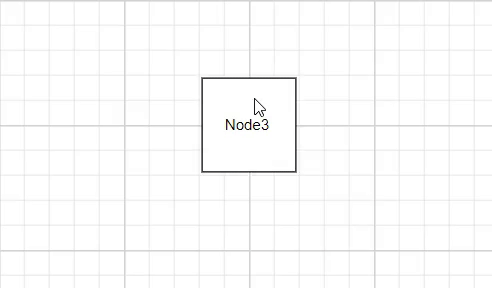

# Annotation Interactions in Vue Diagram component

Diagram allows annotation to be interacted by selecting, dragging, rotating, and resizing. Annotation interaction is disabled, by default. You can enable annotation interaction with the `constraints` property of annotation. You can also curtail the services of interaction by enabling either selecting, dragging, rotating, or resizing individually with the respective constraints property of annotation. The following code illustrates how to enable interactive mode.









        


## Constraints

The [`constraints`](https://ej2.syncfusion.com/vue/documentation/diagram/constraints#annotation-constraints) property of annotation allows you to enable/disable certain annotation behaviors.

## Annotation rotation

The [`rotationReference`](https://ej2.syncfusion.com/vue/documentation/api/diagram/shapeAnnotationModel/#rotationreference) property of an annotation allows you to control whether the text should rotate relative to its parent node or the Page. The following code examples illustrate how to configure rotationReference for an annotation.









        


| Value | Description | Image |
| -------- | -------- | -------- |
| Page | When this option is set, the annotation remains fixed in its original orientation even if its parent node is rotated. |  |
| Parent | In this case, the annotation rotates along with its parent node. | |

### Read-only annotations

Diagram allows to create read-only annotations. You have to set the read-only constraints to the annotation's [`constraints`](https://ej2.syncfusion.com/vue/documentation/api/diagram/annotationModel/#constraints) property. The following code illustrates how to enable read-only mode.









        


## Edit

Diagram provides support to edit an annotation at runtime, either programmatically or interactively. By default, annotation is in view mode. But it can be brought to edit mode in two ways;

### Programmatically
By using [`startTextEdit`](https://ej2.syncfusion.com/vue/documentation/api/diagram/#starttextedit) method, edit the text through programmatically.









        


### Interactively
    1. By double-clicking the annotation.
    2. By selecting the item and pressing the F2 key.

Double-clicking any annotation will enables editing mode. When the focus of editor is lost, the annotation for the node is updated. When you double-click on the node/connector/diagram model, the [`doubleClick`](https://ej2.syncfusion.com/vue/documentation/api/diagram/#doubleclick) event gets triggered.

## Drag Limit

* The diagram control now supports defining the [`dragLimit`](https://ej2.syncfusion.com/vue/documentation/api/diagram/annotationModel/#draglimit) to the label while dragging from the connector and also update the position to the nearest segment offset.

* You can set the value to dragLimit [`left`](https://ej2.syncfusion.com/vue/documentation/api/diagram/marginModel/#left), [`right`](https://ej2.syncfusion.com/vue/documentation/api/diagram/marginModel/#left), [`top`](https://ej2.syncfusion.com/vue/documentation/api/diagram/marginModel/#top), and [`bottom`](https://ej2.syncfusion.com/vue/documentation/api/diagram/marginModel/#bottom) properties which allow the dragging of connector labels to a certain limit based on the user defined values.

* By default, drag limit will be disabled for the connector. It can be enabled by setting connector constraints as drag.

* The following code illustrates how to set a dragLimit for connector annotations.









        


## Multiple annotations

You can add any number of annotations to a node or connector. The following code illustrates how to add multiple annotations to a node and connector.









        

