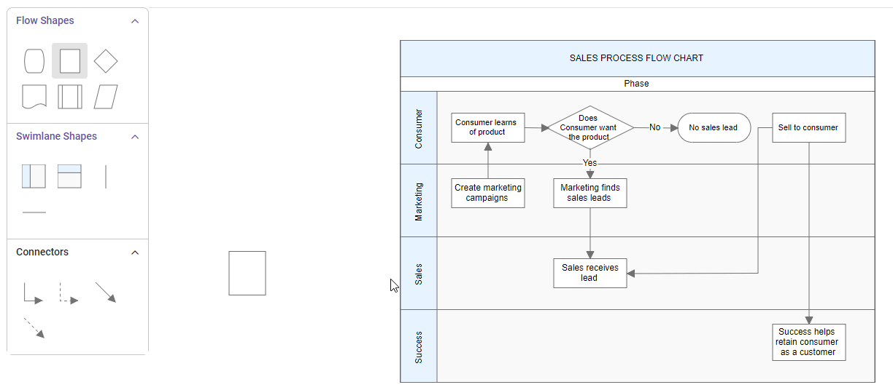
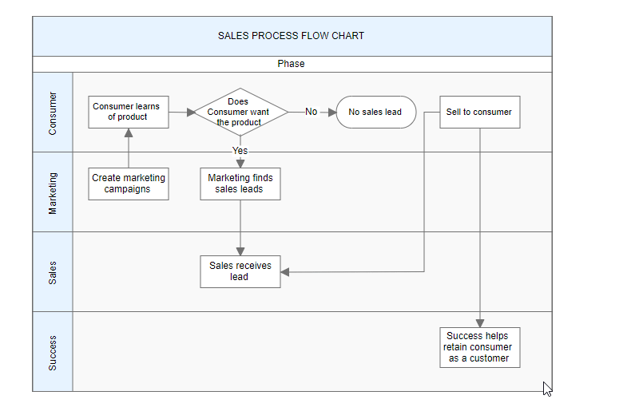

## Lanes

Lane is a functional unit or a responsible department of a business process that helps to map a  process within the functional unit or in between other functional units..

The number of [`lanes`](https://ej2.syncfusion.com/vue/documentation/api/diagram/laneModel/)  can be added to swimlane. The lanes are automatically stacked inside  swimlane based on the order they are added.

### Create an empty lane

* The lane `id` is used to define the name of the lane and its further used to find the lane at runtime and do any customization.

The following code example illustrates how to define a swimlane with lane.









        


### Create lane header

* The [`header`](https://ej2.syncfusion.com/vue/documentation/api/diagram/headerModel/)  property of lane allows you to textually describe the lane and to customize the appearance of the description.

The following code example illustrates how to define a lane header.









        


### Customizing lane and lane header

* The size of lane can be controlled by using [`width`](https://ej2.syncfusion.com/vue/documentation/api/diagram/headerModel/#width) and [`height`](https://ej2.syncfusion.com/vue/documentation/api/diagram/headerModel/#height) properties of the lane.

* The appearance of lane can be set by using the [`style`](https://ej2.syncfusion.com/vue/documentation/api/diagram/headerModel/#style) properties.

* The appearance of header annotation can be customized by using the `style` property of header annotation.

The following code example illustrates how to customize the lane header.









        


#### Dynamic customization of lane header

You can customize the lane header style and text properties dynamically. The following code illustrates how to dynamically customize the lane header.









        


### Add/remove lane at runtime

You can add lanes at runtime by using the [`addLanes`](https://ej2.syncfusion.com/vue/documentation/api/diagram/#addlanes) method and remove lanes at runtime using the [`removeLane`](https://ej2.syncfusion.com/vue/documentation/api/diagram/#removelane) method. The following code illustrates how to dynamically add and remove lane in swimlane.

 







        


### Add children to lane

To add nodes to lane, you should add [`children`](https://ej2.syncfusion.com/vue/documentation/api/diagram/laneModel/#children) collection of the lane.

The following code example illustrates how to add nodes to lane.









        


#### Add child dynamically into the lane

The child node can be inserted into the lane at runtime by using the [`addNodetoLane`](https://ej2.syncfusion.com/vue/documentation/api/diagram/#addnodetolane) method.

 







        


We can also drag nodes from palette or diagram and drop it inside the lane. 

### Prevent child movement outside lane

To prevent child nodes from moving outside their designated lanes, you can use specific constraints. By default, nodes are allowed to move freely. To restrict their movement, you need to set the constraints accordingly.

Here is an example of how to apply these constraints:

 







        


### AddInfo

AddInfo for lanes similar to the nodes. we can store additional informations about the specific lane by using the [`addInfo`](https://ej2.syncfusion.com/vue/documentation/api/diagram/laneModel/#addinfo).

 







        


### Lane interaction

#### Resizing lane

* Lane can be resized in the bottom and left direction.
* Lane can be resized by using resize selector of the lane.
* Once you can resize the lane,the swimlane will be resized automatically.
* The lane can be resized either resizing the selector or the tight bounds of the child object. If the child node move to edge of the lane it can be automatically resized. The following image illustrates how to resize the lane.

#### Lane swapping

* Lanes can be swapped using drag the lanes over another lane.
* Helper should intimate the insertion point while lane swapping. The following image illustrates how swapping the lane. 

#### Disable Swimlane Lane swapping

You can disable swimlane lane swapping by using the property called `canMove`.

The following code illustrates how to disable swimlane lane swapping.

 







        


#### Resize helper

* The special resize helper will be used to resize the lanes.
* The resize cursor will be available on the left and bottom direction alone.
* Once the lane is resized, the swimlane will be resized automatically.

#### Children interaction in lanes

* You can resize the child node within swimlanes.
* You can drag the child nodes within lane.
* Interchange the child nodes from one lane to another lane.
* Drag and drop the child nodes from lane to diagram.
* Drag and drop the child nodes from diagram to lane.
* Based on the child node interactions,the lane size should be updated.
The following image illustrates children interaction in lane. 
  
  
#### Lane header editing

Diagram provides the support to edit Lane headers at runtime. We achieve the header editing by double click event. Double clicking the header label will enables the editing of that.
The following image illustrates how to edit the lane header. 
