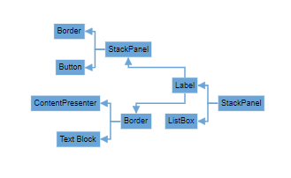

# Mind Map layout in Vue Diagram control

A mind map is a diagram that displays the nodes as a spider diagram organizes information around a central concept. To create mind map, the [`type`](https://ej2.syncfusion.com/vue/documentation/api/diagram/layout/#type) of layout should be set as `MindMap`.

## Mind Map Orientation

An [`Orientation`](https://ej2.syncfusion.com/vue/documentation/api/diagram/layoutModel/#orientation) of a `MindMapTreeLayout` is used to arrange the tree layout according to a specific direction. By default, the orientation is set to Horizontal. 

The following code example illustrates how to create an mindmap layout.









        


The following table outlines the various orientation types available:

|Orientation Type |Description|
| -------- | ----------- |
|Horizontal|Aligns the tree layout from left to right|
|Vertical|Aligns the tree layout from top to bottom|

>Note: If you want to use mind map layout in diagram, you need to inject MindMap in the diagram.

## Mind Map branch

You can also decide the branch for mind map using [`getBranch`](https://ej2.syncfusion.com/vue/documentation/api/diagram/layoutModel/#getbranch) method. The following code demonstrates how to set all branches on the right side for mind map layout using `getBranch` method.









        


