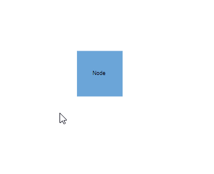
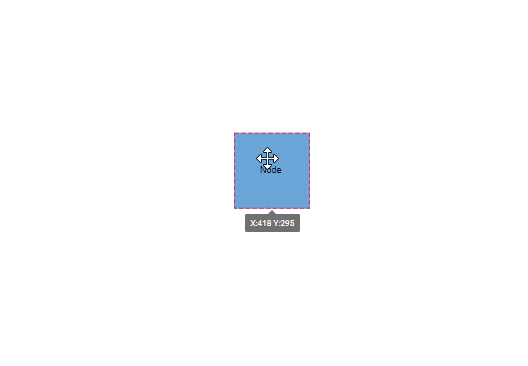

# Node Interaction in Vue Diagram control

The diagram provides support for selecting, dragging, resizing, and rotating nodes interactively. A node can be selected by simply clicking on it, dragged by dragging it on diagram canvas, resized using the resize handle, and rotated using the rotate handle. Additionally, interactions can be performed using some public methods, which are explained below:

## Select

You can simply click on the node to select it and click on diagram canvas to unselect it like below.

### To select node programatically

A node can be selected at runtime by using the [`select`](https://ej2.syncfusion.com/vue/documentation/api/diagram/#select) method and the selection can be cleared in the diagram by using the [`clearSelection`](https://ej2.syncfusion.com/vue/documentation/api/diagram/#clearselection) or [`unSelect`](https://ej2.syncfusion.com/vue/documentation/api/diagram/#unselect) method. The following code explains how to select and clear selection in the diagram.









        


|Method | Parameter | Description|
|----|----|----|
|[`unSelect`](https://ej2.syncfusion.com/vue/documentation/api/diagram/#unselect)| NodeModel/ConnectorModel | The object to remove from the selection.|
|[`clearSelection`](https://ej2.syncfusion.com/vue/documentation/api/diagram/#clearselection)| - | Clears all the selection in the diagram.|

## Drag

You can simply mousedown on a node and drag it anywhere on the diagram canvas like below.

### To drag node programatically

A node can be dragged at runtime by using the [`drag`](https://ej2.syncfusion.com/vue/documentation/api/diagram/#drag) method. The following code explains how to drag the node by using the drag method.









        


## Resize

When we select a node a resize handle will appear on all the sides of the node. We can resize the node by clicking and dragging the resize handle.

### To resize node programatically

A node can be resized at runtime by using the [`scale`](https://ej2.syncfusion.com/vue/documentation/api/diagram/#scale) method. The following code explains how to resize the node by using the scale method.









        


## Rotate

A node can be rotated interactively by clicking and dragging the rotate handle of the node.

### To rotate node programatically

A node can be rotated at runtime by using the [`rotate`](https://ej2.syncfusion.com/vue/documentation/api/diagram/#rotate) method. The following code explains how to rotate the node by using the rotate method.









        


## Flip

The diagram Provides support to flip the node. [`flip`](https://ej2.syncfusion.com/vue/documentation/api/diagram/node/#flip) is performed to give the mirrored image of the original element.

The flip types are as follows:

| Flip direction | Description |
| -------- | ----------- |
|HorizontalFlip |[`Horizontal`](https://ej2.syncfusion.com/vue/documentation/api/diagram/flipDirection/) is used to flip the node to be mirrored across the horizontal axis.|
|VerticalFlip|[`Vertical`](https://ej2.syncfusion.com/vue/documentation/api/diagram/flipDirection/) is used to flip the node to be mirrored across the vertical axis.|
|Both|[`Both`](https://ej2.syncfusion.com/vue/documentation/api/diagram/flipDirection/) is used to flip the node to be mirrored across the horizontal and vertical axes.|
|None|It is used to disable all the flip behavior.|

The following code illustrates how to provide the mirror image of the original element.









        


### Flip modes

The [`flipMode`](../api/diagram/flipMode/) is used to control the behavior of the flip object whether to flip the object along with the port and label.

| FlipMode | Description | 
| -------- | -------- |
|Label| It enables or disables the flip for an object’s label.|
|Port| It enables or disables the flip for an object’s port.|
|All| It enables or disables the flip for both the object’s label and port.|
|None| It is used to disable all the flip mode behavior.|









        
