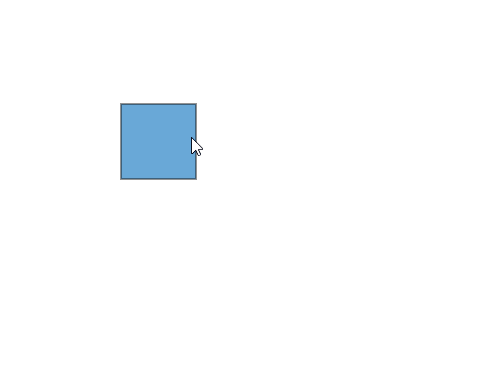

# Positioning a node in Vue Diagram control

## Position

* Position of a node is controlled by using its [`offsetX`](https://ej2.syncfusion.com/vue/documentation/api/diagram/node/#offsetx) and [`offsetY`](https://ej2.syncfusion.com/vue/documentation/api/diagram/node/#offsety) properties. By default, these offset properties represent the distance between the origin of the diagram’s page and node’s center point.

* You may expect this offset values to represent the distance between page origin and node’s top-left corner instead of center. The Pivot property helps to solve this problem. Default value of node’s [`pivot`](https://ej2.syncfusion.com/vue/documentation/api/diagram/node/#pivot) point is (0.5, 0.5), that means center of the node.

* The size of the node can be controlled by using its [`width`](https://ej2.syncfusion.com/vue/documentation/api/diagram/node/#width) and [`height`](https://ej2.syncfusion.com/vue/documentation/api/diagram/node#height-number) properties.

* Rotation of a node is controlled by using its [`rotateAngle`](https://ej2.syncfusion.com/vue/documentation/api/diagram/node/#rotateangle) property.

The following table illustrates how pivot relates offset values with node boundaries.

| Pivot | Offset |
|-------- | -------- |
| (0.5,0.5)| offsetX and offsetY values are considered as the node’s center point. |
| (0,0) | offsetX and offsetY values are considered as the top-left corner of the node. |
| (1,1) | offsetX and offsetY values are considered as the bottom-right corner of the node. |

The following code illustrates how to change the `pivot` value.









        


## Minimum and maximum size for nodes.

The [`minWidth`](https://ej2.syncfusion.com/vue/documentation/api/diagram/node/#minwidth) and [`minHeight`](https://ej2.syncfusion.com/vue/documentation/api/diagram/node/#minheight) properties of node allows you to control the minimum size of the node while resizing. Similarly, the [`maxWidth`](https://ej2.syncfusion.com/vue/documentation/api/diagram/node/#maxwidth) and [`maxHeight`](https://ej2.syncfusion.com/vue/documentation/api/diagram/node/#maxheight) properties of node allows you to control the maximum size of the node while resizing.









        


